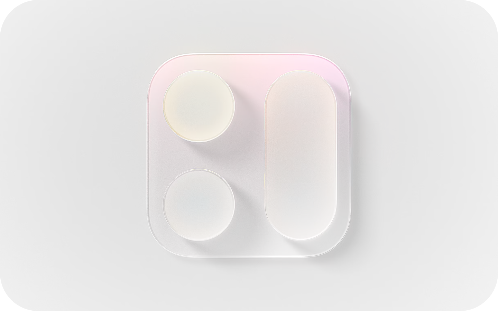
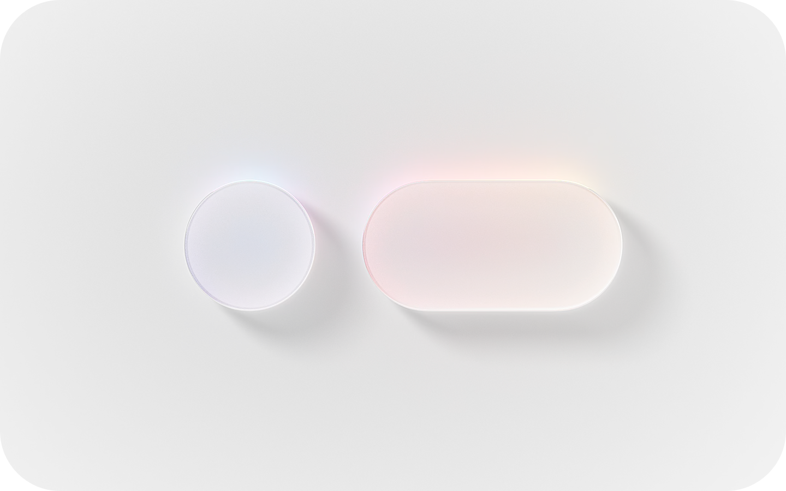
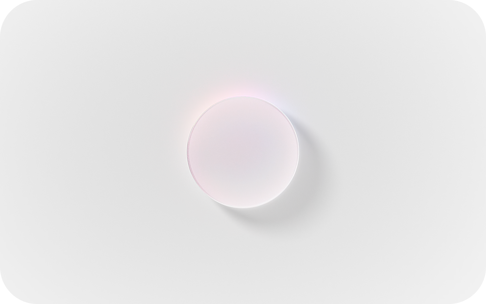
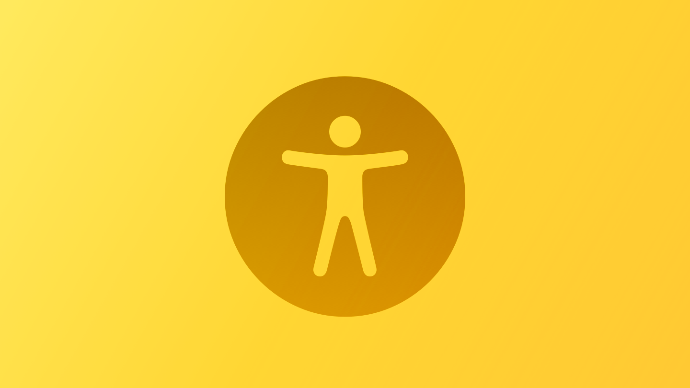

# Human Interface Guidelines

> Offline markdown reference aligned more closely to the current Human Interface Guidelines web documentation.

Generated: 2026-04-12 · Split + re-aligned: 2026-04-17
Format: index + per-section files
Scope: HIG home page, six top-level areas, every HIG page listed in the canonical index, plus Apple Design Resources.

This reference mirrors the six top-level areas of the live HIG: it preserves page names and canonical URLs, carries forward image descriptions and page-level notes, and provides per-page summary, best practices, platform considerations, and change log so the document reads like the web documentation when used offline.

## Table of contents

- [Overview](#overview)
- [Navigation map](#navigation-map)
- [Design fundamentals](#design-fundamentals)
- [New and updated](#new-and-updated)
- [Design resources for offline work](#design-resources-for-offline-work)
- **[Getting started](getting-started.md)** — 7 pages
- **[Foundations](foundations.md)** — 18 pages
- **[Patterns](patterns.md)** — 25 pages
- **[Components](components.md)** — 63 pages (8 subcategories)
- **[Inputs](inputs.md)** — 13 pages
- **[Technologies](technologies.md)** — 29 pages
- [Themes across the HIG](#themes-across-the-hig)
- [Canonical URL index](#canonical-url-index)

## Overview

The Human Interface Guidelines currently organize guidance into six top-level areas: Getting started, Foundations, Patterns, Components, Inputs, and Technologies.

Apple's home page also emphasizes three design principles that frame the rest of the documentation:

- **Hierarchy** — Establish a clear visual hierarchy where controls and interface elements elevate and distinguish the content beneath them.
- **Harmony** — Align with the concentric design of the hardware and software to create harmony between interface elements, system experiences, and devices.
- **Consistency** — Adopt platform conventions to maintain a consistent design that continuously adapts across window sizes and displays.

For developer guidance, see [Adopting Liquid Glass](https://developer.apple.com/documentation/liquidglass/adopting-liquid-glass).

### Home page art

*A conceptual graphic of two circular buttons arranged vertically on the leading side of a capsule-shape vertical item grouping, set atop a larger rounded square.*

*A conceptual graphic of a circular button on the leading side of a capsule-shape item grouping.*

*A conceptual graphic of a circular button.*

## Navigation map

| Area | Total HIG pages | File |
|---|---:|---|
| Getting started | 7 | [getting-started.md](getting-started.md) |
| Foundations | 18 | [foundations.md](foundations.md) |
| Patterns | 25 | [patterns.md](patterns.md) |
| Components | 63 | [components.md](components.md) |
| Inputs | 13 | [inputs.md](inputs.md) |
| Technologies | 29 | [technologies.md](technologies.md) |

## Design fundamentals

The HIG home page currently highlights the following fundamentals:

| | | |
|---|---|---|
|  [App icons](foundations.md#app-icons) |  [Color](foundations.md#color) |  [Materials](foundations.md#materials) |
|  [Layout](foundations.md#layout) |  [Icons](foundations.md#icons) |  [Accessibility](foundations.md#accessibility) |

## New and updated

The HIG home page currently calls out the following topics in its "new and updated" area:

- Multitasking
- The menu bar
- Toolbars
- Search fields
- Game Center
- Generative AI

## Design resources for offline work

Apple's design resources page complements the HIG with official downloads that support offline design and implementation work.

### What Apple currently surfaces there

- Platform-specific UI kits and templates for current releases of iOS and iPadOS, macOS, tvOS, watchOS, and visionOS.
- Technology templates and assets for areas such as App Clips, Apple Pay, Sign in with Apple, Siri and App Shortcuts, Wallet, Live Activities, Games and Game Center, and Apple Health.
- Fonts including SF Pro, SF Compact, SF Mono, New York, and several script-specific San Francisco variants.
- Tooling downloads including SF Symbols, Icon Composer, and parallax-image tools.
- Product bezels, marketing-oriented assets, badges, logos, and icon-production templates.

### File types and toolchains explicitly surfaced

- Figma
- Sketch
- Photoshop
- Illustrator
- Keynote
- PNG
- PDF
- SVG

### Suggested offline workflow

1. Use this index and the per-section files as your searchable overview.
2. Pair them with Apple Design Resources for official templates and downloadable assets.
3. Keep your own screenshots, implementation notes, and design decisions alongside the canonical HIG URLs in this document.

---

## Themes across the HIG

Across the current HIG, several strong themes repeat:

### Native over novel
Apple consistently prefers familiar platform patterns over custom invention, unless the custom design clearly solves a real problem.

### Controls should feel separate from content
This theme appears in layout, materials, toolbars, icons, and motion. The system increasingly provides patterns that make controls stand apart without obscuring what matters.

### Accessibility and inclusion are not side topics
Typography, contrast, control size, gesture alternatives, image choices, wording, and personalization all connect back to accessibility and inclusion.

### Adaptability matters everywhere
Apple repeatedly emphasizes adaptation across:
- device sizes,
- window sizes,
- display characteristics,
- input methods,
- text sizes,
- spatial contexts,
- and appearance settings.

### Apple is currently emphasizing new design-language elements
Several current pages reference:
- **Liquid Glass**
- newer toolbar/search guidance
- updates to widgets
- generative AI
- recent device-dimension tables
- and continued expansion of visionOS guidance

---

## Canonical URL index

### Home page highlights
- Game Center — https://developer.apple.com/design/human-interface-guidelines/game-center
- Generative AI — https://developer.apple.com/design/human-interface-guidelines/generative-ai
- Multitasking — https://developer.apple.com/design/human-interface-guidelines/multitasking
- Search fields — https://developer.apple.com/design/human-interface-guidelines/search-fields
- The menu bar — https://developer.apple.com/design/human-interface-guidelines/the-menu-bar
- Toolbars — https://developer.apple.com/design/human-interface-guidelines/toolbars

### Getting started — [getting-started.md](getting-started.md)
- Designing for iOS — https://developer.apple.com/design/human-interface-guidelines/designing-for-ios
- Designing for iPadOS — https://developer.apple.com/design/human-interface-guidelines/designing-for-ipados
- Designing for macOS — https://developer.apple.com/design/human-interface-guidelines/designing-for-macos
- Designing for tvOS — https://developer.apple.com/design/human-interface-guidelines/designing-for-tvos
- Designing for visionOS — https://developer.apple.com/design/human-interface-guidelines/designing-for-visionos
- Designing for watchOS — https://developer.apple.com/design/human-interface-guidelines/designing-for-watchos
- Designing for games — https://developer.apple.com/design/human-interface-guidelines/designing-for-games

### Foundations (18 pages) — [foundations.md](foundations.md)
- Accessibility — https://developer.apple.com/design/human-interface-guidelines/accessibility
- App icons — https://developer.apple.com/design/human-interface-guidelines/app-icons
- Branding — https://developer.apple.com/design/human-interface-guidelines/branding
- Color — https://developer.apple.com/design/human-interface-guidelines/color
- Dark Mode — https://developer.apple.com/design/human-interface-guidelines/dark-mode
- Icons — https://developer.apple.com/design/human-interface-guidelines/icons
- Images — https://developer.apple.com/design/human-interface-guidelines/images
- Immersive experiences — https://developer.apple.com/design/human-interface-guidelines/immersive-experiences
- Inclusion — https://developer.apple.com/design/human-interface-guidelines/inclusion
- Layout — https://developer.apple.com/design/human-interface-guidelines/layout
- Materials — https://developer.apple.com/design/human-interface-guidelines/materials
- Motion — https://developer.apple.com/design/human-interface-guidelines/motion
- Privacy — https://developer.apple.com/design/human-interface-guidelines/privacy
- Right to left — https://developer.apple.com/design/human-interface-guidelines/right-to-left
- SF Symbols — https://developer.apple.com/design/human-interface-guidelines/sf-symbols
- Spatial layout — https://developer.apple.com/design/human-interface-guidelines/spatial-layout
- Typography — https://developer.apple.com/design/human-interface-guidelines/typography
- Writing — https://developer.apple.com/design/human-interface-guidelines/writing

### Patterns (25 pages) — [patterns.md](patterns.md)
- Charting data — https://developer.apple.com/design/human-interface-guidelines/charting-data
- Collaboration and sharing — https://developer.apple.com/design/human-interface-guidelines/collaboration-and-sharing
- Drag and drop — https://developer.apple.com/design/human-interface-guidelines/drag-and-drop
- Entering data — https://developer.apple.com/design/human-interface-guidelines/entering-data
- Feedback — https://developer.apple.com/design/human-interface-guidelines/feedback
- File management — https://developer.apple.com/design/human-interface-guidelines/file-management
- Going full screen — https://developer.apple.com/design/human-interface-guidelines/going-full-screen
- Launching — https://developer.apple.com/design/human-interface-guidelines/launching
- Live-viewing apps — https://developer.apple.com/design/human-interface-guidelines/live-viewing-apps
- Loading — https://developer.apple.com/design/human-interface-guidelines/loading
- Managing accounts — https://developer.apple.com/design/human-interface-guidelines/managing-accounts
- Managing notifications — https://developer.apple.com/design/human-interface-guidelines/managing-notifications
- Modality — https://developer.apple.com/design/human-interface-guidelines/modality
- Multitasking — https://developer.apple.com/design/human-interface-guidelines/multitasking
- Offering help — https://developer.apple.com/design/human-interface-guidelines/offering-help
- Onboarding — https://developer.apple.com/design/human-interface-guidelines/onboarding
- Playing audio — https://developer.apple.com/design/human-interface-guidelines/playing-audio
- Playing haptics — https://developer.apple.com/design/human-interface-guidelines/playing-haptics
- Playing video — https://developer.apple.com/design/human-interface-guidelines/playing-video
- Printing — https://developer.apple.com/design/human-interface-guidelines/printing
- Ratings and reviews — https://developer.apple.com/design/human-interface-guidelines/ratings-and-reviews
- Searching — https://developer.apple.com/design/human-interface-guidelines/searching
- Settings — https://developer.apple.com/design/human-interface-guidelines/settings
- Undo and redo — https://developer.apple.com/design/human-interface-guidelines/undo-and-redo
- Workouts — https://developer.apple.com/design/human-interface-guidelines/workouts

### Components (63 pages in 8 subcategories) — [components.md](components.md)

#### Content
- Charts — https://developer.apple.com/design/human-interface-guidelines/charts
- Image views — https://developer.apple.com/design/human-interface-guidelines/image-views
- Text views — https://developer.apple.com/design/human-interface-guidelines/text-views
- Web views — https://developer.apple.com/design/human-interface-guidelines/web-views

#### Layout and organization
- Boxes — https://developer.apple.com/design/human-interface-guidelines/boxes
- Collections — https://developer.apple.com/design/human-interface-guidelines/collections
- Column views — https://developer.apple.com/design/human-interface-guidelines/column-views
- Disclosure controls — https://developer.apple.com/design/human-interface-guidelines/disclosure-controls
- Labels — https://developer.apple.com/design/human-interface-guidelines/labels
- Lists and tables — https://developer.apple.com/design/human-interface-guidelines/lists-and-tables
- Lockups — https://developer.apple.com/design/human-interface-guidelines/lockups
- Outline views — https://developer.apple.com/design/human-interface-guidelines/outline-views
- Split views — https://developer.apple.com/design/human-interface-guidelines/split-views
- Tab views — https://developer.apple.com/design/human-interface-guidelines/tab-views

#### Menus and actions
- Activity views — https://developer.apple.com/design/human-interface-guidelines/activity-views
- Buttons — https://developer.apple.com/design/human-interface-guidelines/buttons
- Context menus — https://developer.apple.com/design/human-interface-guidelines/context-menus
- Dock menus — https://developer.apple.com/design/human-interface-guidelines/dock-menus
- Edit menus — https://developer.apple.com/design/human-interface-guidelines/edit-menus
- Home Screen quick actions — https://developer.apple.com/design/human-interface-guidelines/home-screen-quick-actions
- Menus — https://developer.apple.com/design/human-interface-guidelines/menus
- Ornaments — https://developer.apple.com/design/human-interface-guidelines/ornaments
- Pop-up buttons — https://developer.apple.com/design/human-interface-guidelines/pop-up-buttons
- Pull-down buttons — https://developer.apple.com/design/human-interface-guidelines/pull-down-buttons
- The menu bar — https://developer.apple.com/design/human-interface-guidelines/the-menu-bar
- Toolbars — https://developer.apple.com/design/human-interface-guidelines/toolbars

#### Navigation and search
- Path controls — https://developer.apple.com/design/human-interface-guidelines/path-controls
- Search fields — https://developer.apple.com/design/human-interface-guidelines/search-fields
- Sidebars — https://developer.apple.com/design/human-interface-guidelines/sidebars
- Tab bars — https://developer.apple.com/design/human-interface-guidelines/tab-bars
- Token fields — https://developer.apple.com/design/human-interface-guidelines/token-fields

#### Presentation
- Action sheets — https://developer.apple.com/design/human-interface-guidelines/action-sheets
- Alerts — https://developer.apple.com/design/human-interface-guidelines/alerts
- Page controls — https://developer.apple.com/design/human-interface-guidelines/page-controls
- Panels — https://developer.apple.com/design/human-interface-guidelines/panels
- Popovers — https://developer.apple.com/design/human-interface-guidelines/popovers
- Scroll views — https://developer.apple.com/design/human-interface-guidelines/scroll-views
- Sheets — https://developer.apple.com/design/human-interface-guidelines/sheets
- Windows — https://developer.apple.com/design/human-interface-guidelines/windows

#### Selection and input
- Color wells — https://developer.apple.com/design/human-interface-guidelines/color-wells
- Combo boxes — https://developer.apple.com/design/human-interface-guidelines/combo-boxes
- Digit entry views — https://developer.apple.com/design/human-interface-guidelines/digit-entry-views
- Image wells — https://developer.apple.com/design/human-interface-guidelines/image-wells
- Pickers — https://developer.apple.com/design/human-interface-guidelines/pickers
- Segmented controls — https://developer.apple.com/design/human-interface-guidelines/segmented-controls
- Sliders — https://developer.apple.com/design/human-interface-guidelines/sliders
- Steppers — https://developer.apple.com/design/human-interface-guidelines/steppers
- Text fields — https://developer.apple.com/design/human-interface-guidelines/text-fields
- Toggles — https://developer.apple.com/design/human-interface-guidelines/toggles
- Virtual keyboards — https://developer.apple.com/design/human-interface-guidelines/virtual-keyboards

#### Status
- Activity rings — https://developer.apple.com/design/human-interface-guidelines/activity-rings
- Gauges — https://developer.apple.com/design/human-interface-guidelines/gauges
- Progress indicators — https://developer.apple.com/design/human-interface-guidelines/progress-indicators
- Rating indicators — https://developer.apple.com/design/human-interface-guidelines/rating-indicators

#### System experiences
- App Shortcuts — https://developer.apple.com/design/human-interface-guidelines/app-shortcuts
- Complications — https://developer.apple.com/design/human-interface-guidelines/complications
- Controls — https://developer.apple.com/design/human-interface-guidelines/controls
- Live Activities — https://developer.apple.com/design/human-interface-guidelines/live-activities
- Notifications — https://developer.apple.com/design/human-interface-guidelines/notifications
- Status bars — https://developer.apple.com/design/human-interface-guidelines/status-bars
- Top Shelf — https://developer.apple.com/design/human-interface-guidelines/top-shelf
- Watch faces — https://developer.apple.com/design/human-interface-guidelines/watch-faces
- Widgets — https://developer.apple.com/design/human-interface-guidelines/widgets

### Inputs (13 pages) — [inputs.md](inputs.md)
- Action button — https://developer.apple.com/design/human-interface-guidelines/action-button
- Apple Pencil and Scribble — https://developer.apple.com/design/human-interface-guidelines/apple-pencil-and-scribble
- Camera Control — https://developer.apple.com/design/human-interface-guidelines/camera-control
- Digital Crown — https://developer.apple.com/design/human-interface-guidelines/digital-crown
- Eyes — https://developer.apple.com/design/human-interface-guidelines/eyes
- Focus and selection — https://developer.apple.com/design/human-interface-guidelines/focus-and-selection
- Game controls — https://developer.apple.com/design/human-interface-guidelines/game-controls
- Gestures — https://developer.apple.com/design/human-interface-guidelines/gestures
- Gyroscope and accelerometer — https://developer.apple.com/design/human-interface-guidelines/gyroscope-and-accelerometer
- Keyboards — https://developer.apple.com/design/human-interface-guidelines/keyboards
- Nearby interactions — https://developer.apple.com/design/human-interface-guidelines/nearby-interactions
- Pointing devices — https://developer.apple.com/design/human-interface-guidelines/pointing-devices
- Remotes — https://developer.apple.com/design/human-interface-guidelines/remotes

### Technologies (29 pages) — [technologies.md](technologies.md)
- AirPlay — https://developer.apple.com/design/human-interface-guidelines/airplay
- Always On — https://developer.apple.com/design/human-interface-guidelines/always-on
- App Clips — https://developer.apple.com/design/human-interface-guidelines/app-clips
- Apple Pay — https://developer.apple.com/design/human-interface-guidelines/apple-pay
- Augmented reality — https://developer.apple.com/design/human-interface-guidelines/augmented-reality
- CareKit — https://developer.apple.com/design/human-interface-guidelines/carekit
- CarPlay — https://developer.apple.com/design/human-interface-guidelines/carplay
- Game Center — https://developer.apple.com/design/human-interface-guidelines/game-center
- Generative AI — https://developer.apple.com/design/human-interface-guidelines/generative-ai
- HealthKit — https://developer.apple.com/design/human-interface-guidelines/healthkit
- HomeKit — https://developer.apple.com/design/human-interface-guidelines/homekit
- iCloud — https://developer.apple.com/design/human-interface-guidelines/icloud
- ID Verifier — https://developer.apple.com/design/human-interface-guidelines/id-verifier
- iMessage apps and stickers — https://developer.apple.com/design/human-interface-guidelines/imessage-apps-and-stickers
- In-app purchase — https://developer.apple.com/design/human-interface-guidelines/in-app-purchase
- Live Photos — https://developer.apple.com/design/human-interface-guidelines/live-photos
- Mac Catalyst — https://developer.apple.com/design/human-interface-guidelines/mac-catalyst
- Machine learning — https://developer.apple.com/design/human-interface-guidelines/machine-learning
- Maps — https://developer.apple.com/design/human-interface-guidelines/maps
- NFC — https://developer.apple.com/design/human-interface-guidelines/nfc
- Photo editing — https://developer.apple.com/design/human-interface-guidelines/photo-editing
- ResearchKit — https://developer.apple.com/design/human-interface-guidelines/researchkit
- SharePlay — https://developer.apple.com/design/human-interface-guidelines/shareplay
- ShazamKit — https://developer.apple.com/design/human-interface-guidelines/shazamkit
- Sign in with Apple — https://developer.apple.com/design/human-interface-guidelines/sign-in-with-apple
- Siri — https://developer.apple.com/design/human-interface-guidelines/siri
- Tap to Pay on iPhone — https://developer.apple.com/design/human-interface-guidelines/tap-to-pay-on-iphone
- VoiceOver — https://developer.apple.com/design/human-interface-guidelines/voiceover
- Wallet — https://developer.apple.com/design/human-interface-guidelines/wallet
- Widgets — https://developer.apple.com/design/human-interface-guidelines/widgets
