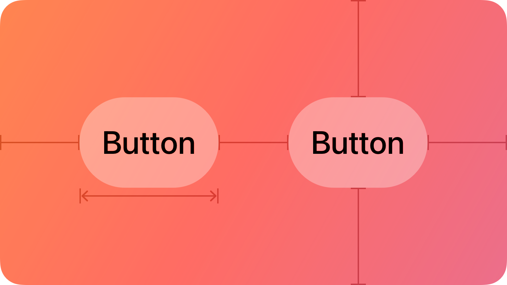
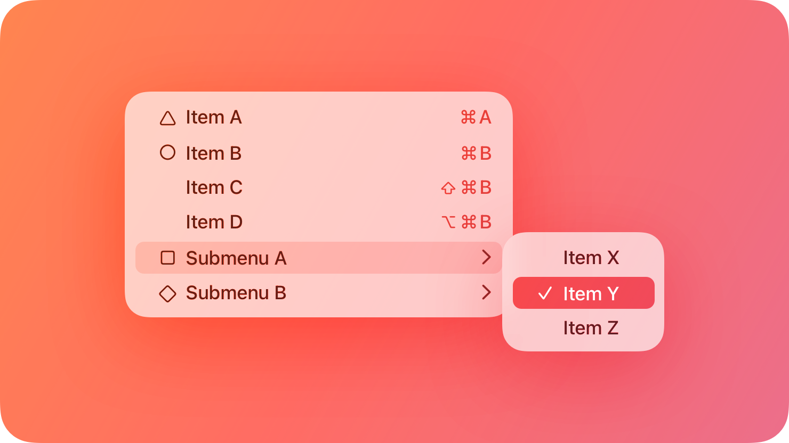
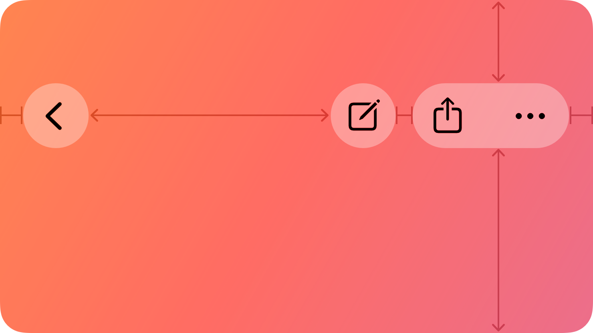

## Components › Menus and actions

The Menus and actions subcategory covers components for presenting commands and choices: Activity views for sharing, Buttons for primary actions, Context menus for contextual commands, Dock menus for app-level actions, Edit menus for text manipulation, Home Screen quick actions for app-icon shortcuts, Menus for general command lists, Ornaments for visionOS toolbar-like elements, Pop-up buttons for mutually exclusive choices, Pull-down buttons for related action sets, The menu bar for macOS app-level navigation, and Toolbars for frequently used actions.

### Section map

| Page | Canonical URL |
|---|---|
| Activity views | https://developer.apple.com/design/human-interface-guidelines/activity-views |
| Buttons | https://developer.apple.com/design/human-interface-guidelines/buttons |
| Context menus | https://developer.apple.com/design/human-interface-guidelines/context-menus |
| Dock menus | https://developer.apple.com/design/human-interface-guidelines/dock-menus |
| Edit menus | https://developer.apple.com/design/human-interface-guidelines/edit-menus |
| Home Screen quick actions | https://developer.apple.com/design/human-interface-guidelines/home-screen-quick-actions |
| Menus | https://developer.apple.com/design/human-interface-guidelines/menus |
| Ornaments | https://developer.apple.com/design/human-interface-guidelines/ornaments |
| Pop-up buttons | https://developer.apple.com/design/human-interface-guidelines/pop-up-buttons |
| Pull-down buttons | https://developer.apple.com/design/human-interface-guidelines/pull-down-buttons |
| The menu bar | https://developer.apple.com/design/human-interface-guidelines/the-menu-bar |
| Toolbars | https://developer.apple.com/design/human-interface-guidelines/toolbars |

### Detailed pages

---

### Activity views
**Path:** Components › Menus and actions
**Canonical URL:** https://developer.apple.com/design/human-interface-guidelines/activity-views

#### Hero image

*A stylized representation of an activity view showing share actions. The image is tinted red to subtly reflect the red in the original six-color Apple logo.*

#### Summary
An activity view — also known as a share sheet — lets people perform tasks with the current content, such as sharing, copying, or printing.

When people trigger an activity view, the system presents a sheet that includes the actions most relevant to the current context. The system determines which app extensions and system actions to show based on the available content type.

Activity views can display both built-in system actions (like Copy, Save to Photos, and Print) and custom actions from app extensions. The system groups actions into rows, with sharing destinations (like Messages, Mail, and AirDrop) typically at the top, followed by other actions.

#### Best practices

Use an activity view to let people perform common tasks with the content your app is displaying. The activity view integrates with the system, so it automatically shows the sharing destinations and actions that are most relevant to the people using your app.

Show an activity view when people tap or click a Share button. People expect the Share button to trigger an activity view — don't use custom UI to present sharing options.

You can add custom actions to the activity view for actions that are specific to your app. Custom actions appear in the activity view alongside system actions.

Consider whether your app provides a full implementation of common activity types. For example, if your app can handle Print, make sure the print experience is complete and functional. Avoid adding an action that leads to a broken or incomplete experience.

#### Share and action extensions

App extensions let your app participate in the activity view presented by other apps. You can create two kinds of extensions for this purpose:

A share extension lets people share content with your app or service. For example, a social media app might provide a share extension that lets people post content to the platform directly from other apps.

An action extension lets people perform custom operations on content from other apps. For example, a translation app might provide an action extension that lets people translate text from any app.

When building a share or action extension, design it to work well in the context of the app presenting the activity view. Your extension should handle the incoming content type gracefully, even if the type is different from what you expected.

#### Platform considerations

Not supported in macOS, tvOS, or watchOS.

#### Resources

**Related**
- Sharing
- Extensions

**Developer documentation**
- UIActivityViewController — UIKit

---

### Buttons
**Path:** Components › Menus and actions
**Canonical URL:** https://developer.apple.com/design/human-interface-guidelines/buttons

#### Hero image

*A stylized representation of several button styles. The image is tinted red to subtly reflect the red in the original six-color Apple logo.*

#### Summary
A button initiates an instantaneous action.

Buttons can display a combination of a title and an image that communicate the action they perform. Buttons use a rounded-rectangle shape, but can use other shapes to create a more specific appearance. The system provides a range of button styles suited for different purposes, sizes, and levels of visual prominence.

Buttons can have a low, medium, or high level of visual prominence. The higher the prominence, the more visual weight a button carries within the interface. Although you can use a prominent button to call attention to the primary action in a view, using too many prominent buttons can dilute the emphasis and make it hard for people to determine which action is most important.

A button's role can convey additional intent. The system provides four button roles to communicate meaning: default, destructive, cancel, and primary.
- Default role buttons perform a standard action.
- Destructive role buttons perform an action that can result in the deletion of data or another irreversible action.
- Cancel role buttons cancel an action without applying any changes.
- Primary role buttons confirm or apply a change in a settings context.

#### Best practices

Prioritize the most likely action. Design for the most common use case by giving important buttons greater prominence. Show no more than one primary button per view or section.

Use a destructive role for buttons that can lead to data loss or other irreversible consequences. A destructive role button uses a red color to signal that the action is potentially irreversible.

Include a title in a button when the action might not be clear from an icon alone. Adding a title makes the button's purpose explicit, especially when the action isn't a standard system action.

Avoid using a button when a control or other element is more appropriate. For example, if your button's purpose is to toggle a value, use a toggle instead of a button.

Use concise, action-oriented titles. Button titles are most effective when they briefly describe what the button does. Use verbs or verb phrases, like Delete, Save, or Cancel. Avoid generic terms like Yes or OK unless the button is part of a standard system dialog.

#### Style

A button's style affects its level of visual prominence within its context. The system provides several button styles including filled, tinted, borderless, and bordered.

Filled buttons have the highest visual prominence and are well-suited for the most important actions. Tinted buttons have a moderate level of prominence. Borderless and bordered styles work well in contexts where you need to show multiple buttons at the same level.

#### Content

A button can display either a title, an image, or both. When combining an image with a title, place the image before the title, or use a separate symbol button alongside the text button.

If you use system-provided SF Symbols in buttons, choose symbols that clearly represent the action. Make sure the symbol's meaning is instantly recognizable and consistent with how the symbol is used elsewhere.

#### Role

A button role communicates the semantic meaning of a button's action:

Default is used for standard actions.
Destructive is used for actions that could result in data loss or are otherwise irreversible.
Cancel dismisses a dialog or workflow without applying changes.
Primary confirms an important choice, typically in a settings or multi-step context.
- The system uses the button role to determine the visual style the button uses automatically.

#### Platform considerations

**iOS, iPadOS**
iOS and iPadOS provide several button styles optimized for touch interaction. The system automatically adjusts button appearance to match the current size class and context.

**macOS**
macOS provides push buttons, image buttons, square buttons, help buttons, and other button types suited for specific contexts.

**Push buttons**
Push buttons are the standard button type for macOS. They initiate an action and can display a title, image, or both.

**Square buttons**
Square buttons are used in toolbars and other contexts where a compact button is needed.

**Help buttons**
Help buttons open help documentation. They display a question mark and don't require a title.

| Button | Usage |
|---|---|
| Help button | Opens help documentation |

**Image buttons**
Image buttons display only an image, without a title. Use them when the image is clear enough to communicate the action without text.

**visionOS**
In visionOS, buttons appear in 3D space and need to be large enough to interact with comfortably. The system provides glass-material button styles suited for spatial interfaces.

| Style | Description |
|---|---|
| Bordered | Default button style for most contexts |
| Borderless | Used in toolbars and other areas with multiple buttons |

**watchOS**
In watchOS, buttons should be large enough to tap comfortably on the small screen. Use concise labels and consider using system-provided button styles.

#### Resources

**Related**
- Pull-down buttons
- Pop-up buttons
- Menus

**Developer documentation**
- Button — SwiftUI
- UIButton — UIKit
- NSButton — AppKit

#### Change log

| Date | Changes |
|---|---|
| December 16, 2025 | Updated guidance for visionOS. |
| June 9, 2025 | Added platform considerations for macOS 26. |
| February 2, 2024 | Updated button role descriptions. |
| December 5, 2023 | Added visionOS guidance. |
| June 21, 2023 | Updated watchOS guidance. |
| June 5, 2023 | Added guidance for buttons in watchOS 10. |

---

### Context menus
**Path:** Components › Menus and actions
**Canonical URL:** https://developer.apple.com/design/human-interface-guidelines/context-menus

#### Hero image

*A stylized representation of a context menu appearing on a content item. The image is tinted red to subtly reflect the red in the original six-color Apple logo.*

#### Summary
A context menu provides access to commands and actions relevant to the current selection or item.

A context menu appears when someone right-clicks or Control-clicks (macOS), long-presses (iOS/iPadOS), or secondary-clicks (visionOS) on an item or area. Context menus display a list of actions that apply specifically to the item or area that triggered the menu.

In iOS and iPadOS, context menus can display a preview of the related item above the menu items. This lets people understand what they're interacting with before choosing an action.

- Context menus should only contain actions that are relevant to the current context.
- Avoid duplicating all menu bar commands in context menus.
- Show only the actions that make sense for the current selection.

#### Best practices

Provide a context menu only when the actions it contains are directly relevant to the selected item or area. Don't use context menus for app-level actions that aren't specific to an item.

Include the most useful actions first. Because context menus can be dismissed quickly, the first few items should be the most commonly needed actions.

Use context menus to augment — not replace — other ways of accessing commands. For example, in macOS, common commands should also be available in the menu bar. Context menus provide a convenient shortcut, not the only path to a command.

Organize commands logically. Use separators to group related commands. Place destructive commands, like Delete, at the end of the menu and separate them from non-destructive commands.

Avoid making context menus too long. A long context menu is harder to scan. If you have many relevant commands, consider whether some of them belong in a submenu.

Prefer concise, action-oriented labels. Context menu items should use short verb phrases that clearly describe what will happen, like Open, Duplicate, Move to Trash, or Get Info.

Don't include preferences or settings in a context menu. Context menus are for actions on a specific item, not for changing app settings.

Avoid making every action available only in a context menu. Context menus should be convenient shortcuts, not the only way to access important functionality.

Disable — don't hide — unavailable commands. If a command in a context menu is currently unavailable, show it as disabled rather than removing it entirely. This gives people a sense of what actions are generally available.

Consider including the most important actions from the context menu in a long-press menu as well. When a context menu is triggered by a long press, people can use the long-press menu to peek at actions before choosing.

#### Content

Use consistent actions across similar items. When people see the same context menu for similar items, they learn to predict what actions are available. Inconsistent context menus can be confusing.

#### Platform considerations

**iOS, iPadOS**
In iOS and iPadOS, a context menu can optionally display a preview of the content above the list of actions. Use a preview to help people understand what item they're about to act on, especially when the item is partially obscured.

**macOS**
In macOS, context menus appear on right-click or Control-click. They integrate with the standard macOS menu system and should follow the same conventions as other menus.

**visionOS**
In visionOS, context menus appear on secondary click or equivalent input. Design them to be clear and easy to select with the available input methods.

#### Resources

**Related**
- Menus
- Edit menus
- Gestures

**Developer documentation**
- contextMenu — SwiftUI
- UIContextMenuInteraction — UIKit
- NSMenu — AppKit

#### Change log

| Date | Changes |
|---|---|
| December 5, 2023 | Added visionOS guidance. |
| June 21, 2023 | Updated iOS and iPadOS guidance. |
| September 14, 2022 | Added context menu guidance. |

---

### Dock menus
**Path:** Components › Menus and actions
**Canonical URL:** https://developer.apple.com/design/human-interface-guidelines/dock-menus

#### Hero image

*A stylized representation of a Dock menu appearing above an app icon in the Dock. The image is tinted red to subtly reflect the red in the original six-color Apple logo.*

#### Summary
A Dock menu appears when someone Control-clicks or right-clicks an app's icon in the Dock.

The system automatically includes several commands in a Dock menu, like the ability to show all windows and quit the app. You can add custom items to this menu to provide quick access to important app-specific actions or destinations within your app.

> Note Dock menus are separate from the App Shortcuts that appear in Spotlight and Siri. If you want to expose app actions in Spotlight and Siri, implement App Shortcuts instead.

#### Best practices

Add Dock menu items for the actions and destinations people are most likely to want from outside the app. For example, a music app might include items for Play, Pause, and Next Track. A messaging app might include items for starting a new conversation or opening recent chats.

Keep the Dock menu focused and short. The Dock menu should include only the most important actions — typically three to five custom items. A long Dock menu can be difficult to navigate.

#### Platform considerations

Not supported in iOS, iPadOS, tvOS, visionOS, or watchOS.

#### Resources

**Related**
- Dock
- Menus

**Developer documentation**
- applicationDockMenu — AppKit

---

### Edit menus
**Path:** Components › Menus and actions
**Canonical URL:** https://developer.apple.com/design/human-interface-guidelines/edit-menus

#### Hero image

*A stylized representation of an edit menu appearing above selected text. The image is tinted red to subtly reflect the red in the original six-color Apple logo.*

#### Summary
An edit menu provides commands for manipulating text and other content.

In iOS and iPadOS, the edit menu appears above selected content when someone selects text or long-presses on a content item. The system automatically includes standard text editing commands, and you can add custom commands relevant to your app.

The edit menu can display different commands depending on what's selected:
- When text is selected, the menu shows text-related commands like Cut, Copy, Paste, and Look Up.
- When a non-text item is selected, the menu can show item-specific commands like Copy, Delete, or Share.
- In macOS, the Edit menu in the menu bar provides standard text editing commands that work across the system.
- Edit menus can include custom commands specific to your app.
- Custom commands appear alongside or separate from system-provided commands.
- Use separators to group related commands.
- Don't hide standard system commands in the edit menu.

#### Best practices

Include standard editing commands when your app uses text. If your app displays or allows editing of text, make sure the standard Cut, Copy, and Paste commands are available. People expect these commands to work the same way in every app.

Add custom commands to the edit menu when they're relevant to the current selection. For example, a drawing app might add a Duplicate or Transform command to the menu when a shape is selected.

Keep the edit menu concise. The edit menu should include only commands that are relevant to the current selection and context.

Use consistent, action-oriented labels. Edit menu items should use short verb phrases that clearly describe what will happen, such as Copy, Paste, Delete, or Bold.

Place destructive commands at the end of the menu. Arrange commands so that less consequential commands appear first and potentially destructive commands appear at the end. Use a separator to visually separate destructive commands.

Disable — don't hide — commands that are currently unavailable. Disabling unavailable commands helps people understand what actions are generally possible, even if they're not possible in the current state.

Localize edit menu commands. Make sure custom commands are localized for all the languages and regions your app supports.

Don't use an edit menu to provide primary navigation. Edit menus are for actions on selected content — not for general navigation within your app.

#### Content

Avoid duplicating all edit menu commands in other UI. Some commands — like Cut, Copy, and Paste — may also be accessible through other means, such as keyboard shortcuts or context menus. This is expected and appropriate. But you don't need to reproduce every edit menu command in every part of your interface.

#### Platform considerations

**iOS, iPadOS**
In iOS and iPadOS, the edit menu appears above the selection point and provides a horizontal list of actions. On devices running iOS 16 and later, the edit menu can display both icons and labels.

**macOS**
In macOS, the Edit menu is one of the standard menus in the menu bar. It typically includes Undo, Redo, Cut, Copy, Paste, and other standard text editing commands.

**visionOS**
In visionOS, the edit menu can appear in the context of text editing. Follow the same principles as for iOS and iPadOS.

#### Resources

**Related**
- Menus
- Context menus
- Text fields

**Developer documentation**
- EditButton — SwiftUI
- UIMenuController — UIKit
- NSMenuItem — AppKit

#### Change log

| Date | Changes |
|---|---|
| June 21, 2023 | Updated iOS and iPadOS guidance. |
| September 14, 2022 | Added edit menu guidance. |

---

### Home Screen quick actions
**Path:** Components › Menus and actions
**Canonical URL:** https://developer.apple.com/design/human-interface-guidelines/home-screen-quick-actions

#### Hero image

*A stylized representation of a set of menu items extending up from an app icon. The image is tinted red to subtly reflect the red in the original six-color Apple logo.*

#### Summary
People can get a menu of available quick actions when they touch and hold an app icon (on a 3D Touch device, people can press on the icon with increased pressure to see the menu). For example, Mail includes quick actions that open the Inbox or the VIP mailbox, initiate a search, and create a new message. In addition to app-specific actions, a Home Screen quick action menu also lists items for removing the app and editing the Home Screen.

Each Home Screen quick action includes a title, an interface icon on the left or right (depending on your app's position on the Home Screen), and an optional subtitle. The title and subtitle are always left-aligned in left-to-right languages. Your app can even dynamically update its quick actions when new information is available. For example, Messages provides quick actions for opening your most recent conversations.

#### Best practices

- **Create quick actions for compelling, high-value tasks.** For example, Maps lets people search near their current location or get directions home without first opening the Maps app. People tend to expect every app to provide at least one useful quick action; you can provide a total of four.
- **Avoid making unpredictable changes to quick actions.** Dynamic quick actions are a great way to keep actions relevant. For example, it may make sense to update quick actions based on the current location or recent activities in your app, time of day, or changes in settings. Make sure that actions change in ways that people can predict.
- **For each quick action, provide a succinct title that instantly communicates the results of the action.** For example, titles like "Directions Home," "Create New Contact," and "New Message" can help people understand what happens when they choose the action. If you need to give more context, provide a subtitle too. Mail uses subtitles to indicate whether there are unread messages in the Inbox and VIP folder. Don't include your app name or any extraneous information in the title or subtitle, keep the text short to avoid truncation, and take localization into account as you write the text.
- **Provide a familiar interface icon for each quick action.** Prefer using SF Symbols to represent actions. For a list of icons that represent common actions, see Standard icons; for additional guidance, see Menus.
- **If you design your own interface icon,** use the Quick Action Icon Template that's included with Apple Design Resources for iOS and iPadOS.
- **Don't use an emoji in place of a symbol or interface icon.** Emojis are full color, whereas quick action symbols are monochromatic and change appearance in Dark Mode to maintain contrast.

#### Platform considerations

No additional considerations for iOS or iPadOS. Not supported in macOS, tvOS, visionOS, or watchOS.

#### Resources

**Related**
- Menus

**Developer documentation**
- Add Home Screen quick actions — UIKit

---

### Menus
**Path:** Components › Menus and actions
**Canonical URL:** https://developer.apple.com/design/human-interface-guidelines/menus

#### Hero image

*A stylized representation of a menu with multiple items. The image is tinted red to subtly reflect the red in the original six-color Apple logo.*

#### Summary
A menu displays a list of choices or commands that people can select from.

Menus can be triggered from various controls, including buttons, toolbars, and the menu bar. They present a list of items that people choose from, where choosing an item either performs an action or makes a selection.

#### Best practices

Use a menu when you need to present several related commands or choices without cluttering the interface. Menus are ideal when you have more options than you can show in the interface at one time.

Use a pop-up button to present a menu for choosing from a set of mutually exclusive options. Pop-up buttons show the currently selected item and let people choose a different one from a menu.

Use a pull-down button to present a menu of related commands or options that don't represent a single selection. Unlike pop-up buttons, pull-down buttons don't show the currently selected item because they're for performing actions, not making a persistent selection.

Organize menu items logically. Group related items using separators. Place the most frequently used items at the top.

Provide keyboard shortcuts for frequently used menu items. Keyboard shortcuts let people quickly access menu commands without opening the menu.

Disable — don't remove — menu items that aren't currently applicable. This gives people a sense of what commands are available even when they can't be used in the current context.

Include icons with menu items when it helps people identify commands more quickly. System-provided SF Symbols are ideal for this purpose because they're designed to work at small sizes and in menus.

Use concise, descriptive labels. Menu item labels should clearly describe the action that will take place, using verb phrases or noun phrases as appropriate.

Use standard keyboard shortcuts for standard commands. People expect standard commands like Undo (Command-Z), Copy (Command-C), and Paste (Command-V) to work the same way in every app.

#### Platform considerations

**iOS, iPadOS**
In iOS and iPadOS, menus appear as floating lists that overlay the current content. Choosing an item dismisses the menu.

**macOS**
Menus are a fundamental part of the macOS interface. The menu bar provides access to all app-level commands, and pop-up and pull-down buttons provide menus for more specific contexts.

**tvOS**
Menus are not commonly used in tvOS. Consider whether there's a more appropriate way to present choices for TV users.

**visionOS**
In visionOS, menus appear in 3D space. They should be easy to read and select with available input methods.

#### Resources

**Related**
- The menu bar
- Context menus
- Pop-up buttons
- Pull-down buttons

**Developer documentation**
- Menu — SwiftUI
- UIMenu — UIKit
- NSMenu — AppKit

---

### Ornaments
**Path:** Components › Menus and actions
**Canonical URL:** https://developer.apple.com/design/human-interface-guidelines/ornaments

#### Hero image

*A stylized representation of an ornament appearing below a visionOS window. The image is tinted red to subtly reflect the red in the original six-color Apple logo.*

#### Summary
An ornament presents app controls and information in a way that's visually separate from but connected to a window.

Ornaments attach to windows and float in front of the window's content, typically appearing near an edge of the window. They're designed specifically for visionOS and provide a way to present frequently used controls without cluttering the main window content.

#### Best practices

Use an ornament to provide access to frequently used controls that aren't part of the main window content. Ornaments work well for playback controls, navigation controls, and other controls that people use repeatedly while interacting with window content.

Position the ornament so that it relates logically to the content. For example, video playback controls typically appear at the bottom of a window, near the content they control.

Keep ornament content focused and minimal. Ornaments are supplementary to the main window content. If you find yourself adding many items to an ornament, consider whether some items should be part of the window itself.

Use standard system controls in ornaments. System controls are designed to work well in ornaments and provide a consistent experience.

Consider whether a tab bar or toolbar might be more appropriate. In some cases, a tab bar or toolbar might be a better choice than an ornament, particularly when the controls are closely related to navigation or primary window actions.

Don't use ornaments for primary navigation. Ornaments are for supplementary controls that relate to the current window content.

#### Platform considerations

Not supported in iOS, iPadOS, macOS, tvOS, or watchOS.

#### Resources

**Related**
- Layout
- Toolbars

**Developer documentation**
- ornament(visibility:…) — SwiftUI

**Videos**
- Design for spatial user interfaces

#### Change log

| Date | Changes |
|---|---|
| February 2, 2024 | Updated guidance for visionOS. |
| December 5, 2023 | Added visionOS ornament guidance. |
| June 21, 2023 | Introduced ornaments documentation. |

---

### Pop-up buttons
**Path:** Components › Menus and actions
**Canonical URL:** https://developer.apple.com/design/human-interface-guidelines/pop-up-buttons

#### Hero image

*A stylized representation of a pop-up button showing a selected option. The image is tinted red to subtly reflect the red in the original six-color Apple logo.*

#### Summary
A pop-up button displays the currently selected item in a list of mutually exclusive options, and lets people select a different option.

When people click or tap a pop-up button, a menu of options appears. After selecting an option, the menu closes and the button updates to display the new selection. Unlike a pull-down button, a pop-up button always displays the current selection, making the current state visible without requiring people to open the menu.

#### Best practices

Use a pop-up button to let people choose from a list of mutually exclusive options. A pop-up button works well when you have a predefined set of options and you want to show the currently selected one.

Provide a concise list of options. A long list of options in a pop-up button makes it harder for people to find what they're looking for. If you have many options, consider using a different component, like a list or table.

Use descriptive option labels that clearly distinguish the available choices. People should be able to understand the difference between options without needing to select each one to understand it.

Sort options in a logical order. In most cases, alphabetical or chronological order works well. If some options are more commonly used than others, consider placing them at the top.

Include a default option when appropriate. If one option is clearly the most common choice, consider making it the default selection.
- Avoid using pop-up buttons for binary choices — use a checkbox or toggle instead.
- Use separators to group related options when your list contains many items.

#### Platform considerations

**iOS, iPadOS**
On iOS and iPadOS, a pop-up button appears with a chevron to indicate that it presents a menu.

**macOS**
In macOS, pop-up buttons display the currently selected item and a downward-pointing arrow. Clicking the button opens a menu of options.

**visionOS**
In visionOS, pop-up buttons work similarly to other platforms, but should be large enough to interact with comfortably.

#### Resources

**Related**
- Pull-down buttons
- Menus
- Pickers

**Developer documentation**
- Picker — SwiftUI
- NSPopUpButton — AppKit

#### Change log

| Date | Changes |
|---|---|
| October 24, 2023 | Updated pop-up button guidance. |
| September 14, 2022 | Added pop-up button documentation. |

---

### Pull-down buttons
**Path:** Components › Menus and actions
**Canonical URL:** https://developer.apple.com/design/human-interface-guidelines/pull-down-buttons

#### Hero image

*A stylized representation of a pull-down button with a chevron indicator. The image is tinted red to subtly reflect the red in the original six-color Apple logo.*

#### Summary
A pull-down button displays a menu of actions or options that are related to its context.

Unlike a pop-up button, a pull-down button doesn't display the currently selected option, because its menu items are typically actions — not mutually exclusive choices. Clicking or tapping a pull-down button opens a menu of related actions. Choosing an item from the menu performs that action.

#### Best practices

Use a pull-down button to present a group of related actions or non-exclusive options. Pull-down buttons are ideal when you have a set of actions that relate to the same subject or task, and you want to reduce clutter by grouping them under a single button.

Include a clear, descriptive label on the button itself. The label should indicate the type of actions the menu contains, like Sort, Filter, or Format.

Keep the menu focused on related actions. A pull-down button's menu should contain items that are all related to the same subject. If you find yourself including unrelated actions, consider whether they belong in a different menu or location.

Order menu items in a logical way. For action menus, consider placing the most commonly used actions first. For option menus, consider alphabetical or another systematic order.

Use icons with menu items to help people identify actions more quickly.
- Use separators to group related items.
- Disable — don't hide — unavailable menu items.

#### Platform considerations

**iOS, iPadOS**
On iOS and iPadOS, pull-down buttons display a downward-pointing chevron to indicate they open a menu. Pull-down buttons are available using the UIButton API with a menu attached.

> Note On iOS and iPadOS, if the button presents a list of options that have a persistent selection, use a pop-up button instead.

**macOS**
In macOS, pull-down buttons display a downward-pointing arrow indicator. They can also be borderless, which is common in toolbar contexts.

**visionOS**
In visionOS, pull-down buttons work similarly to other platforms.

#### Resources

**Related**
- Pop-up buttons
- Menus
- Buttons

**Developer documentation**
- Menu — SwiftUI
- UIButton — UIKit
- NSPopUpButton — AppKit

#### Change log

| Date | Changes |
|---|---|
| September 14, 2022 | Added pull-down button documentation. |

---

### The menu bar
**Path:** Components › Menus and actions
**Canonical URL:** https://developer.apple.com/design/human-interface-guidelines/the-menu-bar

#### Hero image

*A stylized representation of the macOS menu bar. The image is tinted red to subtly reflect the red in the original six-color Apple logo.*

#### Summary
The menu bar appears at the top of the screen and provides access to app-level menus and commands.

The menu bar is a fundamental part of the macOS interface. It always shows the Apple menu on the left, followed by the menus for the frontmost app. The rightmost portion of the menu bar is the menu bar extras area, where apps can display status icons and provide quick access to app functionality.

#### Anatomy

The standard macOS menu bar consists of the following menus, in order from left to right:
1. The Apple menu (managed by the system)
2. The app menu (named after the app)
3. Standard menus (File, Edit, Format, View, and so on)
4. The Window menu
5. The Help menu
6. Menu bar extras (if present)

#### Best practices

Always provide a complete and standard set of menus. People expect every macOS app to have the standard menus — App, File, Edit, and Help at minimum. Don't remove these menus.

Use the standard structure for standard menus. The system and user expectations are based on well-established conventions for menu structure. Follow these conventions so that people can quickly find commands in your app.

Use keyboard shortcuts consistently. Provide keyboard shortcuts for frequently used menu commands. Use standard shortcuts (like Command-C for Copy) for standard commands, and choose intuitive shortcuts for app-specific commands.

Enable and disable menu items based on context. Don't hide menu items when they're unavailable — instead, disable them (show them grayed out). This helps people understand what commands are available and why some aren't currently applicable.

Organize menu items logically within menus. Group related commands using separators. Place the most frequently used commands at the top of each group.

#### App menu

The app menu is named after the current app and is always the second menu from the left in the menu bar. It contains commands that apply to the app as a whole, such as About, Preferences, and Quit.

| Command | Description |
|---|---|
| About [App Name] | Opens a panel with app version and copyright information |
| Preferences… | Opens the app's preferences window |
| Hide [App Name] | Hides the app's windows |
| Hide Others | Hides all other apps' windows |
| Show All | Shows all hidden apps |
| Quit [App Name] | Quits the app |

#### File menu

The File menu contains commands for creating, opening, saving, and managing files and documents.

| Command | Description |
|---|---|
| New | Creates a new document |
| Open… | Opens an existing document |
| Close | Closes the current window |
| Save | Saves the current document |
| Save As… | Saves a copy of the document with a different name |
| Print… | Prints the current document |

#### Edit menu

The Edit menu contains commands for editing content, including undo/redo, cut/copy/paste, and find/replace.

| Command | Description |
|---|---|
| Undo | Undoes the last action |
| Redo | Redoes the last undone action |
| Cut | Cuts the selection |
| Copy | Copies the selection |
| Paste | Pastes from the clipboard |
| Select All | Selects all content |
| Find… | Opens a find interface |

#### Format menu

The Format menu contains commands for formatting content, such as text style, size, and alignment.

| Command | Description |
|---|---|
| Font | Shows font panel or submenu |
| Text | Shows text alignment and direction options |

#### View menu

The View menu contains commands for changing how the app's content is displayed.

| Command | Description |
|---|---|
| Show Toolbar | Shows or hides the toolbar |
| Customize Toolbar… | Opens the toolbar customization sheet |
| Show Sidebar | Shows or hides the sidebar |
| Enter Full Screen | Enters full-screen mode |

#### App-specific menus

In addition to the standard menus, apps can add one or more app-specific menus. Place app-specific menus between the View menu and the Window menu.

#### Window menu

The Window menu contains commands for managing the app's windows.

| Command | Description |
|---|---|
| Minimize | Minimizes the current window |
| Zoom | Zooms the current window |
| Bring All to Front | Brings all app windows to the front |

#### Help menu

The Help menu provides access to the app's help documentation.

| Command | Description |
|---|---|
| [App Name] Help | Opens the app's help documentation |
| Search | Searches the menu bar |

#### Dynamic menu items

Some menu items change based on context. For example, the Undo command changes to reflect the type of action that can be undone (like "Undo Typing" or "Undo Move").

When a menu item changes dynamically, the change should be predictable and meaningful. Avoid changing menu item labels in ways that might confuse people.

#### Platform considerations

Not supported in iOS, tvOS, visionOS, or watchOS.

**iPadOS**
In iPadOS, apps running on Mac with Catalyst or on iPad can show a menu bar. The menu bar in iPadOS follows the same conventions as macOS.

| Feature | iPadOS | macOS |
|---|---|---|
| Menu bar visibility | Optional | Always visible |
| Keyboard shortcut support | Yes (with hardware keyboard) | Yes |

**macOS**
The menu bar is a core part of the macOS user interface. Apps are expected to provide a complete and well-organized menu bar.

**Menu bar extras**
Menu bar extras are small icons that appear in the rightmost part of the menu bar. They provide quick access to app functionality or status information. Use menu bar extras sparingly — only for functionality that people need to access frequently and quickly.

#### Resources

**Related**
- Menus
- Keyboard shortcuts
- Toolbars

**Developer documentation**
- Commands — SwiftUI
- NSMenu — AppKit
- NSStatusItem — AppKit

#### Change log

| Date | Changes |
|---|---|
| June 9, 2025 | Updated menu bar guidance for macOS 26. |

---

### Toolbars
**Path:** Components › Menus and actions
**Canonical URL:** https://developer.apple.com/design/human-interface-guidelines/toolbars

#### Hero image

*A stylized representation of a toolbar with multiple control items. The image is tinted red to subtly reflect the red in the original six-color Apple logo.*

#### Summary
A toolbar provides convenient access to frequently used commands and controls associated with a window.

Toolbars appear at the top of windows and display controls for the app's most important functions. They can also include optional controls that people add or remove when customizing the toolbar.

#### Best practices

Include only the most frequently used commands in a toolbar. A toolbar's purpose is to provide quick access to commonly used commands. If you include too many items, the toolbar becomes cluttered and less useful.

Let people customize the toolbar when appropriate. If your app has many toolbar items, consider allowing people to add, remove, and rearrange items to suit their workflow. Provide a Customize Toolbar sheet that lists all available items.

Use system-provided toolbar item styles when possible. The system provides standard toolbar item types — including buttons, segmented controls, and text fields — that are designed to work well together. Custom toolbar items should match the visual style of system items.

Consider using a Search field in the toolbar. If your app supports search, placing a search field in the toolbar makes it easily accessible.

#### Titles

A toolbar can include a title that identifies the current document or content being shown in the window. In macOS, the window title is typically shown in or near the toolbar.

#### Navigation

Toolbars can include navigation controls like Back and Forward buttons for navigating through a history of views or documents.

#### Actions

Toolbar actions should relate to the content in the window. Don't include app-level actions (like Preferences) in the toolbar — those belong in the menu bar.

#### Item groupings

You can group related toolbar items visually by placing them next to each other. Items that are unrelated to each other should be separated with spaces or separator bars.

#### Platform considerations

**iOS**
In iOS, toolbars appear at the bottom of the screen and provide actions relevant to the current view. Toolbars contain one or more buttons, with optional separator items between groups of buttons.

**iPadOS**
iPadOS supports toolbars at the bottom of the screen similar to iOS, and also supports customizable toolbars at the top of windows for apps that support multiple windows.

**macOS**
In macOS, the toolbar appears below the title bar at the top of a window. Toolbars are customizable and can contain a variety of control types. The system provides standard toolbar styles that you can use or adapt.

**visionOS**
In visionOS, toolbars can appear at the bottom of windows or as ornaments. Consider whether an ornament might be more appropriate than a traditional toolbar for your app's use case.

**watchOS**
Toolbars are not supported in watchOS. Use other navigation patterns appropriate for the small screen.

#### Resources

**Related**
- Ornaments
- Menus
- Buttons

**Developer documentation**
- ToolbarItem — SwiftUI
- UIToolbar — UIKit
- NSToolbar — AppKit

#### Change log

| Date | Changes |
|---|---|
| December 16, 2025 | Updated toolbar guidance. |
| June 9, 2025 | Added macOS 26 toolbar guidance. |
| June 21, 2023 | Updated visionOS guidance. |
| June 5, 2023 | Added toolbar guidance for watchOS 10. |
