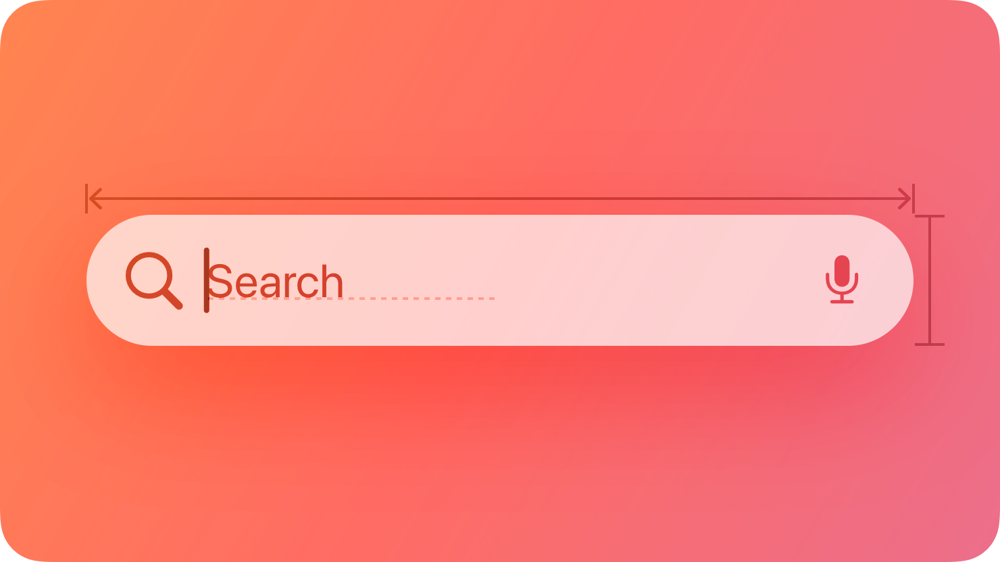

## Components › Navigation and search

The Navigation and search subcategory covers controls that help people move through and locate content in an app: Path controls for displaying file system paths on macOS, Search fields for entering queries across all platforms, Sidebars for primary navigation on iPad and Mac, Tab bars for switching between top-level sections of an app, and Token fields for converting typed text into discrete selectable tokens on macOS.

### Section map

| Page | Canonical URL |
|---|---|
| Path controls | https://developer.apple.com/design/human-interface-guidelines/path-controls |
| Search fields | https://developer.apple.com/design/human-interface-guidelines/search-fields |
| Sidebars | https://developer.apple.com/design/human-interface-guidelines/sidebars |
| Tab bars | https://developer.apple.com/design/human-interface-guidelines/tab-bars |
| Token fields | https://developer.apple.com/design/human-interface-guidelines/token-fields |

### Detailed pages

---

### Path controls
**Path:** Components › Navigation and search
**Canonical URL:** https://developer.apple.com/design/human-interface-guidelines/path-controls

#### Hero image

*A stylized representation of a path control for a HIG Design document showing its root disk, parent folder, and selected item. The image is tinted red to subtly reflect the red in the original six-color Apple logo.*

#### Summary
A path control shows the file system path of a selected file or folder.

For example, choosing View > Show Path Bar in the Finder displays a path bar at the bottom of the window. It shows the path of the selected item, or the path of the window's folder if nothing is selected.

There are two styles of path control.

Standard. A linear list that includes the root disk, parent folders, and selected item. Each item appears with an icon and a name. If the list is too long to fit within the control, it hides names between the first and last items. If you make the control editable, people can drag an item onto the control to select the item and display its path in the control.

Pop up. A control similar to a pop-up button that shows the icon and name of the selected item. People can click the item to open a menu containing the root disk, parent folders, and selected item. If you make the control editable, the menu contains an additional Choose command that people can use to select an item and display it in the control. They can also drag an item onto the control to select it and display its path.

#### Best practices

Use a path control in the window body, not the window frame. Path controls aren't intended for use in toolbars or status bars. Note that the path control in the Finder appears at the bottom of the window body, not in the status bar.

#### Platform considerations

Not supported in iOS, iPadOS, tvOS, visionOS, or watchOS.

#### Resources

**Related**
- File management

**Developer documentation**
- NSPathControl — AppKit

---

### Search fields
**Path:** Components › Navigation and search
**Canonical URL:** https://developer.apple.com/design/human-interface-guidelines/search-fields

#### Hero image

*A stylized representation of a search field containing placeholder text and a dictation icon. The image is tinted red to subtly reflect the red in the original six-color Apple logo.*

#### Summary
A search field is an editable text field that displays a Search icon, a Clear button, and placeholder text where people can enter what they are searching for. Search fields can use a scope control as well as tokens to help filter and refine the scope of their search. Across each platform, there are different patterns for accessing search based on the goals and design of your app.

For developer guidance, see Adding a search interface to your app; for guidance related to systemwide search, see Searching.

#### Best practices

Display placeholder text that describes the type of information people can search for. For example, the Apple TV app includes the placeholder text Shows, Movies, and More. Avoid using a term like Search for placeholder text because it doesn't provide any helpful information.

If possible, start search immediately when a person types. Searching while someone types makes the search experience feel more responsive because it provides results that are continuously refined as the text becomes more specific.

Consider showing suggested search terms before search begins, or as a person types. This can help someone search faster by suggesting common searches, even when the search itself doesn't begin immediately.

Simplify search results. Provide the most relevant search results first to minimize the need for someone to scroll to find what they're looking for. In addition to prioritizing the most likely results, consider categorizing them to help people find what they want.

Consider letting people filter search results. For example, you can include a scope control in the search results content area to help people quickly and easily filter search results.

#### Scope controls and tokens

Scope controls and tokens are components you can use to let someone narrow the parameters of a search either before or after they make it.

- A scope control acts like a segmented control for choosing a category for the search.
- A token is a visual representation of a search term that someone can select and edit, and acts as a filter for any additional terms in the search.

Use a scope control to filter among clearly defined search categories. A scope control can help someone move from a broader scope to a narrower one. For example, in Mail on iPhone, a scope control helps people move from searching their entire mailbox to just the specific mailbox they're viewing. For developer guidance, see Scoping a search operation.

Default to a broader scope and let people refine it as they need. A broader scope provides context for the full set of available results, which helps guide people in a useful direction when they choose to narrow the scope.

Use tokens to filter by common search terms or items. When you define a token, the term it represents gains a visual treatment that encapsulates it, indicating that people can select and edit it as a single item. Tokens can clarify a search term, like filtering by a specific contact in Mail, or focus a search to a specific set of attributes, like filtering by photos in Messages. For the related macOS component, see Token fields.

Consider pairing tokens with search suggestions. People may not know which tokens are available, so pairing them with search suggestions can help people learn how to use them.

#### Platform considerations

No additional considerations for visionOS.

**iOS**

There are three main places you can position the entry point for search:
- In a tab bar at the bottom of the screen
- In a toolbar at the bottom or top of the screen
- Directly inline with content

Where search makes the most sense depends on the layout, content, and navigation of your app.

**Search in a tab bar**

You can place search as a visually distinct tab on the trailing side of a tab bar, which keeps search visible and always available as people switch between the sections of your app.

When someone navigates to the search tab, the search field that appears can start as focused or unfocused.

Start with the search field focused to help people quickly find what they need. When the search field starts focused, the keyboard immediately appears with the search field above it, ready to begin the search. This provides a more transient experience that brings people directly back to their previous tab after they exit search, and is ideal when you want search to resolve quickly and seamlessly.

Start with the search field unfocused to promote discovery and exploration. When the search field starts unfocused, the search tab expands into an unselected field at the bottom of the screen. This provides space on the rest of the screen for additional discovery or navigation before someone taps the field to begin the search. This is great for an app with a large collection of content to showcase, like Music or TV.

**Search in a toolbar**

As an alternative to search in a tab bar, you can also place search in a toolbar either at the bottom or top of the screen.

- You can include search in a bottom toolbar either as an expanded field or as a toolbar button, depending on how much space is available and how important search is to your app. When someone taps it, it animates into a search field above the keyboard so they can begin typing.
- You can include search in a top toolbar, also called a navigation bar, where it appears as a toolbar button. When someone taps it, it animates into a search field that appears either above the keyboard or inline at the top if there isn't space at the bottom.

Place search at the bottom if there's room. You can either add a search field to an existing toolbar, or as a new toolbar where search is the only item. Search at the bottom is useful in any situation where search is a priority, since it keeps the search experience easy to reach. Examples of apps with search at the bottom in various toolbar layouts include Settings, where it's the only item, and Mail and Notes, where it fits alongside other important controls.

Place search at the top when it's important to defer to content at the bottom of the screen, or there's no bottom toolbar. Use search at the top in cases where covering the content might interfere with a primary function of the app. The Wallet app, for example, includes event passes in a stack at the bottom of the screen for easy access and viewing at a glance.

**Search as an inline field**

In some cases you might want your app to include a search field inline with content.

Place search as an inline field when its position alongside the content it searches strengthens that relationship. When you need to filter or search within a single view, it can be helpful to have search appear directly next to content to illustrate that the search applies to it, rather than globally. For example, although the main search in the Music app is in the tab bar, people can navigate to their library and use an inline search field to filter their songs and albums.

Prefer placing search at the bottom. Generally, even for search that applies to a subset of your app's content, it's better to locate search where people can reach it easily. The Settings app, for example, places search at the bottom both for its top-level search and for search in the section for individual apps. If there isn't space at the bottom (because it's occupied by a tab bar or other important UI, for example), it's okay to place search inline at the top.

When at the top, position an inline search field above the list it searches, and pin it to the top toolbar when scrolling. This helps keep it distinct from search that appears in other locations.

**iPadOS, macOS**

The placement and behavior of the search field in iPadOS and macOS is similar; on both platforms, clearing the field exits search and dismisses the keyboard if present. If your app is available on both iPad and Mac, try to keep the search experience as consistent as possible across both platforms.

Put a search field at the trailing side of the toolbar for many common uses. Many apps benefit from the familiar pattern of search in the toolbar, particularly apps with split views or apps that navigate between multiple sources, like Mail, Notes, and Voice Memos. The persistent availability of search at the side of the toolbar gives it a global presence within your app, so it's generally appropriate to start with a global scope for the initial search.

Include search at the top of the sidebar when filtering content or navigation there. Apps such as Settings take advantage of search to quickly filter the sidebar and expose sections that may be multiple levels deep, providing a simple way for people to search, preview, and navigate to the section or setting they're looking for.

Include search as an item in the sidebar or tab bar when you want an area dedicated to discovery. If your search is paired with rich suggestions, categories, or content that needs more space, it can be helpful to have a dedicated area for it. This is particularly true for apps where browsing and search go hand in hand, like Music and TV, where it provides a unified location to highlight suggested content, categories, and recent searches. A dedicated area also ensures search is always available as people navigate and switch sections of your app.

In a search field in a dedicated area, consider immediately focusing the field when a person navigates to the section to help people search faster and locate the field itself more easily. An exception to this is on iPad when only a virtual keyboard is available, in which case it's better to leave the field unfocused to prevent the keyboard from unexpectedly covering the view.

Account for window resizing with the placement of the search field. On iPad, the search field fluidly resizes with the app window like it does on Mac. However, for compact views on iPad, it's important to ensure that search is available where it's most contextually useful. For example, Notes and Mail place search above the column for the content list when they resize down to a compact view.

**tvOS**

A search screen is a specialized keyboard screen that helps people enter search text, displaying search results beneath the keyboard in a fully customizable view. For developer guidance, see UISearchController.

Provide suggestions to make searching easier. People typically don't want to do a lot of typing in tvOS. To improve the search experience, provide popular and context-specific search suggestions, including recent searches when available. For developer guidance, see Using suggested searches with a search controller.

**watchOS**

When someone taps the search field, the system displays a text-input control that covers the entire screen. The app only returns to the search field after they tap the Cancel or Search button.

#### Resources

**Related**
- Searching
- Token fields

**Developer documentation**
- Adding a search interface to your app — SwiftUI
- searchable(text:placement:prompt:) — SwiftUI
- UISearchBar — UIKit
- UISearchTextField — UIKit
- NSSearchField — AppKit

#### Change log

| Date | Changes |
|---|---|
| June 9, 2025 | Updated guidance for search placement in iOS, consolidated iPadOS and macOS platform considerations, and added guidance for tokens. |
| September 12, 2023 | Combined guidance common to all platforms. |
| June 5, 2023 | Added guidance for using search fields in watchOS. |

---

### Sidebars
**Path:** Components › Navigation and search
**Canonical URL:** https://developer.apple.com/design/human-interface-guidelines/sidebars

#### Hero image

*A stylized representation of the top portion of a window's sidebar displaying a title, a section, and some folders. The image is tinted red to subtly reflect the red in the original six-color Apple logo.*

#### Summary
A sidebar appears on the leading side of a view and lets people navigate between sections in your app or game.

A sidebar floats above content without being anchored to the edges of the view. It provides a broad, flat view of an app's information hierarchy, giving people access to several peer content areas or modes at the same time.

A sidebar requires a large amount of vertical and horizontal space. When space is limited or you want to devote more of the screen to other information or functionality, a more compact control such as a tab bar may provide a better navigation experience. For guidance, see Layout.

#### Best practices

Extend content beneath the sidebar. In iOS, iPadOS, and macOS, as with other controls such as toolbars and tab bars, sidebars float above content in the Liquid Glass layer. To reinforce the separation and floating appearance of the sidebar, extend content beneath it either by letting it horizontally scroll or applying a background extension view, which mirrors adjacent content to give the impression of stretching it under the sidebar. For developer guidance, see backgroundExtensionEffect().

When possible, let people customize the contents of a sidebar. A sidebar lets people navigate to important areas in your app, so it works well when people can decide which areas are most important and in what order they appear.

Group hierarchy with disclosure controls if your app has a lot of content. Using disclosure controls helps keep the sidebar's vertical space to a manageable level.

Consider using familiar symbols to represent items in the sidebar. SF Symbols provides a wide range of customizable symbols you can use to represent items in your app. If you need to use a custom icon, consider creating a custom symbol rather than using a bitmap image. Download the SF Symbols app from Apple Design Resources.

Consider letting people hide the sidebar. People sometimes want to hide the sidebar to create more room for content details or to reduce distraction. When possible, let people hide and show the sidebar using the platform-specific interactions they already know. For example, in iPadOS, people expect to use the built-in edge swipe gesture; in macOS, you can include a show/hide button or add Show Sidebar and Hide Sidebar commands to your app's View menu. In visionOS, a window typically expands to accommodate a sidebar, so people rarely need to hide it. Avoid hiding the sidebar by default to ensure that it remains discoverable.

In general, show no more than two levels of hierarchy in a sidebar. When a data hierarchy is deeper than two levels, consider using a split view interface that includes a content list between the sidebar items and detail view.

If you need to include two levels of hierarchy in a sidebar, use succinct, descriptive labels to title each group. To help keep labels short, omit unnecessary words.

#### Platform considerations

No additional considerations for tvOS. Not supported in watchOS.

**iOS**

Avoid using a sidebar. A sidebar takes up a lot of space in landscape orientation and isn't available in portrait orientation. Instead, consider using a tab bar, which takes less space and remains visible in both orientations.

**iPadOS**

When you use the sidebarAdaptable style of tab view to present a sidebar, you choose whether to display a sidebar or a tab bar when your app opens. Both variations include a button that people can use to switch between them. This style also responds automatically to rotation and window resizing, providing a version of the control that's appropriate to the width of the view.

> Developer note To display a sidebar only, use NavigationSplitView to present a sidebar in the primary pane of a split view, or use UISplitViewController.

Consider using a tab bar first. A tab bar provides more space to feature content, and offers enough flexibility to navigate between many apps' main areas. If you need to expose more areas than fit in a tab bar, the tab bar's convertible sidebar-style appearance can provide access to content that people use less frequently. For guidance, see Tab bars.

If necessary, apply the correct appearance to a sidebar. If you're not using SwiftUI to create a sidebar, you can use the UICollectionLayoutListConfiguration.Appearance.sidebar appearance of a collection view list layout. For developer guidance, see UICollectionLayoutListConfiguration.Appearance.

**macOS**

A sidebar's row height, text, and glyph size depend on its overall size, which can be small, medium, or large. You can set the size programmatically, but people can also change it by selecting a different sidebar icon size in General settings.

Avoid stylizing your app by specifying a fixed color for all sidebar icons. By default, sidebar icons use the current accent color and people expect to see their chosen accent color throughout all the apps they use. Although a fixed color can help clarify the meaning of an icon, you want to make sure that most sidebar icons display the color people choose.

Consider automatically hiding and revealing a sidebar when its container window resizes. For example, reducing the size of a Mail viewer window can automatically collapse its sidebar, making more room for message content.

Avoid putting critical information or actions at the bottom of a sidebar. People often relocate a window in a way that hides its bottom edge.

**visionOS**

If your app's hierarchy is deep, consider using a sidebar within a tab in a tab bar. In this situation, a sidebar can support secondary navigation within the tab. If you do this, be sure to prevent selections in the sidebar from changing which tab is currently open.

#### Resources

**Related**
- Split views
- Tab bars
- Layout

**Developer documentation**
- sidebarAdaptable — SwiftUI
- NavigationSplitView — SwiftUI
- sidebar — SwiftUI
- UICollectionLayoutListConfiguration — UIKit
- NSSplitViewController — AppKit

**Videos**
- Elevate the design of your iPad app

#### Change log

| Date | Changes |
|---|---|
| June 9, 2025 | Added guidance for extending content beneath the sidebar. |
| August 6, 2024 | Updated guidance to include the SwiftUI adaptable sidebar style. |
| December 5, 2023 | Added artwork for iPadOS. |
| June 21, 2023 | Updated to include guidance for visionOS. |

---

### Tab bars
**Path:** Components › Navigation and search
**Canonical URL:** https://developer.apple.com/design/human-interface-guidelines/tab-bars

#### Hero image

*A stylized representation of a tab bar containing four placeholder icons with names. The image is tinted red to subtly reflect the red in the original six-color Apple logo.*

#### Summary
A tab bar lets people navigate between top-level sections of your app.

Tab bars help people understand the different types of information or functionality that an app provides. They also let people quickly switch between sections of the view while preserving the current navigation state within each section.

#### Best practices

Use a tab bar to support navigation, not to provide actions. A tab bar lets people navigate among different sections of an app, like the Alarm, Stopwatch, and Timer tabs in the Clock app. If you need to provide controls that act on elements in the current view, use a toolbar instead.

Make sure the tab bar is visible when people navigate to different sections of your app. If you hide the tab bar, people can forget which area of the app they're in. The exception is when a modal view covers the tab bar, because a modal is temporary and self-contained.

Use the appropriate number of tabs required to help people navigate your app. As a representation of your app's hierarchy, it's important to weigh the complexity of additional tabs against the need for people to frequently access each section; keep in mind that it's generally easier to navigate among fewer tabs. Where available, consider a sidebar or a tab bar that adapts to a sidebar as an alternative for an app with a complex information structure.

Avoid overflow tabs. Depending on device size and orientation, the number of visible tabs can be smaller than the total number of tabs. If horizontal space limits the number of visible tabs, the trailing tab becomes a More tab in iOS and iPadOS, revealing the remaining items in a separate list. The More tab makes it harder for people to reach and notice content on tabs that are hidden, so limit scenarios in your app where this can happen.

Don't disable or hide tab bar buttons, even when their content is unavailable. Having tab bar buttons available in some cases but not others makes your app's interface appear unstable and unpredictable. If a section is empty, explain why its content is unavailable.

Include tab labels to help with navigation. A tab label appears beneath or beside a tab bar icon, and can aid navigation by clearly describing the type of content or functionality the tab contains. Use single words whenever possible.

Consider using SF Symbols to provide familiar, scalable tab bar icons. When you use SF Symbols, tab bar icons automatically adapt to different contexts. For example, the tab bar can be regular or compact, depending on the device and orientation. Tab bar icons appear above tab labels in compact views, whereas in regular views, the icons and labels appear side by side. Prefer filled symbols or icons for consistency with the platform.

If you're creating custom tab bar icons, see Apple Design Resources for tab bar icon dimensions.

Use a badge to indicate that critical information is available. You can display a badge — a red oval containing white text and either a number or an exclamation point — on a tab to indicate that there's new or updated information in the section that warrants a person's attention. Reserve badges for critical information so you don't dilute their impact and meaning. For guidance, see Notifications.

Avoid applying a similar color to tab labels and content layer backgrounds. If your app already has bright, colorful content in the content layer, prefer a monochromatic appearance for tab bars, or choose an accent color with sufficient visual differentiation. For more guidance, see Liquid Glass color.

#### Platform considerations

No additional considerations for macOS. Not supported in watchOS.

**iOS**

A tab bar floats above content at the bottom of the screen. Its items rest on a Liquid Glass background that allows content beneath to peek through.

For tab bars with an attached accessory, like the MiniPlayer in Music, you can choose to minimize the tab bar and move the accessory inline with it when a person scrolls down. A person can exit the minimized state by tapping a tab or scrolling to the top of the view. For developer guidance, see TabBarMinimizeBehavior and UITabBarController.MinimizeBehavior.

A tab bar can include a distinct search item at the trailing end. For guidance, see Search fields.

**iPadOS**

The system displays a tab bar near the top of the screen. You can choose to have the tab bar appear as a fixed element, or with a button that converts it to a sidebar. For developer guidance, see tabBarOnly and sidebarAdaptable.

> Note To present a sidebar without the option to convert it to a tab bar, use a navigation split view instead of a tab view. For guidance, see Sidebars.

Prefer a tab bar for navigation. A tab bar provides access to the sections of your app that people use most. If your app is more complex, you can provide the option to convert the tab bar to a sidebar so people can access a wider set of navigation options.

Let people customize the tab bar. In apps with a lot of sections that people might want to access, it can be useful to let people select items that they use frequently and add them to the tab bar, or remove items that they use less frequently. For example, in the Music app, a person can choose a favorite playlist to display in the tab bar. If you let people select their own tabs, aim for a default list of five or fewer to preserve continuity between compact and regular view sizes. For developer guidance, see TabViewCustomization and UITab.Placement.

**tvOS**

A tab bar is highly customizable. For example, you can:
- Specify a tint, color, or image for the tab bar background
- Choose a font for tab items, including a different font for the selected item
- Specify tints for selected and unselected items
- Add button icons, like settings and search

By default, a tab bar is translucent, and only the selected tab is opaque. When people use the remote to focus on the tab bar, the selected tab includes a drop shadow that emphasizes its selected state. The height of a tab bar is 68 points, and its top edge is 46 points from the top of the screen; you can't change either of these values.

If there are more items than can fit in the tab bar, the system truncates the rightmost item by applying a fade effect that begins at the right side of the tab bar. If there are enough items to cause scrolling, the system also applies a truncating fade effect that starts from the left side.

Be aware of tab bar scrolling behaviors. By default, people can scroll the tab bar offscreen when the current tab contains a single main view. You can see examples of this behavior in the Watch Now, Movies, TV Show, Sports, and Kids tabs in the TV app. The exception is when a screen contains a split view, such as the TV app's Library tab or an app's Settings screen. In this case, the tab bar remains pinned at the top of the view while people scroll the content within the primary and secondary panes of the split view. Regardless of a tab's contents, focus always returns to the tab bar at the top of the page when people press Menu on the remote.

In a live-viewing app, organize tabs in a consistent way. For the best experience, organize content in live-streaming apps with tabs in the following order:
- Live content
- Cloud DVR or other recorded content
- Other content

For additional guidance, see Live-viewing apps.

**visionOS**

In visionOS, a tab bar is always vertical, floating in a position that's fixed relative to the window's leading side. When people look at a tab bar, it automatically expands; to open a specific tab, people look at the tab and tap. While a tab bar is expanded, it can temporarily obscure the content behind it.

Supply a symbol and a text label for each tab. A tab's symbol is always visible in the tab bar. When people look at the tab bar, the system reveals tab labels, too. Even though the tab bar expands, you need to keep tab labels short so people can read them at a glance.

If it makes sense in your app, consider using a sidebar within a tab. If your app's hierarchy is deep, you might want to use a sidebar to support secondary navigation within a tab. If you do this, be sure to prevent selections in the sidebar from changing which tab is currently open.

#### Resources

**Related**
- Tab views
- Toolbars
- Sidebars
- Materials

**Developer documentation**
- TabView — SwiftUI
- TabViewBottomAccessoryPlacement — SwiftUI
- Enhancing your app's content with tab navigation — SwiftUI
- UITabBar — UIKit
- Elevating your iPad app with a tab bar and sidebar — UIKit

**Videos**
- Get to know the new design system
- Elevate the design of your iPad app

#### Change log

| Date | Changes |
|---|---|
| December 16, 2025 | Updated guidance for Liquid Glass. |
| July 28, 2025 | Added guidance for Liquid Glass. |
| September 9, 2024 | Added art representing the tab bar in iPadOS 18. |
| August 6, 2024 | Updated with guidance for the tab bar in iPadOS 18. |
| June 21, 2023 | Updated to include guidance for visionOS. |

---

### Token fields
**Path:** Components › Navigation and search
**Canonical URL:** https://developer.apple.com/design/human-interface-guidelines/token-fields

#### Hero image

*A stylized representation of a text field containing a person's name formatted as a token. The image is tinted red to subtly reflect the red in the original six-color Apple logo.*

#### Summary
A token field is a type of text field that can convert text into tokens that are easy to select and manipulate.

For example, Mail uses token fields for the address fields in the compose window. As people enter recipients, Mail converts the text that represents each recipient's name into a token. People can select these recipient tokens and drag to reorder them or move them into a different field.

You can configure a token field to present people with a list of suggestions as they enter text into the field. For example, Mail suggests recipients as people type in an address field. When people select a suggested recipient, Mail inserts the recipient into the field as a token.

An individual token can also include a contextual menu that offers information about the token or editing options. For example, a recipient token in Mail includes a contextual menu with commands for editing the recipient name, marking the recipient as a VIP, and viewing the recipient's contact card, among others.

Tokens can also represent search terms in some situations; for guidance, see Search fields.

#### Best practices

Add value with a context menu. People often benefit from a context menu with additional options or information about a token.

Consider providing additional ways to convert text into tokens. By default, text people enter turns into a token whenever they type a comma. You can specify additional shortcuts, such as pressing Return, that also invoke this action.

Consider customizing the delay the system uses before showing suggested tokens. By default, suggestions appear immediately. However, suggestions that appear too quickly may distract people while they're typing. If your app suggests tokens, consider adjusting the delay to a comfortable level.

#### Platform considerations

Not supported in iOS, iPadOS, tvOS, visionOS, and watchOS.

#### Resources

**Related**
- Text fields
- Search fields
- Context menus

**Developer documentation**
- NSTokenField — AppKit
