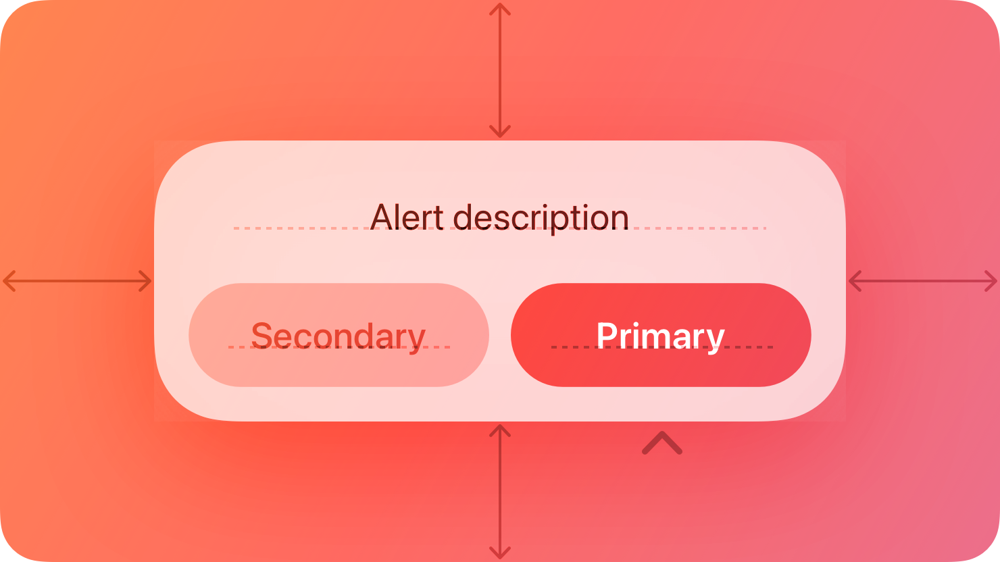

## Components › Presentation

Components for presenting content, tasks, and contextual views across Apple platforms — including modal, transient, and scrollable surfaces.

| Page | Path | Summary |
|---|---|---|
| Action sheets | components/presentation/action-sheets | Modal view offering choices related to a user-initiated action |
| Alerts | components/presentation/alerts | Modal view that gives people critical information they need right away |
| Page controls | components/presentation/page-controls | Row of indicator images representing pages in a flat list |
| Panels | components/presentation/panels | macOS-only floating supplementary window |
| Popovers | components/presentation/popovers | Transient view that appears above other content from a control |
| Scroll views | components/presentation/scroll-views | Container allowing content larger than the view's bounds to be scrolled |
| Sheets | components/presentation/sheets | Scoped task view closely related to the current context |
| Windows | components/presentation/windows | Visual boundaries of app content in iPadOS, macOS, and visionOS |

---

### Action sheets

- **Path:** components/presentation/action-sheets
- **URL:** https://developer.apple.com/design/human-interface-guidelines/action-sheets
- **Hero:** 

An action sheet is a modal view that presents choices related to an action people initiate.

> Developer note: When you use SwiftUI, you can offer action sheet functionality in all platforms by specifying a presentation modifier for a confirmation dialog. If you use UIKit, you use the UIAlertController.Style.actionSheet to display an action sheet in iOS, iPadOS, and tvOS.

#### Best practices

Use an action sheet — not an alert — to offer choices related to an intentional action. For example, when people cancel the message they're editing in Mail on iPhone, an action sheet provides two choices: delete the draft, or save the draft. Although an alert can also help people confirm or cancel an action that has destructive consequences, it doesn't provide additional choices related to the action. More importantly, an alert is usually unexpected, generally telling people about a problem or a change in the current situation that might require them to act. For guidance, see Alerts.

Use action sheets sparingly. Action sheets give people important information and choices, but they interrupt the current task to do so. To encourage people to pay attention to action sheets, avoid using them more than necessary.

Aim to keep titles short enough to display on a single line. A long title is difficult to read quickly and might get truncated or require people to scroll.

Provide a message only if necessary. In general, the title — combined with the context of the current action — provides enough information to help people understand their choices.

If necessary, provide a Cancel button that lets people reject an action that might destroy data. Place the Cancel button at the bottom of the action sheet (or in the upper-left corner of the sheet in watchOS). A SwiftUI confirmation dialog includes a Cancel button by default.

Make destructive choices visually prominent. Use the destructive style for buttons that perform destructive actions, and place these buttons at the top of the action sheet where they tend to be most noticeable. For developer guidance, see destructive (SwiftUI) or UIAlertAction.Style.destructive (UIKit).

#### Platform considerations

No additional considerations for macOS or tvOS. Not supported in visionOS.

**iOS, iPadOS**

Use an action sheet — not a menu — to provide choices related to an action. People are accustomed to having an action sheet appear when they perform an action that might require clarifying choices. In contrast, people expect a menu to appear when they choose to reveal it.

Avoid letting an action sheet scroll. The more buttons an action sheet has, the more time and effort it takes for people to make a choice. Also, scrolling an action sheet can be hard to do without inadvertently tapping a button.

**watchOS**

The system-defined style for action sheets includes a title, an optional message, a Cancel button, and one or more additional buttons. The appearance of this interface is different depending on the device.

Each button has an associated style that conveys information about the button's effect. There are three system-defined button styles:

| Style | Meaning |
|---|---|
| Default | The button has no special meaning. |
| Destructive | The button destroys user data or performs a destructive action in the app. |
| Cancel | The button dismisses the view without taking any action. |

Avoid displaying more than four buttons in an action sheet, including the Cancel button. When there are fewer buttons onscreen, it's easier for people to view all their options at once. Because the Cancel button is required, aim to provide no more than three additional choices.

#### Resources

**Related**

- Modality
- Sheets
- Alerts

**Developer documentation**

- confirmationDialog(_:isPresented:titleVisibility:actions:) — SwiftUI
- UIAlertController.Style.actionSheet — UIKit

---

### Alerts

- **Path:** components/presentation/alerts
- **URL:** https://developer.apple.com/design/human-interface-guidelines/alerts
- **Hero:** 

An alert gives people critical information they need right away.

For example, an alert can tell people about a problem, warn them when their action might destroy data, and give them an opportunity to confirm a purchase or another important action they initiated.

#### Best practices

Use alerts sparingly. Alerts give people important information, but they interrupt the current task to do so. Encourage people to pay attention to your alerts by making certain that each one offers only essential information and useful actions.

Avoid using an alert merely to provide information. People don't appreciate an interruption from an alert that's informative, but not actionable. If you need to provide only information, prefer finding an alternative way to communicate it within the relevant context. For example, when a server connection is unavailable, Mail displays an indicator that people can choose to learn more.

Avoid displaying alerts for common, undoable actions, even when they're destructive. For example, you don't need to alert people about data loss every time they delete an email or file because they do so with the intention of discarding data, and they can undo the action. In comparison, when people take an uncommon destructive action that they can't undo, it's important to display an alert in case they initiated the action accidentally.

Avoid showing an alert when your app starts. If you need to inform people about new or important information the moment they open your app, design a way to make the information easily discoverable. If your app detects a problem at startup, like no network connection, consider alternative ways to let people know. For example, you could show cached or placeholder data and a nonintrusive label that describes the problem.

#### Anatomy

An alert is a modal view that can look different in different platforms and devices.

#### Content

In all platforms, alerts display a title, optional informative text, and up to three buttons. On some platforms, alerts can include additional elements.

- In iOS, iPadOS, macOS, and visionOS, an alert can include a text field.
- Alerts in macOS and visionOS can include an icon and an accessory view.
- macOS alerts can add a suppression checkbox and a Help button.

In all alert copy, be direct, and use a neutral, approachable tone. Alerts often describe problems and serious situations, so avoid being oblique or accusatory, or masking the severity of the issue.

Write a title that clearly and succinctly describes the situation. You need to help people quickly understand the situation, so be complete and specific, without being verbose. As much as possible, describe what happened, the context in which it happened, and why. Avoid writing a title that doesn't convey useful information — like "Error" or "Error 329347 occurred" — but also avoid overly long titles that wrap to more than two lines. If the title is a complete sentence, use sentence-style capitalization and appropriate ending punctuation. If the title is a sentence fragment, use title-style capitalization, and don't add ending punctuation.

Include informative text only if it adds value. If you need to add an informative message, keep it as short as possible, using complete sentences, sentence-style capitalization, and appropriate punctuation.

Avoid explaining alert buttons. If your alert text and button titles are clear, you don't need to explain what the buttons do. In rare cases where you need to provide guidance on choosing a button, use a term like choose to account for people's current device and interaction method, and refer to a button using its exact title without quotes. For guidance, see Buttons.

If supported, include a text field only if you need people's input to resolve the situation. For example, you might need to present a secure text field to receive a password.

#### Buttons

Create succinct, logical button titles. Aim for a one- or two-word title that describes the result of selecting the button. Prefer verbs and verb phrases that relate directly to the alert text — for example, "View All," "Reply," or "Ignore." In informational alerts only, you can use "OK" for acceptance, avoiding "Yes" and "No." Always use "Cancel" to title a button that cancels the alert's action. As with all button titles, use title-style capitalization and no ending punctuation.

Avoid using OK as the default button title unless the alert is purely informational. The meaning of "OK" can be unclear even in alerts that ask people to confirm that they want to do something. For example, does "OK" mean "OK, I want to complete the action" or "OK, I now understand the negative results my action would have caused"? A specific button title like "Erase," "Convert," "Clear," or "Delete" helps people understand the action they're taking.

Place buttons where people expect. In general, place the button people are most likely to choose on the trailing side in a row of buttons or at the top in a stack of buttons. Always place the default button on the trailing side of a row or at the top of a stack. Cancel buttons are typically on the leading side of a row or at the bottom of a stack.

Use the destructive style to identify a button that performs a destructive action people didn't deliberately choose. For example, when people deliberately choose a destructive action — such as Empty Trash — the resulting alert doesn't apply the destructive style to the Empty Trash button because the button performs the person's original intent. In this scenario, the convenience of pressing Return to confirm the deliberately chosen Empty Trash action outweighs the benefit of reaffirming that the button is destructive. In contrast, people appreciate an alert that draws their attention to a button that can perform a destructive action they didn't originally intend.

If there's a destructive action, include a Cancel button to give people a clear, safe way to avoid the action. Always use the title "Cancel" for a button that cancels an alert's action. Note that you don't want to make a Cancel button the default button. If you want to encourage people to read an alert and not just automatically press Return to dismiss it, avoid making any button the default button. Similarly, if you must display an alert with a single button that's also the default, use a Done button, not a Cancel button.

Provide alternative ways to cancel an alert when it makes sense. In addition to choosing a Cancel button, people appreciate using keyboard shortcuts or other quick ways to cancel an onscreen alert. For example:

| Action | Platform |
|---|---|
| Exit to the Home Screen | iOS, iPadOS |
| Pressing Escape (Esc) or Command-Period (.) on an attached keyboard | iOS, iPadOS, macOS, visionOS |
| Pressing Menu on the remote | tvOS |

#### Platform considerations

No additional considerations for tvOS or watchOS.

**iOS, iPadOS**

Use an action sheet — not an alert — to offer choices related to an intentional action. For example, when people cancel the Mail message they're editing, an action sheet provides three choices: delete the edits (or the entire draft), save the draft, or return to editing. Although an alert can also help people confirm or cancel an action that has destructive consequences, it doesn't provide additional choices related to the action. For guidance, see Action sheets.

When possible, avoid displaying an alert that scrolls. Although an alert might scroll if the text size is large enough, be sure to minimize the potential for scrolling by keeping alert titles short and including a brief message only when necessary.

**macOS**

macOS automatically displays your app icon in an alert, but you can supply an alternative icon or symbol. In addition, macOS lets you:

- Configure repeating alerts to let people suppress subsequent occurrences of the same alert.
- Append a custom view if it's necessary to provide additional information (for developer guidance, see accessoryView).
- Include a Help button that opens your help documentation (see Help buttons).

Use a caution symbol sparingly. Using a caution symbol like exclamationmark.triangle too frequently in your alerts diminishes its significance. Use the symbol only when extra attention is really needed, as when confirming an action that might result in unexpected loss of data. Don't use the symbol for tasks whose only purpose is to overwrite or remove data, such as a save or empty trash.

**visionOS**

When your app is running in the Shared Space, visionOS displays an alert in front of the app's window, slightly forward along the z-axis.

If someone moves a window without dismissing its alert, the alert remains anchored to the window. If your app is running in a Full Space, the system displays the alert centered in the wearer's field of view.

If you need to display an accessory view in a visionOS alert, create a view that has a maximum height of 154 pt and a 16-pt corner radius.

#### Resources

**Related**

- Modality
- Action sheets
- Sheets

**Developer documentation**

- alert(_:isPresented:actions:) — SwiftUI
- UIAlertController — UIKit
- NSAlert — AppKit

#### Change log

| Date | Changes |
|---|---|
| February 2, 2024 | Enhanced guidance for using default and Cancel buttons. |
| September 12, 2023 | Added anatomy artwork for visionOS. |
| June 21, 2023 | Updated to include guidance for visionOS. |

---

### Page controls

- **Path:** components/presentation/page-controls
- **URL:** https://developer.apple.com/design/human-interface-guidelines/page-controls
- **Hero:** 

A page control displays a row of indicator images, each of which represents a page in a flat list.

The scrolling row of indicators helps people navigate the list to find the page they want. Page controls can handle an arbitrary number of pages, making them particularly useful in situations where people can create custom lists.

Page controls appear as a series of small indicator dots by default, representing the available pages. A solid dot denotes the current page. Visually, these dots are always equidistant, and are clipped if there are too many to fit in the window.

#### Best practices

Use page controls to represent movement between an ordered list of pages. Page controls don't represent hierarchical or nonsequential page relationships. For more complex navigation, consider using a sidebar or split view instead.

Center a page control at the bottom of the view or window. To ensure people always know where to find a page control, center it horizontally and position it near the bottom of the view.

Although page controls can handle any number of pages, don't display too many. More than about 10 dots are hard to count at a glance. If your app needs to display more than 10 pages as peers, consider using a different arrangement‚ such as a grid, that lets people navigate the content in any order.

#### Customizing indicators

By default, a page control uses the system-provided dot image for all indicators, but it can also display a unique image to help people identify a specific page. For example, Weather uses the location.fill symbol to distinguish the current location's page.

If it enhances your app or game, you can provide a custom image to use as the default image for all indicators and you can also supply a different image for a specific page. For developer guidance, see preferredIndicatorImage and setIndicatorImage(_:forPage:).

Make sure custom indicator images are simple and clear. Avoid complex shapes, and don't include negative space, text, or inner lines, because these details can make an icon muddy and indecipherable at very small sizes. Consider using simple SF Symbols as indicators or design your own icons. For guidance, see Icons.

Customize the default indicator image only when it enhances the page control's overall meaning. For example, if every page you list contains bookmarks, you might use the bookmark.fill symbol as the default indicator image.

Avoid using more than two different indicator images in a page control. If your list contains one page with special meaning — like the current-location page in Weather — you can make the page easy to find by giving it a unique indicator image. In contrast, a page control that uses several unique images to mark several important pages is hard to use because people must memorize the meaning of each image. A page control that displays more than two types of indicator images tends to look messy and haphazard, even when each image is clear.

Avoid coloring indicator images. Custom colors can reduce the contrast that differentiates the current-page indicator and makes the page control visible on the screen. To ensure that your page control is easy to use and looks good in different contexts, let the system automatically color the indicators.

#### Platform considerations

Not supported in macOS.

**iOS, iPadOS**

A page control can adjust the appearance of indicators to provide more information about the list. For example, the control highlights the indicator of the current page so people can estimate the page's relative position in the list. When there are more indicators than fit in the space, the control can shrink indicators at both sides to suggest that more pages are available.

People interact with page controls by tapping or scrubbing (to scrub, people touch the control and drag left or right). Tapping on the leading or trailing side of the current-page indicator reveals the next or previous page; in iPadOS, people can also use the pointer to target a specific indicator. Scrubbing opens pages in sequence, and scrubbing past the leading or trailing edge of the control helps people quickly reach the first or last page.

> Developer note: In the API, tapping is a discrete interaction, whereas scrubbing is a continuous interaction; for developer guidance, see UIPageControl.InteractionState.

Avoid animating page transitions during scrubbing. People can scrub very quickly, and using the scrolling animation for every transition can make your app lag and cause distracting visual flashes. Use the animated scrolling transition only for tapping.

A page control can include a translucent, rounded-rectangle background appearance that provides visual contrast for the indicators. You can choose one of the following background styles:

- Automatic — Displays the background only when people interact with the control. Use this style when the page control isn't the primary navigational element in the UI.
- Prominent — Always displays the background. Use this style only when the control is the primary navigational control in the screen.
- Minimal — Never displays the background. Use this style when you just want to show the position of the current page in the list and you don't need to provide visual feedback during scrubbing.

For developer guidance, see backgroundStyle.

Avoid supporting the scrubber when you use the minimal background style. The minimal style doesn't provide visual feedback during scrubbing. If you want to let people scrub a list of pages in your app, use the automatic or prominent background styles.

**tvOS**

Use page controls on collections of full-screen pages. A page control is designed to operate in a full-screen environment where multiple content-rich pages are peers in the page hierarchy. Inclusion of additional controls makes it difficult to maintain focus while moving between pages.

**visionOS**

In visionOS, page controls represent available pages and indicate the current page, but people don't interact with them.

**watchOS**

In watchOS, page controls can be displayed at the bottom of the screen for horizontal pagination, or next to the Digital Crown when presenting a vertical tab view. When using vertical tab views, the page indicator shows people where they are in the navigation, both within the current page and within the set of pages. The page control transitions between scrolling through a page's content and scrolling to other pages.

Use vertical pagination to separate multiple views into distinct, purposeful pages. Give each page a clear purpose, and let people scroll through the pages using the Digital Crown. In watchOS, this design is more effective than horizontal pagination or many levels of hierarchical navigation.

Consider limiting the content of an individual page to a single screen height. Embracing this constraint encourages each page to serve a clear and distinct purpose and results in a more glanceable design. Use variable-height pages judiciously and, if possible, only place them after fixed-height pages in your app design.

#### Resources

**Related**

- Scroll views

**Developer documentation**

- PageTabViewStyle — SwiftUI
- UIPageControl — UIKit

#### Change log

| Date | Changes |
|---|---|
| June 21, 2023 | Updated to include guidance for visionOS. |
| June 5, 2023 | Updated guidance for using page controls in watchOS. |

---

### Panels

- **Path:** components/presentation/panels
- **URL:** https://developer.apple.com/design/human-interface-guidelines/panels
- **Hero:** 

In a macOS app, a panel typically floats above other open windows providing supplementary controls, options, or information related to the active window or current selection.

In general, a panel has a less prominent appearance than an app's main window. When the situation calls for it, a panel can also use a dark, translucent style to support a heads-up display (or HUD) experience.

When your app runs in other platforms, consider using a modal view to present supplementary content that's relevant to the current task or selection. For guidance, see Modality.

#### Best practices

Use a panel to give people quick access to important controls or information related to the content they're working with. For example, you might use a panel to provide controls or settings that affect the selected item in the active document or window.

Consider using a panel to present inspector functionality. An inspector displays the details of the currently selected item, automatically updating its contents when the item changes or when people select a new item. In contrast, if you need to present an Info window — which always maintains the same contents, even when the selected item changes — use a regular window, not a panel. Depending on the layout of your app, you might also consider using a split view pane to present an inspector.

Prefer simple adjustment controls in a panel. As much as possible, avoid including controls that require typing text or selecting items to act upon because these actions can require multiple steps. Instead, consider using controls like sliders and steppers because these components can give people more direct control.

Write a brief title that describes the panel's purpose. Because a panel often floats above other open windows in your app, it needs a title bar so people can position it where they want. Create a short title using a noun — or a noun phrase with title-style capitalization — that can help people recognize the panel onscreen. For example, macOS provides familiar panels titled "Fonts" and "Colors," and many apps use the title "Inspector."

Show and hide panels appropriately. When your app becomes active, bring all of its open panels to the front, regardless of which window was active when the panel opened. When your app is inactive, hide all of its panels.

Avoid including panels in the Window menu's documents list. It's fine to include commands for showing or hiding panels in the Window menu, but panels aren't documents or standard app windows, and they don't belong in the Window menu's list.

In general, avoid making a panel's minimize button available. People don't usually need to minimize a panel, because it displays only when needed and disappears when the app is inactive.

Refer to panels by title in your interface and in help documentation. In menus, use the panel's title without including the term panel: for example, "Show Fonts," "Show Colors," and "Show Inspector." In help documentation, it can be confusing to introduce "panel" as a different type of window, so it's generally best to refer to a panel by its title or — when it adds clarity — by appending window to the title. For example, the title "Inspector" often supplies enough context to stand on its own, whereas it can be clearer to use "Fonts window" and "Colors window" instead of just "Fonts" and "Colors."

#### HUD-style panels

A HUD-style panel serves the same function as a standard panel, but its appearance is darker and translucent. HUDs work well in apps that present highly visual content or that provide an immersive experience, such as media editing or a full-screen slide show. For example, QuickTime Player uses a HUD to display inspector information without obstructing too much content.

Prefer standard panels. People can be distracted or confused by a HUD when there's no logical reason for its presence. Also, a HUD might not match the current appearance setting. In general, use a HUD only:

- In a media-oriented app that presents movies, photos, or slides
- When a standard panel would obscure essential content
- When you don't need to include controls — with the exception of the disclosure triangle, most system-provided controls don't match a HUD's appearance.

Maintain one panel style when your app switches modes. For example, if you use a HUD when your app is in full-screen mode, prefer maintaining the HUD style when people take your app out of full-screen mode.

Use color sparingly in HUDs. Too much color in the dark appearance of a HUD can be distracting. Often, you need only small amounts of high-contrast color to highlight important information in a HUD.

Keep HUDs small. HUDs are designed to be unobtrusively useful, so letting them grow too large defeats their primary purpose. Don't let a HUD obscure the content it adjusts, and make sure it doesn't compete with the content for people's attention.

For developer guidance, see hudWindow.

#### Platform considerations

Not supported in iOS, iPadOS, tvOS, visionOS, or watchOS.

#### Resources

**Related**

- Windows
- Modality

**Developer documentation**

- NSPanel — AppKit
- hudWindow — AppKit

---

### Popovers

- **Path:** components/presentation/popovers
- **URL:** https://developer.apple.com/design/human-interface-guidelines/popovers
- **Hero:** 

A popover is a transient view that appears above other content when people click or tap a control or interactive area.

#### Best practices

Use a popover to expose a small amount of information or functionality. Because a popover disappears after people interact with it, limit the amount of functionality in the popover to a few related tasks. For example, a calendar event popover makes it easy for people to change the date or time of an event, or to move it to another calendar. The popover disappears after the change, letting people continue reviewing the events on their calendar.

Consider using popovers when you want more room for content. Views like sidebars and panels take up a lot of space. If you need content only temporarily, displaying it in a popover can help streamline your interface.

Position popovers appropriately. Make sure a popover's arrow points as directly as possible to the element that revealed it. Ideally, a popover doesn't cover the element that revealed it or any essential content people may need to see while using it.

Use a Close button for confirmation and guidance only. A Close button, including Cancel or Done, is worth including if it provides clarity, like exiting with or without saving changes. Otherwise, a popover generally closes when people click or tap outside its bounds or select an item in the popover. If multiple selections are possible, make sure the popover remains open until people explicitly dismiss it or they click or tap outside its bounds.

Always save work when automatically closing a nonmodal popover. People can unintentionally dismiss a nonmodal popover by clicking or tapping outside its bounds. Discard people's work only when they click or tap an explicit Cancel button.

Show one popover at a time. Displaying multiple popovers clutters the interface and causes confusion. Never show a cascade or hierarchy of popovers, in which one emerges from another. If you need to show a new popover, close the open one first.

Don't show another view over a popover. Make sure nothing displays on top of a popover, except for an alert.

When possible, let people close one popover and open another with a single click or tap. Avoiding extra gestures is especially desirable when several different bar buttons each open a popover.

Avoid making a popover too big. Make a popover only big enough to display its contents and point to the place it came from. If necessary, the system can adjust the size of a popover to ensure it fits well in the interface.

Provide a smooth transition when changing the size of a popover. Some popovers provide both condensed and expanded views of the same information. If you adjust the size of a popover, animate the change to avoid giving the impression that a new popover replaced the old one.

Avoid using the word popover in help documentation. Instead, refer to a specific task or selection. For example, instead of "Select the Show button at the bottom of the popover," you might write "Select the Show button."

Avoid using a popover to show a warning. People can miss a popover or accidentally close it. If you need to warn people, use an alert instead.

#### Platform considerations

No additional considerations for visionOS. Not supported in tvOS or watchOS.

**iOS, iPadOS**

Avoid displaying popovers in compact views. Make your app or game dynamically adjust its layout based on the size class of the content area. Reserve popovers for wide views; for compact views, use all available screen space by presenting information in a full-screen modal view like a sheet instead. For related guidance, see Modality.

**macOS**

You can make a popover detachable in macOS, which becomes a separate panel when people drag it. The panel remains visible onscreen while people interact with other content.

Consider letting people detach a popover. People might appreciate being able to convert a popover into a panel if they want to view other information while the popover remains visible.

Make minimal appearance changes to a detached popover. A panel that looks similar to the original popover helps people maintain context.

#### Resources

**Related**

- Sheets
- Action sheets
- Alerts
- Modality

**Developer documentation**

- popover(isPresented:attachmentAnchor:arrowEdge:content:) — SwiftUI
- UIPopoverPresentationController — UIKit
- NSPopover — AppKit

---

### Scroll views

- **Path:** components/presentation/scroll-views
- **URL:** https://developer.apple.com/design/human-interface-guidelines/scroll-views
- **Hero:** 

A scroll view lets people view content that's larger than the view's boundaries by moving the content vertically or horizontally.

> March 24, 2026: Added guidance for Look to Scroll in visionOS.

The scroll view itself has no appearance, but it can display a translucent scroll indicator that typically appears after people begin scrolling the view's content. Although the appearance and behavior of scroll indicators can vary per platform, all indicators provide visual feedback about the scrolling action. For example, in iOS, iPadOS, macOS, visionOS, and watchOS, the indicator shows whether the currently visible content is near the beginning, middle, or end of the view.

#### Best practices

Support default scrolling gestures and keyboard shortcuts. People are accustomed to the systemwide scrolling behavior and expect it to work everywhere. If you build custom scrolling for a view, make sure your scroll indicators use the elastic behavior that people expect.

Make it apparent when content is scrollable. Because scroll indicators aren't always visible, it can be helpful to make it obvious when content extends beyond the view. For example, displaying partial content at the edge of a view indicates that there's more content in that direction. Although most people immediately try scrolling a view to discover if additional content is available, it's considerate to draw their attention to it.

Avoid putting a scroll view inside another scroll view with the same orientation. Nesting scroll views that have the same orientation can create an unpredictable interface that's difficult to control. It's alright to place a horizontal scroll view inside a vertical scroll view (or vice versa), however.

Consider supporting page-by-page scrolling if it makes sense for your content. In some situations, people appreciate scrolling by a fixed amount of content per interaction instead of scrolling continuously. On most platforms, you can define the size of such a page — typically the current height or width of the view — and define an interaction that scrolls one page at a time. To help maintain context during page-by-page scrolling, you can define a unit of overlap, such as a line of text, a row of glyphs, or part of a picture, and subtract the unit from the page size. For developer guidance, see PagingScrollTargetBehavior.

In some cases, scroll automatically to help people find their place. Although people initiate almost all scrolling, automatic scrolling can be helpful when relevant content is no longer in view, such as when:

- Your app performs an operation that selects content or places the insertion point in an area that's currently hidden. For example, when your app locates text that people are searching for, scroll the content to bring the new selection into view.
- People start entering information in a location that's not currently visible. For example, if the insertion point is on one page and people navigate to another page, scroll back to the insertion point as soon as they begin to enter text.
- The pointer moves past the edge of the view while people are making a selection. In this case, follow the pointer by scrolling in the direction it moves.
- People select something and scroll to a new location before acting on the selection. In this case, scroll until the selection is in view before performing the operation.

In all cases, automatically scroll the content only as much as necessary to help people retain context. For example, if part of a selection is visible, you don't need to scroll the entire selection into view.

If you support zoom, set appropriate maximum and minimum scale values. For example, zooming in on text until a single character fills the screen doesn't make sense in most situations.

#### Scroll edge effects

In iOS, iPadOS, and macOS, a scroll edge effect is a variable blur that provides a transition between a content area and an area with Liquid Glass controls, such as toolbars. In most cases, the system applies a scroll edge effect automatically when a pinned element overlaps with scrolling content. If you use custom controls or layouts, the effect might not appear, and you may need to add it manually. For developer guidance, see ScrollEdgeEffectStyle and UIScrollEdgeEffect.

There are two styles of scroll edge effect: soft and hard.

- Use a soft edge effect in most cases, especially in iOS and iPadOS, to provide a subtle transition that works well for toolbars and interactive elements like buttons.
- Use a hard edge effect primarily in macOS for a stronger, more opaque boundary that's ideal for interactive text, backless controls, or pinned table headers that need extra clarity.

Only use a scroll edge effect when a scroll view is adjacent to floating interface elements. Scroll edge effects aren't decorative. They don't block or darken like overlays; they exist to clarify where controls and content meet.

Apply one scroll edge effect per view. In split view layouts on iPad and Mac, each pane can have its own scroll edge effect; in this case, keep them consistent in height to maintain alignment.

#### Platform considerations

**iOS, iPadOS**

Consider showing a page control when a scroll view is in page-by-page mode. Page controls show how many pages, screens, or other chunks of content are available and indicates which one is currently visible. For example, Weather uses a page control to indicate movement between people's saved locations. If you show a page control with a scroll view, don't show the scrolling indicator on the same axis to avoid confusing people with redundant controls.

**macOS**

In macOS, a scroll indicator is commonly called a scroll bar.

If necessary, use small or mini scroll bars in a panel. When space is tight, you can use smaller scroll bars in panels that need to coexist with other windows. Be sure to use the same size for all controls in such a panel.

**tvOS**

Views in tvOS can scroll, but they aren't treated as distinct objects with scroll indicators. Instead, when content exceeds the size of the screen, the system automatically scrolls the interface to keep focused items visible.

**visionOS**

In visionOS, the scroll indicator has a small, fixed size to help communicate that people can scroll efficiently without making large movements. To make it easy to find, the scroll indicator always appears in a predictable location with respect to the window: vertically centered at the trailing edge during vertical scrolling and horizontally centered at the window's bottom edge during horizontal scrolling.

When people begin swiping content in the direction they want it to scroll, the scroll indicator appears at the window's edge, visually reinforcing the effect of their gesture and providing feedback about the content's current position and overall length. When people look at the scroll indicator and begin a drag gesture, the indicator enables a jog bar experience that lets people manipulate the scrolling speed instead of the content's position. In this experience, the scroll indicator reveals tick marks that speed up or slow down as people make small adjustments to their gesture, providing visual feedback that helps people precisely control scrolling acceleration.

If necessary, account for the size of the scroll indicator. Although the indicator's overall size is small, it's a little thicker than the same component in iOS. If your content uses tight margins, consider increasing them to prevent the scroll indicator from overlapping the content.

**Look to Scroll**

In views that support Look to Scroll, people can scroll using only their eyes. Scrolling starts when people look near the boundary of the scroll view — along the top and bottom for vertical scroll views, or along the sides for horizontal scroll views. For example, a person can look at the bottom edge of a Safari window to scroll the page down, or look at an album on the trailing edge in the Music app to scroll it horizontally toward the center of the page. Look to Scroll works in conjunction with existing behavior, so someone can choose whether to use a gesture or their eyes to scroll. For developer guidance, see look.

Support Look to Scroll for reading or browsing views. Because Look to Scroll doesn't work by default, you need to add support for it to each individual scroll view. If your app contains reading or browsing views, add support for Look to Scroll to provide a comfortable and hands-free experience. For developer guidance, see ScrollInputKind.

Avoid using Look to Scroll for secondary content. In general, support standard gestures — but not Look to Scroll — in views that contain UI controls or dense information that requires quick, precise scrolling. For example, the Notes app offers Look to Scroll within the main view to let people easily read their content, but doesn't support it for the list of notes.

Maintain consistency across content. If you support Look to Scroll for one view in your app, make sure to support it for all similar views. For example, if you offer several collection views of videos throughout your app, support Look to Scroll for each of these views so people know what to expect.

Define clear scroll areas within your app. In views that support Look to Scroll, prefer making the view the full width or full height of the window. This gives people generous space to scroll and provides clear edges. If you inset a scroll view from a window, like in the Notes app, provide clear boundaries so people know where to look.

If your app uses custom scroll effects or animations, remove them before supporting Look to Scroll. Custom effects that use scroll position to change content, such as parallax effects and animations, can cause Look to Scroll to behave unexpectedly.

**watchOS**

Prefer vertically scrolling content. People are accustomed to using the Digital Crown to navigate to and within apps on Apple Watch. If your app contains a single list or content view, rotating the Digital Crown scrolls vertically when your app's content is taller than the height of the display.

Use tab views to provide page-by-page scrolling. watchOS displays tab views as pages. If you place tab views in a vertical stack, people can rotate the Digital Crown to move vertically through full-screen pages of content. In this scenario, the system displays a page indicator next to the Digital Crown that shows people where they are in the content, both within the current page and within a set of pages. For guidance, see Tab views.

When displaying paged content, consider limiting the content of an individual page to a single screen height. Embracing this constraint clarifies the purpose of each page, helping you create a more glanceable design. However, if your app has long pages, people can still use the Digital Crown both to navigate between shorter pages and to scroll content in a longer page because the page indicator expands into a scroll indicator when necessary. Use variable-height pages judiciously and place them after fixed-height pages when possible.

#### Resources

**Related**

- Page controls
- Gestures
- Pointing devices

**Developer documentation**

- ScrollView — SwiftUI
- UIScrollView — UIKit
- NSScrollView — AppKit
- WKPageOrientation — WatchKit
- look — SwiftUI

#### Change log

| Date | Changes |
|---|---|
| March 24, 2026 | Added guidance for Look to Scroll in visionOS. |
| July 28, 2025 | Added guidance for scroll edge effects. |
| February 2, 2024 | Added artwork showing the behavior of the visionOS scroll indicator. |
| December 5, 2023 | Described the visionOS scroll indicator and added guidance for integrating it with window layout. |
| June 5, 2023 | Updated guidance for using scroll views in watchOS. |

---

### Sheets

- **Path:** components/presentation/sheets
- **URL:** https://developer.apple.com/design/human-interface-guidelines/sheets
- **Hero:** 

A sheet helps people perform a scoped task that's closely related to their current context.

> March 24, 2026: Updated guidance for button placement.

A sheet is useful for requesting specific information from people or presenting a simple task that they can complete before returning to the parent view. For example, a sheet might let people supply information needed to complete an action, such as attaching a file or choosing a location to save it.

#### Anatomy

In macOS, tvOS, visionOS, and watchOS, a sheet is always modal. A modal sheet presents a targeted experience that prevents people from interacting with the parent view until they dismiss the sheet (for more on modal presentation, see Modality).

In iOS and iPadOS, a sheet can be either modal or nonmodal. When a nonmodal sheet is onscreen, people use its functionality to affect the parent view without dismissing the sheet. For example, Notes on iPhone and iPad uses a nonmodal sheet to let people format various text selections as they edit a note.

There are several common buttons that help people navigate through and dismiss sheets.

- The Cancel (or Close) button dismisses a sheet without saving any changes. This type of button is common in most sheets.
- The Done button dismisses a sheet after completing a task or explicitly saving changes.
- The Back button lets people navigate to a previous step in a multi-step flow or to a parent view in a hierarchy. It isn't intended to dismiss a sheet.

The placement of these buttons varies between platforms; see Platform considerations.

#### Best practices

For complex or prolonged user flows, consider alternatives to sheets. For example, iOS and iPadOS offer a full-screen style of modal view that can work well to display content like videos, photos, or camera views or to help people perform multistep tasks like document or photo editing. (For developer guidance, see UIModalPresentationStyle.fullScreen.) In a macOS experience, you might want to open a new window or let people enter full-screen mode instead of using a sheet. For example, a self-contained task like editing a document tends to work well in a separate window, whereas going full screen can help people view media. In visionOS, you can give people a way to transition your app to a Full Space where they can dive into content or a task; for guidance, see Immersive experiences.

Display only one sheet at a time from the main interface. When people close a sheet, they expect to return to the parent view or window. If closing a sheet takes people back to another sheet, they can lose track of where they are in your app. If something people do within a sheet results in another sheet appearing, close the first sheet before displaying the new one. If necessary, you can display the first sheet again after people dismiss the second one.

Use a nonmodal view when you want to present supplementary items that affect the main task in the parent view. To give people access to information and actions they need while continuing to interact with the main window, consider using a split view in visionOS or a panel in macOS; in iOS and iPadOS, you can use a nonmodal sheet for this workflow. For guidance, see iOS, iPadOS.

Provide an alternative to the Done button. If you provide a Done button, always pair it with a Cancel button to give people a clear way to dismiss the sheet without confirming or saving their changes, or a Back button to move to a previous step in the sheet. Relying solely on the Done button implies that completing the task is the only way to exit the sheet, which can feel restrictive or misleading.

Avoid showing all three buttons — Cancel, Done, and Back — together.

#### Platform considerations

No additional considerations for tvOS.

**iOS, iPadOS**

In iOS and iPadOS, for sheets with a single view, the Cancel button belongs on the leading edge of the top toolbar. When present, the Done button belongs on the trailing edge.

For sheets with a multi-step flow, the placement of buttons can vary across steps.

A resizable sheet expands when people scroll its contents or drag the grabber, which is a small horizontal indicator that can appear at the top edge of a sheet. Sheets resize according to their detents, which are particular heights at which a sheet naturally rests. Designed for iPhone, detents specify particular heights at which a sheet naturally rests. The system defines two detents: large is the height of a fully expanded sheet and medium is about half of the fully expanded height. Sheets can have one or more custom detent values.

Sheets automatically support the large detent. Adding the medium detent allows the sheet to rest at both heights, whereas specifying only medium prevents the sheet from expanding to full height. For developer guidance, see detents.

In an iPhone app, consider supporting the medium detent to allow progressive disclosure of the sheet's content. For example, a share sheet displays the most relevant items within the medium detent, where they're visible without resizing. To view more items, people can scroll or expand the sheet. In contrast, you might not want to support the medium detent if a sheet's content is more useful when it displays at full height. For example, the compose sheets in Messages and Mail display only at full height to give people enough room to create content.

Include a grabber in a resizable sheet. A grabber shows people that they can drag the sheet to resize it; they can also tap it to cycle through the detents. In addition to providing a visual indicator of resizability, a grabber also works with VoiceOver so people can resize the sheet without seeing the screen. For developer guidance, see prefersGrabberVisible.

Support swiping to dismiss a sheet. People expect to swipe vertically to dismiss a sheet instead of tapping a dismiss button. If people have unsaved changes in the sheet when they begin swiping to dismiss it, use an action sheet to let them confirm their action.

Prefer using the page or form sheet presentation styles in an iPadOS app. Each style uses a default size for the sheet, centering its content on top of a dimmed background view and providing a consistent experience. For developer guidance, see UIModalPresentationStyle.

**macOS**

In macOS, a sheet is a cardlike view with rounded corners that floats on top of its parent window. The parent window is dimmed while the sheet is onscreen, signaling that people can't interact with it until they dismiss the sheet. However, people expect to interact with other app windows before dismissing a sheet.

Present a sheet in a reasonable default size. People don't generally expect to resize sheets, so it's important to use a size that's appropriate for the content you display. In some cases, however, people appreciate a resizable sheet — such as when they need to expand the contents for a clearer view — so it's a good idea to support resizing.

Let people interact with other app windows without first dismissing a sheet. When a sheet opens, you bring its parent window to the front — if the parent window is a document window, you also bring forward its modeless document-related panels. When people want to interact with other windows in your app, make sure they can bring those windows forward even if they haven't dismissed the sheet yet.

Use a panel instead of a sheet if people need to repeatedly provide input and observe results. A find and replace panel, for example, might let people initiate replacements individually, so they can observe the result of each search for correctness. For guidance, see Panels.

**visionOS**

While a sheet is visible in a visionOS app, it floats in front of its parent window, dimming it, and becoming the target of people's interactions with the app.

Avoid displaying a sheet that emerges from the bottom edge of a window. To help people view the sheet, prefer centering it in their field of view.

Present a sheet in a default size that helps people retain their context. Avoid displaying a sheet that covers most or all of its window, but consider letting people resize the sheet if they want.

**watchOS**

In watchOS, a sheet is a full-screen view that slides over your app's current content. The sheet is semitransparent to help maintain the current context, but the system applies a material to the background that blurs and desaturates the covered content.

Use a sheet only when your modal task requires a custom title or custom content presentation. If you need to give people important information or present a set of choices, consider using an alert or action sheet.

Keep sheet interactions brief and occasional. Use a sheet only as a temporary interruption to the current workflow, and only to facilitate an important task. Avoid using a sheet to help people navigate your app's content.

If you change the default label, prefer using SF Symbols to represent the action. Avoid using a label that might mislead people into thinking that the sheet is part of a hierarchical navigation interface. Also, if the text in the top-leading corner looks like a page or app title, people won't know how to dismiss the sheet. For guidance, see Standard icons.

#### Resources

**Related**

- Modality
- Action sheets
- Popovers
- Panels

**Developer documentation**

- sheet(item:onDismiss:content:) — SwiftUI
- UISheetPresentationController — UIKit
- presentAsSheet(_:) — AppKit

#### Change log

| Date | Changes |
|---|---|
| March 24, 2026 | Updated guidance for button placement. |
| March 29, 2024 | Added guidance to use form or page sheet styles in iPadOS apps. |
| December 5, 2023 | Recommended using a split view to offer supplementary items in a visionOS app. |
| June 21, 2023 | Updated to include guidance for visionOS. |
| June 5, 2023 | Updated guidance for using sheets in watchOS. |

---

### Windows

- **Path:** components/presentation/windows
- **URL:** https://developer.apple.com/design/human-interface-guidelines/windows
- **Hero:** 

In iPadOS, macOS, and visionOS, windows help define the visual boundaries of app content and separate it from other areas of the system, and enable multitasking workflows both within and between apps. Windows include system-provided interface elements such as frames and window controls that let people open, close, resize, and relocate them.

Conceptually, apps use two types of windows to display content:

- A primary window presents the main navigation and content of an app, and actions associated with them.
- An auxiliary window presents a specific task or area in an app. Dedicated to one experience, an auxiliary window doesn't allow navigation to other app areas, and it typically includes a button people use to close it after completing the task.

For guidance laying out content within a window on any platform, see Layout; for guidance laying out content in Apple Vision Pro space, see Spatial layout. For developer guidance, see Windows.

#### Best practices

Make sure that your windows adapt fluidly to different sizes to support multitasking and multiwindow workflows. For guidance, see Layout and Multitasking.

Choose the right moment to open a new window. Opening content in a separate window is great for helping people multitask or preserve context. For example, Mail opens a new window whenever someone selects the Compose action, so both the new message and the existing email are visible at the same time. However, opening new windows excessively creates clutter and can make navigating your app more confusing. Avoid opening new windows as default behavior unless it makes sense for your app.

Consider providing the option to view content in a new window. While it's best to avoid opening new windows as default behavior unless it benefits your user experience, it's also great to give people the flexibility of viewing content in multiple ways. Consider letting people view content in a new window using a command in a context menu or in the File menu. For developer guidance, see OpenWindowAction.

Avoid creating custom window UI. System-provided windows look and behave in a way that people understand and recognize. Avoid making custom window frames or controls, and don't try to replicate the system-provided appearance. Doing so without perfectly matching the system's look and behavior can make your app feel broken.

Use the term window in user-facing content. The system refers to app windows as windows regardless of type. Using different terms — including scene, which refers to window implementation — is likely to confuse people.

#### Platform considerations

Not supported in iOS, tvOS, or watchOS.

**iPadOS**

Windows present in one of two ways depending on a person's choice in Multitasking & Gestures settings.

- Full screen. App windows fill the entire screen, and people switch between them — or between multiple windows of the same app — using the app switcher.
- Windowed. People can freely resize app windows. Multiple windows can be onscreen at once, and people can reposition them and bring them to the front. The system remembers window size and placement even when an app is closed.

Make sure window controls don't overlap toolbar items. When windowed, app windows include window controls at the leading edge of the toolbar. If your app has toolbar buttons at the leading edge, they might be hidden by window controls when they appear. To prevent this, instead of placing buttons directly on the leading edge, move them inward when the window controls appear.

Consider letting people use a gesture to open content in a new window. For example, people can use the pinch gesture to expand a Notes item into a new window. For developer guidance, see collectionView(_:sceneActivationConfigurationForItemAt:point:) (to transition from a collection view item), or UIWindowScene.ActivationInteraction (to transition from an item in any other view).

> Tip: If you only need to let people view one file, you can present it without creating your own window, but you must support multiple windows in your app. For developer guidance, see QLPreviewSceneActivationConfiguration.

**macOS**

In macOS, people typically run several apps at the same time, often viewing windows from multiple apps on one desktop and switching frequently between different windows — moving, resizing, minimizing, and revealing the windows to suit their work style.

To learn about setting up a window to display your game in macOS, see Managing your game window for Metal in macOS.

**macOS window anatomy**

A macOS window consists of a frame and a body area. People can move a window by dragging the frame and can often resize the window by dragging its edges.

The frame of a window appears above the body area and can include window controls and a toolbar. In rare cases, a window can also display a bottom bar, which is a part of the frame that appears below body content.

**macOS window states**

A macOS window can have one of three states:

- Main. The frontmost window that people view is an app's main window. There can be only one main window per app.
- Key. Also called the active window, the key window accepts people's input. There can be only one key window onscreen at a time. Although the front app's main window is usually the key window, another window — such as a panel floating above the main window — might be key instead. People typically click a window to make it key; when people click an app's Dock icon to bring all of that app's windows forward, only the most recently accessed window becomes key.
- Inactive. A window that's not in the foreground is an inactive window.

The system gives main, key, and inactive windows different appearances to help people visually identify them. For example, the key window uses color in the title bar options for closing, minimizing, and zooming; inactive windows and main windows that aren't key use gray in these options. Also, inactive windows don't use vibrancy (an effect that can pull color into a window from the content underneath it), which makes them appear subdued and seem visually farther away than the main and key windows.

> Note: Some windows — typically, panels like Colors or Fonts — become the key window only when people click the window's title bar or a component that requires keyboard input, such as a text field.

Make sure custom windows use the system-defined appearances. People rely on the visual differences between windows to help them identify the foreground window and know which window will accept their input. When you use system-provided components, a window's background and button appearances update automatically when the window changes state; if you use custom implementations, you need to do this work yourself.

Avoid putting critical information or actions in a bottom bar, because people often relocate a window in a way that hides its bottom edge. If you must include one, use it only to display a small amount of information directly related to a window's contents or to a selected item within it. For example, Finder uses a bottom bar (called the status bar) to display the total number of items in a window, the number of selected items, and how much space is available on the disk. A bottom bar is small, so if you have more information to display, consider using an inspector, which typically presents information on the trailing side of a split view.

**visionOS**

visionOS defines two main window styles: default and volumetric. Both a default window (called a window) and a volumetric window (called a volume) can display 2D and 3D content, and people can view multiple windows and volumes at the same time in both the Shared Space and a Full Space.

> Note: visionOS also defines the plain window style, which is similar to the default style, except that the upright plane doesn't use the glass background. For developer guidance, see PlainWindowStyle.

The system defines the initial position of the first window or volume people open in your app or game. In both the Shared Space and a Full Space, people can move windows and volumes to new locations.

**visionOS windows**

The default window style consists of an upright plane that uses an unmodifiable background material called glass and includes a close button, window bar, and resize controls that let people close, move, and resize the window. A window can also include a Share button, tab bar, toolbar, and one or more ornaments. By default, visionOS uses dynamic scale to help a window's size appear to remain consistent regardless of its proximity to the viewer. For developer guidance, see DefaultWindowStyle.

Prefer using a window to present a familiar interface and to support familiar tasks. Help people feel at home in your app by displaying an interface they're already comfortable with, reserving more immersive experiences for the meaningful content and activities you offer. If you want to showcase bounded 3D content like a game board, consider using a volume.

Retain the window's glass background. The default glass background helps your content feel like part of people's surroundings while adapting dynamically to lighting and using specular reflections and shadows to communicate the window's scale and position. Removing the glass material tends to cause UI elements and text to become less legible and to no longer appear related to each other; using an opaque background obscures people's surroundings and can make a window feel constricting and heavy.

Choose an initial window size that minimizes empty areas within it. By default, a window measures 1280x720 pt. When a window first opens, the system places it about two meters in front of the wearer, giving it an apparent width of about three meters. Too much empty space inside a window can make it look unnecessarily large while also obscuring other content in people's space.

Aim for an initial shape that suits a window's content. For example, a default Keynote window is wide because slides are wide, whereas a default Safari window is tall because most webpages are much longer than they are wide. For games, a tower-building game is likely to open in a taller window than a driving game.

Choose a minimum and maximum size for each window to help keep your content looking great. People appreciate being able to resize windows as they customize their space, but you need to make sure your layout adjusts well across all sizes. If you don't set a minimum and maximum size for a window, people could make it so small that UI elements overlap or so large that your app or game becomes unusable. For developer guidance, see Positioning and sizing windows.

Minimize the depth of 3D content you display in a window. The system adds highlights and shadows to the views and controls within a window, giving them the appearance of depth and helping them feel more substantial, especially when people view the window from an angle. Although you can display 3D content in a window, the system clips it if the content extends too far from the window's surface. To display 3D content that has greater depth, use a volume.

**visionOS volumes**

You can use a volume to display 2D or 3D content that people can view from any angle. A volume includes window-management controls just like a window, but unlike in a window, a volume's close button and window bar shift position to face the viewer as they move around the volume. For developer guidance, see VolumetricWindowStyle.

Prefer using a volume to display rich, 3D content. In contrast, if you want to present a familiar, UI-centric interface, it generally works best to use a window.

Place 2D content so it looks good from multiple angles. Because a person's perspective changes as they move around a volume, the location of 2D content within it might appear to change in ways that don't make sense. To pin 2D content to specific areas of 3D content inside a volume, you can use an attachment.

In general, use dynamic scaling. Dynamic scaling helps a volume's content remain comfortably legible and easy to interact with, even when it's far away from the viewer. On the other hand, if you want a volume's content to represent a real-world object, like a product in a retail app, you can use fixed scaling (this is the default).

Take advantage of the default baseplate appearance to help people discern the edges of a volume. In visionOS 2 and later, the system automatically makes a volume's horizontal "floor," or baseplate, visible by displaying a gentle glow around its border when people look at it. If your content doesn't fill the volume, the system-provided glow can help people become aware of the volume's edges, which can be particularly useful in keeping the resize control easy to find. On the other hand, if your content is full bleed or fills the volume's bounds — or if you display a custom baseplate appearance — you may not want the default glow.

Consider offering high-value content in an ornament. In visionOS 2 and later, a volume can include an ornament in addition to a toolbar and tab bar. You can use an ornament to reduce clutter in a volume and elevate important views or controls. When you use an attachment anchor to specify the ornament's location, such as topBack or bottomFront, the ornament remains in the same position, relative to the viewer's perspective, as they move around the volume. Be sure to avoid placing an ornament on the same edge as a toolbar or tab bar, and prefer creating only one additional ornament to avoid overshadowing the important content in your volume. For developer guidance, see ornament(visibility:attachmentAnchor:contentAlignment:ornament:).

Choose an alignment that supports the way people interact with your volume. As people move a volume, the baseplate can remain parallel to the floor of a person's surroundings, or it can tilt to match the angle at which a person is looking. In general, a volume that remains parallel to the floor works well for content that people don't interact with much, whereas a volume that tilts to match where a person is looking can keep content comfortably usable, even when the viewer is reclining.

#### Resources

**Related**

- Layout
- Split views
- Multitasking

**Developer documentation**

- Windows — SwiftUI
- WindowGroup — SwiftUI
- UIWindow — UIKit
- NSWindow — AppKit

#### Change log

| Date | Changes |
|---|---|
| June 9, 2025 | Added best practices, and updated with guidance for resizable windows in iPadOS. |
| June 10, 2024 | Updated to include guidance for using volumes in visionOS 2 and added game-specific examples. |
| June 21, 2023 | Updated to include guidance for visionOS. |
