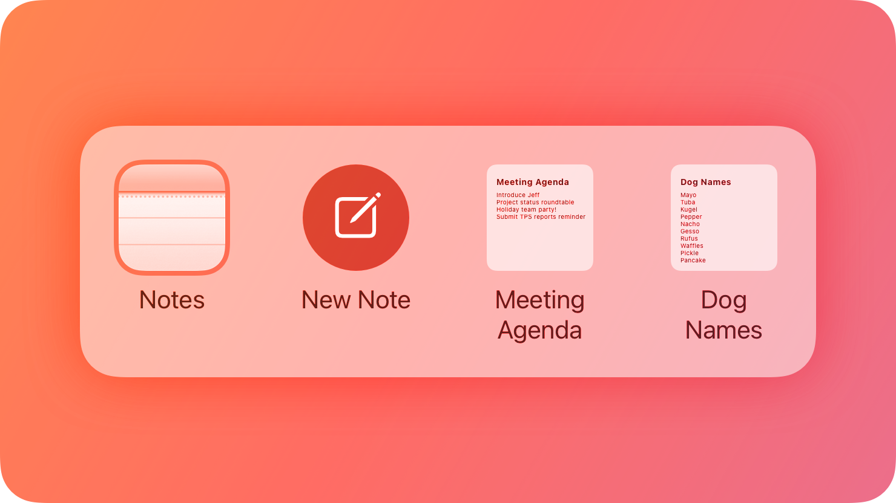
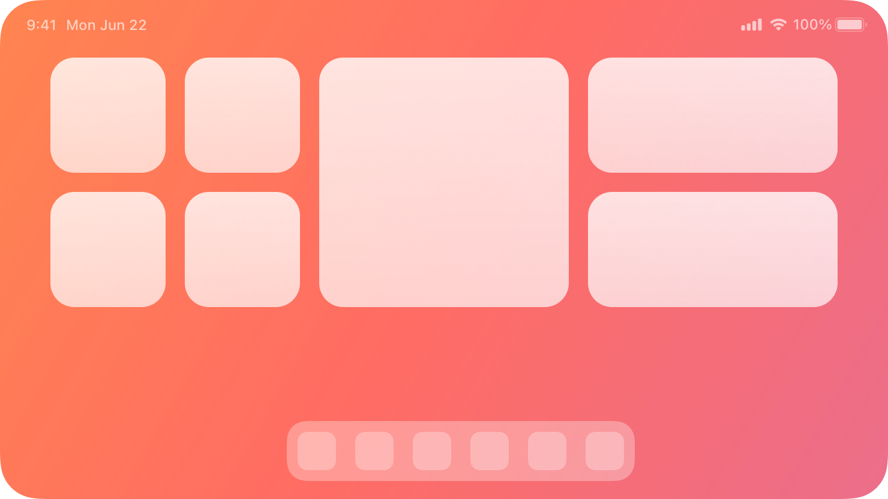

## Components › System experiences

System experiences are platform-level surfaces — shortcuts, complications, controls, Live Activities, notifications, status bars, Top Shelf, watch faces, and widgets — that let apps integrate directly into the operating system.

| Page | Path | URL |
|---|---|---|
| App Shortcuts | components/system-experiences/app-shortcuts | https://developer.apple.com/design/human-interface-guidelines/app-shortcuts |
| Complications | components/system-experiences/complications | https://developer.apple.com/design/human-interface-guidelines/complications |
| Controls | components/system-experiences/controls | https://developer.apple.com/design/human-interface-guidelines/controls |
| Live Activities | components/system-experiences/live-activities | https://developer.apple.com/design/human-interface-guidelines/live-activities |
| Notifications | components/system-experiences/notifications | https://developer.apple.com/design/human-interface-guidelines/notifications |
| Status bars | components/system-experiences/status-bars | https://developer.apple.com/design/human-interface-guidelines/status-bars |
| Top Shelf | components/system-experiences/top-shelf | https://developer.apple.com/design/human-interface-guidelines/top-shelf |
| Watch faces | components/system-experiences/watch-faces | https://developer.apple.com/design/human-interface-guidelines/watch-faces |
| Widgets | components/system-experiences/widgets | https://developer.apple.com/design/human-interface-guidelines/widgets |

---

### App Shortcuts

- **Path:** components/system-experiences/app-shortcuts
- **URL:** https://developer.apple.com/design/human-interface-guidelines/app-shortcuts
- **Hero:** 

App Shortcuts enable people to perform specific actions in your app using Siri, Spotlight, the Shortcuts app, or the Action button on supported devices, making key functionality accessible without launching the app. An App Shortcut is a focused task or action that exposes app functionality to the broader system.

#### Best practices

Offer App Shortcuts for the most important and frequently used tasks in your app. People use App Shortcuts to quickly complete actions that would otherwise require launching your app, so focus on tasks that are genuinely useful when accessed from outside your app. Make sure each shortcut represents a clearly defined, atomic action that completes in a reasonable amount of time.

Provide useful parameter options and a natural spoken name. App Shortcuts need a spoken-language phrase that people can use to invoke them with Siri. Use a phrase that feels natural and is distinct from other shortcuts in the system. Offer parameter options so people can customize the shortcut to their needs.

**Responding to App Shortcuts**

When a person invokes an App Shortcut through Siri, provide a clear and timely response. In cases where your shortcut requires additional input, ask for it naturally. Use snippets, dialogs, and visual responses that feel appropriate to the context.

#### Editorial guidelines

Use title-style capitalization for shortcut names. Describe the shortcut's action clearly and concisely. Avoid using your app name in the shortcut name unless it's necessary for disambiguation.

#### Platform considerations

**iOS/iPadOS:** App Shortcuts work with Siri, Spotlight, the Shortcuts app, and the Action button. Users can add App Shortcuts to the Home Screen.

**macOS:** App Shortcuts are available through Siri and the Shortcuts app.

#### Resources

- **Related:** Siri, Action button
- **Developer documentation:** App Intents

#### Change log

| Date | Changes |
|---|---|
| January 17, 2025 | New guidance added. |
| June 5, 2023 | New page. |

---

### Complications

- **Path:** components/system-experiences/complications
- **URL:** https://developer.apple.com/design/human-interface-guidelines/complications
- **Hero:** 

People often prefer apps that provide multiple, powerful complications, because it gives them quick ways to view the data they care about, even when they don't open the app. Most watch faces can display at least one complication; some can display four or more. Starting in watchOS 9, the system organizes complications (also known as accessories) into several families — like circular and inline — and defines some recommended layouts you can use to display your complication data. A watch face can specify the family it supports in each complication slot. Complications that work in earlier versions of watchOS can use the legacy templates, which define nongraphic complication styles that don't take on a wearer's selected color.

> Developer note Prefer using WidgetKit to develop complications for watchOS 9 and later. For guidance, see Migrating ClockKit complications to WidgetKit. To support earlier versions of watchOS, continue to implement the ClockKit complication data source protocol (see CLKComplicationDataSource).

#### Best practices

Identify essential, dynamic content that people want to view at a glance. Although people can use a complication to quickly launch an app, the complication behavior they appreciate more is the display of relevant information that always feels up to date. A static complication that doesn't display meaningful data may be less likely to remain in a prominent position on the watch face.

Support all complication families when possible. Supporting more families means that your complications are available on more watch faces. If you can't display useful information for a particular complication family, provide an image that represents your app — like your app icon — that still lets people launch your app from the watch face.

Consider creating multiple complications for each family. Supporting multiple complications helps you take advantage of shareable watch faces and lets people configure a watch face that's centered on an app they love. For example, an app that helps people train for triathlons could offer three circular complications — one for each segment of the race — each of which deep-links to the segment-specific area in the app. This app could also offer a shareable watch face that's preconfigured to include its swimming, biking, and running complications and to use its custom images and colors. When people choose this watch face, they don't have to do any configuration before they can start using it. For guidance, see Watch faces.

Define a different deep link for each complication you support. It works well when each complication opens your app to the most relevant area. If all the complications you support open the same area in your app, they can seem less useful.

Keep privacy in mind. With the Always-On Retina display, information on the watch face might be visible to people other than the wearer. Make sure you help people prevent potentially sensitive information from being visible to others. For guidance, see Always On.

Carefully consider when to update data. You provide a complication's data in the form of a timeline where each entry has a value that specifies the time at which to display your data on the watch face. Different data sets might require different time values. For example, a meeting app might display information about an upcoming meeting an hour before the meeting starts, but a weather app might display forecast information at the time those conditions are expected to occur. You can update the timeline a limited number of times each day, and the system stores a limited number of timeline entries for each app, so you need to choose times that enhance the usefulness of your data. For developer guidance, see Migrating ClockKit complications to WidgetKit.

#### Visual design

Choose a ring or gauge style based on the data you need to display. Many families support a ring or gauge layout that provides consistent ways to represent numerical values that can change over time. For example:

- The closed style can convey a value that's a percentage of a whole, such as for a battery gauge.
- The open style works well when the minimum and maximum values are arbitrary — or don't represent a percentage of the whole — like for a speed indicator.
- Similar to the open style, the segmented style also displays values within an app-defined range, and can convey rapid value changes, such as in the Noise complication.

Make sure images look good in tinted mode. In tinted mode, the system applies a solid color to a complication's text, gauges, and images, and desaturates full-color images unless you provide tinted versions of them. For developer guidance, see WidgetRenderingMode. (If you're using legacy templates, tinted mode applies only to graphic complications.) To help your complications perform well in tinted mode:

- Avoid using color as the only way to communicate important information. You want people to get the same information in tinted mode as they do in nontinted mode.
- When necessary, provide an alternative tinted-mode version of a full-color image. If your full-color image doesn't look good when it's desaturated, you can supply a different version of the image for the system to use in tinted mode.

Recognize that people might prefer to use tinted mode for complications, instead of viewing them in full color. When people choose tinted mode, the system automatically desaturates your complication, converting it to grayscale and tinting its images, gauges, and text using a single color that's based on the wearer's selected color.

When creating complication content, generally use line widths of two points or greater. Thinner lines can be difficult to see at a glance, especially when the wearer is in motion. Use line weights that suit the size and complexity of the image.

Provide a set of static placeholder images for each complication you support. The system uses placeholder images when there's no other content to display for your complication's data. For example, when people first install your app, the system can display a static placeholder while it checks to see if your app can generate a localized placeholder to use instead. Placeholder images can also appear in the carousel from which people select complications. Note that complication image sizes vary per layout (and per legacy template) and the size of a placeholder image may not match the size of the actual image you supply for that complication. For developer guidance, see placeholder(in:).

#### Circular

Circular layouts can include text, gauges, and full-color images in circular areas on the Infograph and Infograph Modular watch faces. The circular family also defines extra-large layouts for displaying content on the X-Large watch face.

As you design images for a regular-size circular complication, use the following values for guidance.

| Image | 40mm | 41mm | 44mm | 45mm/49mm |
|---|---|---|---|---|
| Image | 42x42 pt (84x84 px @2x) | 44.5x44.5 pt (89x89 px @2x) | 47x47 pt (94x94 px @2x) | 50x50 pt (100x100 px @2x) |
| Closed gauge | 27x27 pt (54x54 px @2x) | 28.5x28.5 pt (57x57 px @2x) | 31x31 pt (62x62 px @2x) | 32x32 pt (64x64 px @2x) |
| Open gauge | 11x11 pt (22x22 px @2x) | 11.5x11.5 pt (23x23 px @2x) | 12x12 pt (24x24 px @2x) | 13x13 pt (26x26 px @2x) |
| Stack (not text) | 28x14 pt (56x28 px @2x) | 29.5x15 pt (59X30 px @2x) | 31x16 pt (62x32px @ 2x) | 33.5x16.5 pt (67x33 px @2x) |

> Note The system applies a circular mask to each image.

A SwiftUI view that implements a regular-size circular complication uses the following default text values:

- Style: Rounded
- Weight: Medium
- Text size: 12 pt (40mm), 12.5 pt (41mm), 13 pt (44mm), 14.5 pt (45mm/49mm)

Use the following values for guidance as you create images for an extra-large circular complication.

| Image | 40mm | 41mm | 44mm | 45mm/49mm |
|---|---|---|---|---|
| Image | 120x120 pt (240x240 px @2x) | 127x127 pt (254x254 px @2x) | 132x132 pt (264x264 px @2x) | 143x143 pt (286x286 px @2x) |
| Open gauge | 31x31 pt (62x62 px @2x) | 33x33 pt (66x66 px @2x) | 33x33 pt (66x66 px @2x) | 37x37 pt (74x74 px @2x) |
| Closed gauge | 77x77 pt (154x154 px @2x) | 81.5x81.5 (163x163 px @2x) | 87x87 pt (174x174 px @2x) | 91.5x91.5 (183x183 px @2x) |
| Stack | 80x40 pt (160x80 px @2x) | 85x42 (170x84 px @2x) | 87x44 pt (174x88 px @2x) | 95x48 pt (190x96 px @2x ) |

> Note The system applies a circular mask to the circular, open-gauge, and closed-gauge images.

Use the following values to create no-content placeholder images for your circular-family complications.

| Layout | 38mm | 40mm/42mm | 41mm | 44mm | 45mm/49mm |
|---|---|---|---|---|---|
| Circular | – | 42x42 pt (84x84 px @2x) | 44.5x44.5 pt (89x89 px @2x) | 47x47 pt (94x94 px @2x) | 50x50 pt (100x100 px @2x) |
| Bezel | – | 42x42 pt (84x84 px @2x) | 44.5x44.5 pt (89x89 px @2x) | 47x47 pt (94x94 px @2x) | 50x50 pt (100x100 px @2x) |
| Extra Large | – | 120x120 pt (240x240 px @2x) | 127x127 pt (254x254 px @2x) | 132x132 pt (264x264 px @2x) | 143x143 pt (286x286 px @2x) |

A SwiftUI view that implements an extra-large circular layout uses the following default text values:

- Style: Rounded
- Weight: Medium
- Text size: 34.5 pt (40mm), 36.5 pt (41mm), 36.5 pt (44mm), 41 pt (45mm/49mm)

#### Corner

Corner layouts let you display full-color images, text, and gauges in the corners of the watch face, like Infograph. Some of the templates also support multicolor text.

As you design images for a corner complication, use the following values for guidance.

| Image | 40mm | 41mm | 44mm | 45mm/49mm |
|---|---|---|---|---|
| Circular | 32x32 pt (64x64 px @2x) | 34x34 pt (68x68 px @2x) | 36x36 pt (72x72 px @2x) | 38x38 pt (76x76 px @2x ) |
| Gauge | 20x20 pt (40x40 px @2x) | 21x21 pt (42x42 px @2x) | 22x22 pt (44x44 px @2x) | 24x24 pt (48x48 px @2x) |
| Text | 20x20 pt (40x40 px @2x) | 21x21 pt (42x42 px @2x) | 22x22 pt (44x44 px @2x) | 24x24 pt (48x48 px @2x) |

> Note The system applies a circular mask to each image.

Use the following values to create no-content placeholder images for your corner-family complications.

| 38mm | 40mm/42mm | 41mm | 44mm | 45mm/49mm |
|---|---|---|---|---|
| – | 20x20 pt (40x40 px @2x) | 21x21 pt (42x42 px @2x) | 22x22 pt (44x44 px @2x) | 24x24 pt (48x48 px @2x) |

A SwiftUI view that implements a corner layout uses the following default text values:

- Style: Rounded
- Weight: Semibold
- Text size: 10 pt (40mm), 10.5 pt (41mm), 11 pt (44mm), 12 pt (45mm/49mm)

#### Inline

Inline layouts include utilitarian small and large layouts. Utilitarian small layouts are intended to occupy a rectangular area in the corner of a watch face, such as the Chronograph and Simple watch faces. The content can include an image, interface icon, or a circular graph.

As you design images for a utilitarian small layout, use the following values for guidance.

| Content | 38mm | 40mm/42mm | 41mm | 44mm | 45mm/49mm |
|---|---|---|---|---|---|
| Flat | 9-21x9 pt (18-42x18 px @2x) | 10-22x10 pt (20-44x20 px @2x) | 10.5-23.5x21 pt (21-47x21 @2x) | N/A | 12-26x12 pt (24-52x24 px @2x) |
| Ring | 14x14 pt (28x28 px @2x) | 14x14 pt (28x28 px @2x) | 15x15 pt (30x30 px @2x) | 16x16 pt (32x32 px @2x) | 16.5x16.5 pt (33x33 px @2x) |
| Square | 20x20 pt (40x40 px @2x) | 22x22 pt (44x44 px @2x) | 23.5x23.5 pt (47x47 px @2x) | 25x25 pt (50x50 px @2x) | 26x26 pt (52x52 px @2x) |

The utilitarian large layout is primarily text-based, but also supports an interface icon placed on the leading side of the text. This layout spans the bottom of a watch face, like the Utility or Motion watch faces.

As you design images for a utilitarian large layout, use the following values for guidance.

| Content | 38mm | 40mm/42mm | 41mm | 44mm | 45mm/49mm |
|---|---|---|---|---|---|
| Flat | 9-21x9 pt (18-42x18 px @2x) | 10-22x10 pt (20-44x20 px @2x) | 10.5-23.5x10.5 pt (21-47x21 px @2x) | N/A | 12-26x12 pt (24-52x24 px @2x) |

#### Rectangular

Rectangular layouts can display full-color images, text, a gauge, and an optional title in a large rectangular region. Some of the text fields can support multicolor text.

The large rectangular region works well for showing details about a value or process that changes over time, because it provides room for information-rich charts, graphs, and diagrams. For example, the Heart Rate complication displays a graph of heart-rate values within a 24-hour period. The graph uses high-contrast white and red for the primary content and a lower-contrast gray for the graph lines and labels, making the data easy to understand at a glance.

Starting with watchOS 10, if you have created a rectangular layout for your watchOS app, the system may display it in the Smart Stack. You can optimize this presentation in a few ways:

- By supplying background color or content that communicates information or aids in recognition
- By using intents to specify relevancy, and help ensure that your widget is displayed in the Smart Stack at times that are most appropriate and useful to people
- By creating a custom layout of your information that is optimized for the Smart Stack

For developer guidance, see WidgetFamily.accessoryRectangular. See Widgets for additional guidance on designing widgets for the Smart Stack.

Use the following values for guidance as you create images for a rectangular layout.

| Content | 40mm | 41mm | 44mm | 45mm/49mm |
|---|---|---|---|---|
| Large image with title * | 150x47 pt (300x94 px @2x) | 159x50 pt (318x100 px @2x) | 171x54 pt (342x108 px @2x) | 178.5x56 pt (357x112 px @2x) |
| Large image without title * | 162x69 pt (324x138 px @2x) | 171.5x73 pt (343x146 px @2x) | 184x78 pt (368x156 px @2x) | 193x82 pt (386x164 px @2x) |
| Standard body | 12x12 pt (24x24 px @2x) | 12.5x12.5 pt (25x25 px @2x) | 13.5x13.5 pt (27x27 px @2x) | 14.5x14.5 pt (29x29 px @2x) |
| Text gauge | 12x12 pt (24x24 px @2x) | 12.5x12.5 pt (25x25 px @2x) | 13.5x13.5 pt (27x27 px @2x) | 14.5x14.5 pt (29x29 px @2x) |

> Note Both large-image layouts automatically include a four-point corner radius.

A SwiftUI view that implements a rectangular layout uses the following default text values:

- Style: Rounded
- Weight: Medium
- Text size: 16.5 pt (40mm), 17.5 pt (41mm), 18 pt (44mm), 19.5 pt (45mm/49mm)

#### Legacy templates

**Circular small**

Circular small templates display a small image or a few characters of text. They appear in the corner of the watch face (for example, in the Color watch face).

As you design images for a circular small complication, use the following values for guidance.

| Image | 38mm | 40mm/42mm | 41mm | 44mm | 45mm/49mm |
|---|---|---|---|---|---|
| Ring | 20x20 pt (40x40 px @2x) | 22x22 pt (44x44 px @2x) | 23.5x23.5 pt (47x47 px @2x) | 24x24 pt (48x48 px @2x) | 26x26 pt (52x52 px @2x) |
| Simple | 16x16 pt (32x32 px @2x) | 18x18 pt (36x36 px @2x) | 19x19 pt (38x38 px @2x) | 20x20 pt (40x40 px @2x) | 21.5x21.5 pt (43x43 px @2x) |
| Stack | 16x7 pt (32x14 px @2x) | 17x8 pt (34x16 px @2x) | 18x8.5 pt (36x17 px @2x) | 19x9 pt (38x18 px @2x) | 19x9.5 pt (38x19 px @2x) |
| Placeholder | 16x16 pt (32x32 px @2x) | 18x18x pt (36x36 px @2x) | 19x19 pt (38x38 px @2x) | 20x20 pt (40x40 px @2x) | 21.5x21.5 pt (43x43 px @2x) |

> Note In each stack measurement, the width value represents the maximum size.

**Modular small**

Modular small templates display two stacked rows consisting of an icon and content, a circular graph, or a single larger item (for example, the bottom row of complications on the Modular watch face).

As you design icons and images for a modular small complication, use the following values for guidance.

| Image | 38mm | 40mm/42mm | 41mm | 44mm | 45mm/49mm |
|---|---|---|---|---|---|
| Ring | 18x18 pt (36x36 px @2x) | 19x19 pt (38x38 px @2x) | 20x20 pt (40x40 px @2x) | 21x21 pt (42x42 px @2x) | 22.5x22.5 pt (45x45 px @2x) |
| Simple | 26x26 pt (52x52 px @2x) | 29x29 pt (58x58 px @2x) | 30.5x30.5 pt (61x61 px @2x) | 32x32 pt (64x64 px @2x) | 34.5x34.5 pt (69x69 px @2x) |
| Stack | 26x14 pt (52x28 px @2x) | 29x15 pt (58x30 px @2x) | 30.5x16 pt (61x32 px @2x) | 32x17 pt (64x34 px @2x) | 34.5x18 pt (69x36 px @2x) |
| Placeholder | 26x26 pt (52x52 px @2x) | 29x29 pt (58x58 px @2x) | 30.5x30.5 pt (61x61 px @2x) | 32x32 pt (64x64 px @2x) | 34.5x34.5 pt (69x69 px @2x) |

> Note In each stack measurement, the width value represents the maximum size.

**Modular large**

Modular large templates offer a large canvas for displaying up to three rows of content (for example, in the center of the Modular watch face).

As you design icons and images for a modular large complication, use the following values for guidance.

| Content | 38mm | 40mm/42mm | 41mm | 44mm | 45mm/49mm |
|---|---|---|---|---|---|
| Columns | 11-32x11 pt (22-64x22 px @2x) | 12-37x12 pt (24-74x24 px @2x) | 12.5-39x12.5 pt (25-78x25 px @2x) | 14-42x14 pt (28-84x28 px @2x) | 14.5-44x14.5 pt (29-88x29 px @2x) |
| Standard body | 11-32x11 pt (22-64x22 px @2x) | 12-37x12 pt (24-74x24 px @2x) | 12.5-39x12.5 pt (25-78x25 px @2x) | 14-42x14 pt (28-84x28 px @2x) | 14.5-44x14.5 pt (29-88x29 px @2x) |
| Table | 11-32x11 pt (22-64x22 px @2x) | 12-37x12 pt (24-74x24 px @2x) | 12.5-39x12.5 pt (25-78x25 px @2x) | 14-42x14 pt (28-84x28 px @2x) | 14.5-44x14.5 pt (29-88x29 px @2x) |

**Extra large**

Extra large templates display larger text and images (for example, on the X-Large watch faces).

As you design icons and images for an extra large complication, use the following values for guidance.

| Image | 38mm | 40mm/42mm | 41mm | 44mm | 45mm/49mm |
|---|---|---|---|---|---|
| Ring | 63x63 pt (126x126 px @2x) | 66.5x66.5 pt (133x133 px @2x) | 70.5x70.5 pt (141x141 px @2x) | 73x73 pt (146x146 px @2x) | 79x79 pt (158x158 px @2x) |
| Simple | 91x91 pt (182x182 px @2x) | 101.5x101.5 pt (203x203 px @2x) | 107.5x107.5 pt (215x215 px @2x) | 112x112 pt (224x224 px @2x) | 121x121 pt (242x242 px @2x ) |
| Stack | 78x42 pt (156x84 px @2x) | 87x45 pt (174x90 px @2x) | 92x47.5 pt (184x95 px @2x) | 96x51 pt (192x102 px @2x) | 103.5x53.5 pt (207x107 px @2x) |
| Placeholder | 91x91 pt (182x182 px @2x) | 101.5x101.5 pt (203x203 px @2x) | 107.5x107.5 pt (215x215 px @2x) | 112x112 pt (224x224 px @2x) | 121x121 pt (242x242 px @2x) |

> Note In each stack measurement, the width value represents the maximum size.

#### Platform considerations

Not supported in iOS, iPadOS, macOS, tvOS, or visionOS.

#### Resources

- **Related:** Watch faces
- **Developer documentation:** WidgetKit

#### Change log

| Date | Changes |
|---|---|
| October 24, 2023 | Replaced links to deprecated ClockKit documentation with links to WidgetKit documentation. |
| June 5, 2023 | Updated guidance for rectangular complications to support them as widgets in the Smart Stack. |
| September 14, 2022 | Added specifications for Apple Watch Ultra. |

---

### Controls

- **Path:** components/system-experiences/controls
- **URL:** https://developer.apple.com/design/human-interface-guidelines/controls
- **Hero:** 

A control is a button or toggle that provides quick access to your app's features from other areas of the system. Control buttons perform an action, link to a specific area of your app, or launch a camera experience on a locked device. Control toggles switch between two states, such as on and off. People can add controls to Control Center by pressing and holding in an empty area of Control Center, to the Lock Screen by customizing their Lock Screen, and to the Action button by configuring the Action button in the Settings app.

#### Anatomy

Controls contain a symbol image, a title, and, optionally, a value. The symbol visually represents what the control does and can be a symbol from SF Symbols or a custom symbol. The title describes what the control relates to, and the value represents the state of the control. For example, the title can display the name of a light in a room, while the value can display whether it's on or off.

Controls display their information differently depending on where they appear:

- In Control Center, a control displays its symbol and, at larger sizes, its title and value.
- On the Lock Screen, a control displays its symbol.
- On iPhone devices with a control assigned to the Action button, pressing and holding it displays the control's symbol in the Dynamic Island, as well as its value (if present).

#### Best practices

Offer controls for actions that provide the most benefit without having to launch your app. For example, launching a Live Activity from a control creates an easy and seamless experience that informs someone about progress without having to navigate to your app to stay up to date. For guidance, see Live Activities.

Update controls when someone interacts with them, when an action completes, or remotely with a push notification. Update the contents of a control to accurately reflect the state and show if an action is still in progress.

Choose a descriptive symbol that suggests the behavior of the control. Depending on where a person adds a control, it may not display the title and value, so the symbol needs to convey enough information about the control's action. For control toggles, provide a symbol for both the on and off states. For example, use the SF Symbols door.garage.open and door.garage.closed to represent a control that opens and closes a garage door. For guidance, see SF Symbols.

Use symbol animations to highlight state changes. For control toggles, animate the transition between both on and off states. For control buttons with actions that have a duration, animate indefinitely while the action performs and stop animating when the action is complete. For developer guidance, see Symbols and SymbolEffect.

Select a tint color that works with your app's brand. The system applies this tint color to a control toggle's symbol in its on state. When a person performs the action of a control from the Action button, the system also uses this tint color to display the value and symbol in the Dynamic Island. For guidance, see Branding.

Help people provide additional information the system needs to perform an action. A person may need to configure a control to perform a desired action — for example, select a specific light in a house to turn on and off. If a control requires configuration, prompt people to complete this step when they first add it. People can reconfigure the control at any time. For developer guidance, see promptsForUserConfiguration().

Provide hint text for the Action button. When a person presses the Action button, the system displays hint text to help them understand what happens when they press and hold. When someone presses and holds the Action button, the system performs the action configured to it. Use verbs to construct the hint text. For developer guidance, see controlWidgetActionHint(_:).

If your control title or value can vary, include a placeholder. Placeholder information tells people what your control does when the title and value are situational. The system displays this information when someone brings up the controls gallery in Control Center or the Lock Screen and chooses your control, or before they assign it to the Action button.

Hide sensitive information when the device is locked. When the device is locked, consider having the system redact the title and value to hide personal or security-related information. Specify if the system needs to redact the symbol state as well. If specified, the system redacts the title and value, and displays the symbol in its off state.

Require authentication for actions that affect security. For example, require people to unlock their device to access controls to lock or unlock the door to their house or start their car. For developer guidance, see IntentAuthenticationPolicy.

#### Camera experiences on a locked device

If your app supports camera capture, starting with iOS 18 you can create a control that launches directly to your app's camera experience while the device is locked. For any task beyond capture, a person must authenticate and unlock their device to complete the task in your app. For developer guidance, see LockedCameraCapture.

Use the same camera UI in your app and your camera experience. Sharing UI leverages people's familiarity with the app. By using the same UI, the transition to the app is seamless when someone captures content and taps a button to perform additional tasks, such as posting to a social network or editing a photo.

Provide instructions for adding the control. Help people understand how to add the control that launches this camera experience.

#### Platform considerations

No additional considerations for iOS, iPadOS, or macOS. Not supported in watchOS, tvOS, or visionOS.

#### Resources

- **Related:** Widgets, Action button
- **Developer documentation:** LockedCameraCapture, WidgetKit

#### Change log

| Date | Changes |
|---|---|
| June 10, 2024 | New page. |

---

### Live Activities

- **Path:** components/system-experiences/live-activities
- **URL:** https://developer.apple.com/design/human-interface-guidelines/live-activities
- **Hero:** 

Live Activities let people keep track of tasks and events in glanceable locations across devices. They go beyond push notifications, delivering frequent content and status updates over a few hours and letting people interact with the displayed information. For example, a Live Activity might show the remaining time until a food delivery order arrives, live in-game information for a soccer match, or real-time fitness metrics and interactive controls to pause or cancel a workout.

Live Activities start on iPhone or iPad and automatically appear in system locations across a person's devices:

| Platform or system experience | Location |
|---|---|
| iPhone and iPad | Lock Screen, Home Screen, in the Dynamic Island and StandBy on iPhone |
| Mac | The menu bar |
| Apple Watch | Smart Stack |
| CarPlay | CarPlay Dashboard |

#### Anatomy

Live Activities appear across the system in various locations like the Dynamic Island and the Lock Screen. It serves as a unified home for alerts and indicators of ongoing activity. Depending on the device and system location where a Live Activity appears, the system chooses a presentation style or a combination of styles to compose the appearance of your Live Activity. As a result, your Live Activity must support:

- Compact
- Minimal
- Expanded
- Lock Screen

In iOS and iPadOS, your Live Activity appears throughout the system using these presentations. Additionally, the system uses them to create default appearances for other contexts. For example, the compact presentation appears in the Dynamic Island on iPhone and consists of two elements that the system combines into a single view for Apple Watch and in CarPlay.

**Compact**

In the Dynamic Island, the system uses the compact presentation when only one Live Activity is active. The presentation consists of two separate elements: one on the leading side of the TrueDepth camera and one on the trailing side. Despite its limited space, the compact presentation displays up-to-date information about your app's Live Activity. For design guidance, see Compact presentation.

**Minimal**

When multiple Live Activities are active, the system uses the minimal presentation to display two of them in the Dynamic Island. One appears attached to the Dynamic Island while the other appears detached. Depending on its content size, the detached minimal presentation appears circular or oval. As with the compact presentation, people tap the minimal presentation to open its app or touch and hold it to see the expanded presentation. For design guidance, see Minimal presentation.

**Expanded**

When people touch and hold a Live Activity in compact or minimal presentation, the system displays the expanded presentation. For design guidance, see Expanded presentation.

**Lock Screen**

The system uses the Lock Screen presentation to display a banner at the bottom of the Lock Screen. In this presentation, use a layout similar to the expanded presentation. When you alert people about Live Activity updates on devices that don't support the Dynamic Island, the Lock Screen presentation briefly appears as a banner that overlays the Home Screen or other apps. For design guidance, see Lock Screen presentation.

**StandBy**

On iPhone in StandBy, your Live Activity appears in the minimal presentation. When someone taps it, it transitions to the Lock Screen presentation, scaled up by 2x to fill the screen. If your Lock Screen presentation uses a custom background color, the system automatically extends it to the whole screen to create a seamless, full-screen design. For design guidance, see StandBy presentation.

#### Best practices

Offer Live Activities for tasks and events that have a defined beginning and end. Live Activities work best for tracking short to medium duration activities that don't exceed eight hours.

Focus on important information that people need to see at a glance. Your Live Activity doesn't need to display everything. Think about what information people find most useful and prioritize sharing it in a concise way. When a person wants to learn more, they can tap your Live Activity to open your app where you can provide additional detail.

Don't use a Live Activity to display ads or promotions. Live Activities help people stay informed about ongoing events and tasks, so it's important to display only information that's related to those events and tasks.

Avoid displaying sensitive information. Live Activities are prominently visible and could be viewed by casual observers; for example, on the Lock Screen or in the Always-On display. For content people might consider sensitive or private, display an innocuous summary and let people tap the Live Activity to view the sensitive information in your app. Alternatively, redact views that may contain sensitive information and let people configure whether to show sensitive data. For developer guidance, see Creating a widget extension.

Create a Live Activity that matches your app's visual aesthetic and personality in both dark and light appearances. This makes it easier for people to recognize your Live Activity and creates a visual connection to your app.

If you include a logo mark, display it without a container. This better integrates the logo mark with your Live Activity layout. Don't use the entire app icon.

Don't add elements to your app that draw attention to the Dynamic Island. Your Live Activity appears in the Dynamic Island while your app isn't in use, and other items can appear in the Dynamic Island when your app is open.

Ensure text is easy to read. Use large, heavier-weight text — a medium weight or higher. Use small text sparingly and make sure key information is legible at a glance.

**Creating Live Activity layouts**

Adapt to different screen sizes and presentations. Live Activities scale to fit various device screens. Create layouts and assets for various devices and scale factors, recognizing that the actual size on screen may vary or change. Ensure they look great everywhere by using the values in Specifications as guidance and providing appropriately sized content.

Adjust element size and placement for efficient use of space. Create a layout that only uses the space you need to clearly display its content. Adapt the size and placement of elements in your Live Activity so they fit well together.

Use familiar layouts for custom views and layouts. Templates with default system margins and recommended text sizes are available in Apple Design Resources. Using them helps your Live Activity remain legible at a glance and fit in with the visual language of its surroundings; for example, the Smart Stack on Apple Watch.

Use consistent margins and concentric placement. Use even, matching margins between rounded shapes and the edges of the Live Activity, including corners, to ensure a harmonious fit. This prevents elements from poking into the rounded shape of the Live Activity and creating visual tension. For example, when placing a rounded rectangle near a corner of your Live Activity, match its corner radius to the outer corner radius of the Live Activity by subtracting the margin and using a SwiftUI container to apply the correct corner radius. For developer guidance, see ContainerRelativeShape.

Keep content compact and snug within a margin that's concentric to the outer edge of the Live Activity.

When separating a block of content, place it in an inset container shape or use a thick line. Don't draw content all the way to the edge of the Dynamic Island.

> Tip To align nonrounded content in the rounded corners of the Live Activity view, it may be helpful to blur the nonrounded content in your drawing tool. When the content is blurred, it may be easier to find the positioning that best aligns with the outer perimeter of the view.

Dynamically change the height of your Live Activity on the Lock Screen or in the expanded presentation. When there's less information to show, reduce the height of the Live Activity to only use the space needed for the content. When more information becomes available, increase the height to display additional content.

**Choosing colors**

Carefully consider using a custom background color and opacity. You can't customize background colors for compact, minimal, and expanded presentations. However, you can use a custom background color for the Lock Screen presentation. If you set a custom background color or image for the Lock Screen presentation, ensure sufficient contrast — especially for tint colors on devices that feature an Always-On display with reduced luminance.

Use color to express the character and identity of your app. Live Activities in the Dynamic Island use a black opaque background. Consider using bold colors for text and objects to convey the personality and brand of your app. Bold colors make your Live Activity recognizable at a glance, stand out from other Live Activities, and feel like a small, glanceable part of your app. Additionally, bold colors can help reinforce the relationship between elements in the Live Activity itself.

Tint your Live Activity's key line color so that it matches your content. When the background is dark — for example, in Dark Mode — a key line appears around the Dynamic Island to distinguish it from other content. Choose a key line color that's consistent with the color of other elements in your Live Activity. For developer guidance, see Creating custom views for Live Activities.

**Adding transitions and animating content updates**

In addition to extending and contracting transitions, Live Activities use system and custom animations with a maximum duration of two seconds. Note that the system doesn't perform animations on Always-On displays with reduced luminance.

Use animations to reinforce the information you're communicating and to bring attention to updates. In addition to moving the position of elements, you can animate elements in and out with the default content-replace transition, or create custom transitions using scale, opacity, and movement. For example, a sports app might use numeric content transitions for score changes or fade a timer in and out when it reaches zero.

Animate layout changes. Content updates can require a change to your Live Activity layout — for example, when it expands to fill the screen in StandBy or when more information becomes available. During the transition to a new layout, preserve as much of the existing layout as possible by animating existing elements to their new positions rather than removing and animating them back in.

Try to avoid overlapping elements. Sometimes, it's best to animate out certain elements and then re-animate them in at a new position to avoid colliding with other parts of your transition. For example, when animating items in lists, only animate the element that moves to a new position and use fade-in-and-out transitions for the other list items.

For developer guidance, see Animating data updates in widgets and Live Activities.

**Offering interactivity**

Make sure tapping the Live Activity opens your app at the right location. Take people directly to related details and actions — don't make them navigate to find relevant information. For developer guidance on SwiftUI views that support deep linking to specific screens, see Linking to specific app scenes from your widget or Live Activity.

Focus on simple, direct actions. Buttons or toggles take up space that might otherwise display useful information. Only include interactive elements for essential functionality that's directly related to your Live Activity and that people activate once or temporarily pause and resume, like music playback, workouts, or apps that access the microphone to record live audio. If you offer interactivity, prefer limiting it to a single element to help people avoid accidentally tapping the wrong control.

Consider letting people respond to event or progress updates. If an update to your Live Activity is something that a person could respond to, consider offering a button or toggle to let people take action.

**Starting, updating, and ending a Live Activity**

Start Live Activities at appropriate times, and make it easy for people to turn them off in your app. People expect Live Activities to start and provide important updates for a task at hand or at specific times, even automatically.

Offer an App Shortcut that starts your Live Activity. App Shortcuts expose functionality to the system, allowing access in various contexts. For example, create an App Shortcut that allows people to start your Live Activity using the Action button on iPhone.

Update a Live Activity only when new content is available. If the underlying content or status remains the same, maintain the same display until the underlying content or status changes.

Alert people only for essential updates that require their attention. Live Activity alerts light up the screen and by default play the notification sound to alert people about updates they shouldn't miss.

Let people track multiple events efficiently with a single Live Activity. Instead of creating separate Live Activities people need to jump between to track different events, prefer a single Live Activity that uses a dynamic layout and rotates through events.

Always end a Live Activity immediately when the task or event ends, and consider setting a custom dismissal time. When a Live Activity ends, the system immediately removes it from the Dynamic Island and in CarPlay. On the Lock Screen, in the Mac menu bar, and the watchOS Smart Stack, it remains for up to four hours.

#### Presentation

Your Live Activity needs to support all locations, devices, and their corresponding appearances. Because it appears across systems at different dimensions, create Live Activity layouts that best support each place they appear.

Start with the iPhone design, then refine it for other contexts. Create standard designs for each presentation first. Then, depending on the functionality that your Live Activity provides, design additional custom layouts for specific contexts like iPhone in StandBy, CarPlay, or Apple Watch.

**Compact presentation**

Focus on the most important information. Use the compact presentation to show dynamic, up-to-date information that's essential to the Live Activity and easy to understand.

Ensure unified information and design of the compact presentations in the Dynamic Island. Though the TrueDepth camera separates the leading and trailing elements, design them to read as a single piece of information, and use consistent color and typography to help create a connection between both elements.

Keep content as narrow as possible and ensure it's snug against the TrueDepth camera. Try not to obscure key information in the status bar, and don't add padding between content and the TrueDepth camera. Maintain a balanced layout with similarly sized views for both leading and trailing elements.

Link to relevant app content. When people tap a compact Live Activity, open your app directly to the related details. Ensure both leading and trailing elements link to the same screen.

**Minimal presentation**

Ensure that your Live Activity is recognizable in the minimal presentation. If possible, display updated information rather than just a logo, while ensuring people can quickly recognize your app. For example, the Timer app's minimal Live Activity presentation displays the remaining time instead of a static icon.

**Expanded presentation**

Maintain the relative placement of elements to create a coherent layout between presentations. The expanded presentation is an enlarged version of the compact or minimal presentation. Ensure information and layouts expand predictably when the Live Activity expands.

Wrap content tightly around the TrueDepth camera. Arrange content close to the TrueDepth camera, and try to avoid leaving too much room around it to use space more efficiently and to help diminish the camera's presence.

**Lock Screen presentation**

Don't replicate notification layouts. Create a unique layout that's specific to the information that appears in the Live Activity.

Choose colors that work well on a personalized Lock Screen. People customize their Lock Screen with wallpapers, custom tint colors, and widgets. To make a Live Activity fit a custom Lock Screen aesthetic while remaining legible, use custom background or tint colors and opacity sparingly.

Make sure your design, assets, and colors look great and offer enough contrast in Dark Mode and on an Always-On display. By default, a Live Activity on the Lock Screen uses a light background color in the light appearance and a dark background color in the dark appearance.

Verify the generated color of the dismiss button. The system automatically generates a matching dismiss button based on the background and foreground colors of your Live Activity. Verify that the generated color matches your design and adjust it if needed using activitySystemActionForegroundColor(_:).

Use standard margins to align your design with notifications. The standard layout margin for Live Activities on the Lock Screen is 14 points.

**StandBy presentation**

Update your layout for StandBy. Make sure assets look great at the larger scale, and consider creating a custom layout that makes use of the extra space.

Consider using the default background color in StandBy. The default background color seamlessly blends your Live Activity with the device bezel, achieves a softer look that integrates with a person's surroundings, and allows the system to scale the Live Activity slightly larger because it doesn't need to account for the margins around the TrueDepth camera.

Use standard margins and avoid extending graphic elements to the edge of the screen. Without standard margins, content gets cut off as the Live Activity extends, making it feel broken.

Verify your design in Night Mode. In Night Mode, the system applies a red tint to your Live Activity. Check that your Live Activity design uses colors that provide enough contrast in Night Mode.

#### CarPlay

In CarPlay, the system automatically combines the leading and trailing elements of the compact presentation into a single layout that appears on CarPlay Dashboard.

Your Live Activity design applies to both CarPlay and Apple Watch, so design for both contexts. While Live Activities on Apple Watch can be interactive, the system deactivates interactive elements in CarPlay.

Consider creating a custom layout if your Live Activity would benefit from larger text or additional information. Instead of using the default appearance in CarPlay, declare support for a ActivityFamily.small supplemental activity family.

Carefully consider including buttons or toggles in your custom layout. In CarPlay, the system deactivates interactive elements in your Live Activity. If people are likely to start or observe your Live Activity while driving, prefer displaying timely content rather than buttons and toggles.

#### Platform considerations

No additional considerations for iOS or iPadOS. Not supported in tvOS or visionOS.

**macOS**

Active Live Activities automatically appear in the Menu bar of a paired Mac using the compact, minimal, and expanded presentations. Clicking the Live Activity launches iPhone Mirroring to display your app.

**watchOS**

When a Live Activity begins on iPhone, it appears on a paired Apple Watch at the top of the Smart Stack. By default, the view displayed in the Smart Stack combines the leading and trailing elements from the Live Activity's compact presentation on iPhone.

If you offer a watchOS app and someone taps the Live Activity in the Smart Stack, it opens your watchOS app. Without a watchOS app, tapping opens a full-screen view with a button to open your app on the paired iPhone.

Consider creating a custom watchOS layout. While the system provides a default view automatically, a custom layout designed for Apple Watch can show more information and add interactive functionality like a button or toggle.

Carefully consider including buttons or toggles in your custom layout. The custom watchOS layout also applies to your Live Activity in CarPlay where the system deactivates interactive elements. If people are likely to start or observe your Live Activity while driving, don't include buttons or toggles in your custom watchOS layout.

Focus on essential information and significant updates. Use space in the Smart Stack as efficiently as possible and think of the most useful information that a Live Activity can convey:

- Progress, like the estimated arrival time of a delivery
- Interactive elements, like stopwatch or timer controls
- Significant updates, like sports score changes

#### Specifications

When you design your Live Activities, use the following values for guidance.

**CarPlay dimensions**

The system may scale your Live Activity to best fit a vehicle's screen size and resolution. Use the listed values to verify your design:

| Live Activity size (pt) |
|---|
| 240x78 |
| 240x100 |
| 170x78 |

Test your designs with the CarPlay Simulator and the following configurations for Smart Display Zoom — available in Settings > Display in CarPlay:

| Configuration | Resolution (pt) |
|---|---|
| Widescreen | 1920x720 |
| Portrait | 900x1200 |
| Standard | 800x480 |

**iOS dimensions**

All values listed in the tables below are in points.

| Screen dimensions (portrait) | Compact leading | Compact trailing | Minimal (width given as a range) | Expanded (height given as a range) | Lock Screen (height given as a range) |
|---|---|---|---|---|---|
| 430x932 | 62.33x36.67 | 62.33x36.67 | 36.67–45x36.67 | 408x84–160 | 408x84–160 |
| 393x852 | 52.33x36.67 | 52.33x36.67 | 36.67–45x36.67 | 371x84–160 | 371x84–160 |

The Dynamic Island uses a corner radius of 44 points, and its rounded corner shape matches the TrueDepth camera.

| Presentation type | Device | Dynamic Island width (pt) |
|---|---|---|
| Compact or minimal | iPhone 17 Pro Max | 250 |
|  | iPhone 17 Pro | 230 |
|  | iPhone Air | 250 |
|  | iPhone 17 | 230 |
|  | iPhone 16 Pro Max | 250 |
|  | iPhone 16 Pro | 230 |
|  | iPhone 16 Plus | 250 |
|  | iPhone 16 | 230 |
|  | iPhone 15 Pro Max | 250 |
|  | iPhone 15 Pro | 230 |
|  | iPhone 15 Plus | 250 |
|  | iPhone 15 | 230 |
|  | iPhone 14 Pro Max | 250 |
|  | iPhone 14 Pro | 230 |
| Expanded | iPhone 17 Pro Max | 408 |
|  | iPhone 17 Pro | 371 |
|  | iPhone Air | 408 |
|  | iPhone 17 | 371 |
|  | iPhone 16 Pro Max | 408 |
|  | iPhone 16 Pro | 371 |
|  | iPhone 16 Plus | 408 |
|  | iPhone 16 | 371 |
|  | iPhone 15 Pro Max | 408 |
|  | iPhone 15 Pro | 371 |
|  | iPhone 15 Plus | 408 |
|  | iPhone 15 | 371 |
|  | iPhone 14 Pro Max | 408 |
|  | iPhone 14 Pro | 371 |

**iPadOS dimensions**

All values listed in the table below are in points.

| Screen dimensions (portrait) | Lock Screen (height given as a range) |
|---|---|
| 1366x1024 | 500x84–160 |
| 1194x834 | 425x84–160 |
| 1012x834 | 425x84–160 |
| 1080x810 | 425x84–160 |
| 1024x768 | 425x84–160 |

**macOS dimensions**

Use the provided iOS dimensions.

**watchOS dimensions**

Live Activities in the Smart Stack use the same dimensions as watchOS widgets.

| Apple Watch size | Size of a Live Activity in the Smart Stack (pt) |
|---|---|
| 40mm | 152x69.5 |
| 41mm | 165x72.5 |
| 44mm | 173x76.5 |
| 45mm | 184x80.5 |
| 49mm | 191x81.5 |

#### Resources

- **Developer documentation:** ActivityKit, SwiftUI, WidgetKit, Developing a WidgetKit strategy — WidgetKit

#### Change log

| Date | Changes |
|---|---|
| December 16, 2025 | Updated guidance for all platforms, and added guidance for macOS and CarPlay. |
| June 10, 2024 | Added guidance for Live Activities in watchOS. |
| October 24, 2023 | Expanded and updated guidance and added new artwork. |
| June 5, 2023 | Updated guidance to include features of iOS 17 and iPadOS 17. |
| November 3, 2022 | Updated artwork and specifications. |
| September 23, 2022 | New page. |

---

### Notifications

- **Path:** components/system-experiences/notifications
- **URL:** https://developer.apple.com/design/human-interface-guidelines/notifications
- **Hero:** 

A notification gives people timely, high-value information they can understand at a glance. Before you can send any notifications to people, you have to get their consent (for developer guidance, see Asking permission to use notifications). After agreeing, people generally use settings to specify the styles of notification they want to receive, and to specify delivery times for notifications that have different levels of urgency. To learn more about the ways people can customize the notification experience, see Managing notifications.

#### Anatomy

Depending on the platform, a notification can use various styles, such as:

- A banner or view on a Lock Screen, Home Screen, Home View, or desktop
- A badge on an app icon
- An item in Notification Center

In addition, a notification related to direct communication — like a phone call or message — can provide an interface that's distinct from noncommunication notifications, featuring prominent contact images (or avatars) and group names instead of the app icon.

#### Best practices

Provide concise, informative notifications. People turn on notifications to get quick updates, so you want to provide valuable information succinctly.

Avoid sending multiple notifications for the same thing, even if someone hasn't responded. People attend to notifications at their convenience. If you send multiple notifications for the same thing, you fill up Notification Center, and people may turn off all notifications from your app.

Avoid sending a notification that tells people to perform specific tasks within your app. If it makes sense to offer simple tasks that people can perform without opening your app, you can provide notification actions. Otherwise, avoid telling people what to do because it's hard for people to remember such instructions after they dismiss the notification.

Use an alert — not a notification — to display an error message. People are familiar with both alerts and notifications, so you don't want to cause confusion by using the wrong component. For guidance, see Alerts.

Handle notifications gracefully when your app is in the foreground. Your app's notifications don't appear when your app is in the front, but your app still receives the information. In this scenario, present the information in a way that's discoverable but not distracting or invasive, such as incrementing a badge or subtly inserting new data into the current view.

Avoid including sensitive, personal, or confidential information in a notification. You can't predict what people will be doing when they receive a notification, so it's essential to avoid including private information that could be visible to others.

#### Content

When a notification includes a title, the system displays it at the top where it's most visible. In a notification related to direct communication, the system automatically displays the sender's name in the title area; in a noncommunication notification, the system displays your app name if you don't provide a title.

Create a short title if it provides context for the notification content. Prefer brief titles that people can read at a glance, especially on Apple Watch, where space is limited. When possible, take advantage of the prominent notification title area to provide useful information, like a headline, event name, or email subject. If you can only provide a generic title for a noncommunication notification — like New Document — it can be better to let the system display your app name instead. Use title-style capitalization and no ending punctuation.

Write succinct, easy-to-read notification content. Use complete sentences, sentence case, and proper punctuation, and don't truncate your message — the system does this automatically when necessary.

Provide generically descriptive text to display when notification previews aren't available. In Settings, people can choose to hide notification previews for all apps. In this situation, the system shows only your app icon and the default title Notification. To give people sufficient context to know whether they want to view the full notification, write body text that succinctly describes the notification content without revealing too many details, like "Friend request," "New comment," "Reminder," or "Shipment" (for developer guidance, see hiddenPreviewsBodyPlaceholder). Use sentence-style capitalization for this text.

Avoid including your app name or icon. The system automatically displays a large version of your app icon at the leading edge of each notification; in a communication notification, the system displays the sender's contact image badged with a small version of your icon.

Consider providing a sound to supplement your notifications. Sound can be a great way to distinguish your app's notifications and get someone's attention when they're not looking at the device. You can create a custom sound that coordinates with the style of your app or use a system-provided alert sound. If you use a custom sound, make sure it's short, distinctive, and professionally produced. A notification sound can enhance the user experience, but don't rely on it to communicate important information, because people may not hear it. For developer guidance, see UNNotificationSound.

#### Notification actions

A notification can present a customizable detail view that contains up to four buttons people use to perform actions without opening your app. For example, a Calendar event notification provides a Snooze button that postpones the event's alarm for a few minutes. For developer guidance, see Handling notifications and notification-related actions.

Provide beneficial actions that make sense in the context of your notification. Prefer actions that let people perform common, time-saving tasks that eliminate the need to open your app. For each button, use a short, title-case term or phrase that clearly describes the result of the action. Don't include your app name or any extraneous information in the button label, keep the text brief to avoid truncation, and take localization into account as you write it.

Avoid providing an action that merely opens your app. When people tap a notification or its preview, they expect your app to display related content, so presenting an action button that does the same thing clutters the detail view and can be confusing.

Prefer nondestructive actions. If you must provide a destructive action, make sure people have enough context to avoid unintended consequences. The system gives a distinct appearance to the actions you identify as destructive.

Provide a simple, recognizable interface icon for each notification action. An interface icon reinforces an action's meaning, helping people instantly understand what it does. The system displays your interface icon on the trailing side of the action title. When you use SF Symbols, you can choose an existing symbol that represents your command or edit a related symbol to create a custom icon.

#### Badging

A badge is a small, filled oval containing a number that can appear on an app icon to indicate the number of unread notifications that are available. After people address unread notifications, the badge disappears from the app icon, reappearing when new notifications arrive. People can choose whether to allow an app to display badges in their notification settings.

Use a badge only to show people how many unread notifications they have. Don't use a badge to convey numeric information that isn't related to notifications, such as weather-related data, dates and times, stock prices, or game scores.

Make sure badging isn't the only method you use to communicate essential information. People can turn off badging for your app, so if you rely on it to show people when there's important information, people can miss the message. Always make sure that you make important information easy for people to find as soon as they open your app.

Keep badges up to date. Update your app's badge as soon as people open the corresponding notifications. You don't want people to think there are new notifications available, only to find that they've already viewed them all. Note that reducing a badge's count to zero removes all related notifications from Notification Center.

Avoid creating a custom image or component that mimics the appearance or behavior of a badge. People can turn off notification badges if they choose, and will become frustrated if they have done so and then see what appears to be a badge.

#### Platform considerations

No additional considerations for iOS, iPadOS, macOS, tvOS, or visionOS.

**watchOS**

On Apple Watch, notifications occur in two stages: short look and long look. People can also view notifications in Notification Center. On supported devices, people can double-tap to respond to notifications.

You can help people have a great notification experience by designing app-specific assets and actions that are relevant on Apple Watch. If your watchOS app has an iPhone companion that supports notifications, watchOS can automatically provide default short-look and long-look interfaces if necessary.

**Short looks**

A short look appears when the wearer's wrist is raised and disappears when it's lowered.

Avoid using a short look as the only way to communicate important information. A short look appears only briefly, giving people just enough time to see what the notification is about and which app sent it. If your notification information is critical, make sure you deliver it in other ways, too.

Keep privacy in mind. Short looks are intended to be discreet, so it's important to provide only basic information. Avoid including potentially sensitive information in the notification's title.

**Long looks**

Long looks provide more detail about a notification. If necessary, people can swipe vertically or use the Digital Crown to scroll a long look. After viewing a long look, people can dismiss it by tapping it or simply by lowering their wrist.

A custom long-look interface can be static or dynamic. The static interface lets you display a notification's message along with additional static text and images. The dynamic interface gives you access to the notification's full content and offers more options for configuring the appearance of the interface.

You can customize the content area for both static and dynamic long looks, but you can't change the overall structure of the interface. The system-defined structure includes a sash at the top of the interface and a Dismiss button at the bottom, below all custom buttons.

Consider using a rich, custom long-look notification to let people get the information they need without launching your app. You can use SwiftUI Animations to create engaging, interruptible animations; alternatively, you can use SpriteKit or SceneKit.

At the minimum, provide a static interface; prefer providing a dynamic interface too. The system defaults to the static interface when the dynamic interface is unavailable, such as when there is no network or the iPhone companion app is unreachable. Be sure to create the resources for your static interface in advance and package them with your app.

Choose a background appearance for the sash. The system-provided sash, at the top of the long-look interface, displays your app icon and name. You can customize the sash's color or give it a blurred appearance. If you display a photo at the top of the content area, you'll probably want to use the blurred sash, which has a light, translucent appearance that gives the illusion of overlapping the image.

Choose a background color for the content area. By default, the long look's background is transparent. If you want to match the background color of other system notifications, use white with 18% opacity; otherwise, you can use a custom color, such as a color within your brand's palette.

Provide up to four custom actions below the content area. For each long look, the system uses the notification's type to determine which of your custom actions to display as buttons in the notification UI. In addition, the system always displays a Dismiss button at the bottom of the long-look interface, below all custom buttons.

**Double tap**

People can double-tap to respond to notifications on supported devices. When a person responds to a notification with a double tap, the system selects the first nondestructive action as the response.

Keep double tap in mind when choosing the order of custom actions you present as responses to a notification. Because a double tap runs the first nondestructive action, consider placing the action that people use most frequently at the top of the list.

#### Resources

- **Related:** Managing notifications, Alerts
- **Developer documentation:** Asking permission to use notifications — User Notifications, User Notifications UI, User Notifications

#### Change log

| Date | Changes |
|---|---|
| October 24, 2023 | Updated watchOS platform considerations with guidance for presenting notification responses to double tap. |

---

### Status bars

- **Path:** components/system-experiences/status-bars
- **URL:** https://developer.apple.com/design/human-interface-guidelines/status-bars
- **Hero:** 

A status bar appears along the upper edge of the screen and displays information about the device's current state, like the time, cellular carrier, and battery level.

#### Best practices

Obscure content under the status bar. By default, the background of the status bar is transparent, allowing content beneath to show through. This transparency can make it difficult to see information presented in the status bar. If controls are visible behind the status bar, people may attempt to interact with them and be unable to do so. Be sure to keep the status bar readable, and don't imply that content behind it is interactive. Prefer using a scroll edge effect to place a blurred view behind the status bar. For developer guidance, see ScrollEdgeEffectStyle and UIScrollEdgeEffect.

Consider temporarily hiding the status bar when displaying full-screen media. A status bar can be distracting when people are paying attention to media. Temporarily hide these elements to provide a more immersive experience. The Photos app, for example, hides the status bar and other interface elements when people browse full-screen photos.

Avoid permanently hiding the status bar. Without a status bar, people have to leave your app to check the time or see if they have a Wi-Fi connection. Let people redisplay a hidden status bar with a simple, discoverable gesture. For example, when browsing full-screen photos in the Photos app, a single tap shows the status bar again.

#### Platform considerations

No additional considerations for iOS or iPadOS. Not supported in macOS, tvOS, visionOS, or watchOS.

#### Resources

- **Developer documentation:** UIStatusBarStyle — UIKit, preferredStatusBarStyle — UIKit

---

### Top Shelf

- **Path:** components/system-experiences/top-shelf
- **URL:** https://developer.apple.com/design/human-interface-guidelines/top-shelf
- **Hero:** 

The Apple TV Home Screen provides an area called Top Shelf, which showcases your content in a rich, engaging way while also giving people access to their favorite apps in the Dock. When you support full-screen Top Shelf, people can swipe through multiple full-screen content views, play trailers and previews, and get more information about your content.

Top Shelf is a unique opportunity to highlight new, featured, or recommended content and let people jump directly to your app or game to view it. For example, when people select Apple TV in the Dock, full-screen previews immediately begin playing and soon the Dock slides away. As people watch previews for the first show, they can swipe through previews of all other featured shows, stopping to select Play or More Info for a preview that interests them.

The system defines several layout templates that you can use to give people a compelling Top Shelf experience when they select your app in the Dock. To help you position content, you can download these templates from Apple Design Resources.

#### Best practices

Help people jump right into your content. Top Shelf provides a path to the content people care about most. Two of the system-provided layout templates — carousel actions and carousel details — each include two buttons by default: A primary button intended to begin playback and a More Info button intended to open your app to a view that displays details about the content.

Feature new content. For example, showcase new releases or episodes, highlight upcoming movies and shows, and avoid promoting content that people have already purchased, rented, or watched.

Personalize people's favorite content. People typically put the apps they use most often into Top Shelf. You can personalize their experience by showing targeted recommendations in the Top Shelf content you supply, letting people resume media playback or jump back into active gameplay.

Avoid showing advertisements or prices. People put your app into Top Shelf because you've already sold them on it, so they may not appreciate seeing lots of ads from your app. Showing purchasable content in the Top Shelf is fine, but prefer putting the focus on new and exciting content, and consider displaying prices only when people show interest.

Showcase compelling dynamic content that can help draw people in and encourage them to view more. If necessary, you can supply static images, but people typically prefer a captivating, dynamic Top Shelf experience that features the newest or highest rated content. To provide this experience, prefer creating layered images to display in Top Shelf.

If you don't provide the recommended full-screen content, supply at least one static image as a fallback. The system displays a static image when your app is in the Dock and in focus and full-screen content is unavailable. tvOS flips and blurs the image, ensuring that it fits into a width of 1920 pixels at the 16:9 aspect ratio. Use the following values for guidance.

| Image size |
|---|
| 2320x720 pt (2320x720 px @1x, 4640x1440 px @2x) |

Avoid implying interactivity in a static image. A static Top Shelf image isn't focusable, and you don't want to make people think it's interactive.

#### Dynamic layouts

Dynamic Top Shelf images can appear in several ways:

- A carousel of full-screen video and images that includes two buttons and optional details
- A row of focusable content
- A set of scrolling banners

**Carousel actions**

The carousel actions layout style focuses on full-screen video and images and includes a few unobtrusive controls that help people see more. This layout style works especially well to showcase content that people already know something about. For example, it's great for displaying user-generated content, like photos, or new content from a franchise or show that people are likely to enjoy.

Provide a title. Include a succinct title, like the title of the show or movie or the title of a photo album. If necessary, you can also provide a brief subtitle. For example, a subtitle for a photo album could be a range of dates; a subtitle for an episode could be the name of the show.

**Carousel details**

This layout style extends the carousel actions layout style, giving you the opportunity to include some information about the content. For example, you might provide information like a plot summary, cast list, and other metadata that helps people decide whether to choose the content.

Provide a title that identifies the currently playing content. The content title appears near the top of the screen so it's easy for people to read it at a glance. Above the title, you can also provide a succinct phrase or app attribution, like "Featured on My App."

**Sectioned content row**

This layout style shows a single labeled row of sectioned content, which can work well to highlight recently viewed content, new content, or favorites. Row content is focusable, which lets people scroll quickly through it. A label appears when an individual piece of content comes into focus, and small movements on the remote's Touch surface bring the focused image to life. You can also configure a sectioned content row to show multiple labels.

Provide enough content to constitute a complete row. At a minimum, load enough images in a sectioned content row to span the full width of the screen. In addition, include at least one label for greater platform consistency and to provide additional context.

You can use the following image sizes in a sectioned content row.

**Poster (2:3)**

| Aspect | Image size |
|---|---|
| Actual size | 404x608 pt (404x608 px @1x, 808x1216 px @2x) |
| Focused/Safe zone size | 380x570 pt (380x570 px @1x, 760x1140 px @2x) |
| Unfocused size | 333x570 pt (333x570 px @1x, 666x1140 px @2x) |

**Square (1:1)**

| Aspect | Image size |
|---|---|
| Actual size | 608x608 pt (608x608 px @1x, 1216x1216 px @2x) |
| Focused/Safe zone size | 570x570 pt (570x570 px @1x, 1140x1140 px @2x) |
| Unfocused size | 500x500 pt (500x500 px @1x, 1000x1000 px @2x) |

**16:9**

| Aspect | Image size |
|---|---|
| Actual size | 908x512 pt (908x512 px @1x, 1816x1024 px @2x) |
| Focused/Safe zone size | 852x479 pt (852x479 px @1x, 1704x958 px @2x) |
| Unfocused size | 782x440 pt (782x440 px @1x, 1564x880 px @2x) |

Be aware of additional scaling when combining image sizes. If your Top Shelf design includes a mixture of image sizes, keep in mind that images will automatically scale up to match the height of the tallest image if necessary. For example, a 16:9 image scales to 500 pixels high if included in a row with a poster or square image.

**Scrolling inset banner**

This layout shows a series of large images, each of which spans almost the entire width of the screen. Apple TV automatically scrolls through these banners on a preset timer until people bring one into focus. The sequence circles back to the beginning after the final image is reached.

When a banner is in focus, a small, circular gesture on the remote's Touch surface enacts the system focus effect, animating the item, applying lighting effects, and, if the banner contains layered images, producing a 3D effect. Swiping on the Touch surface pans to the next or previous banner in the sequence. Use this style to showcase rich, captivating content, such as a popular new movie.

Provide three to eight images. A minimum of three images is recommended for a scrolling banner to feel effective. More than eight images can make it hard to navigate to a specific image.

If you need text, add it to your image. This layout style doesn't show labels under content, so all text must be part of the image itself. In layered images, consider elevating text by placing it on a dedicated layer above the others. Add the text to the accessibility label of the image too, so VoiceOver can read it.

Use the following size for a scrolling inset banner image:

| Aspect | Image size |
|---|---|
| Actual size | 1940x692 pt (1940x692 px @1x, 3880x1384 px @2x) |
| Focused/Safe zone size | 1740x620 pt (1740x620 px @1x, 3480x1240 px @2x) |
| Unfocused size | 1740x560 pt (1740x560 px @1x, 3480x1120 px @2x) |

#### Platform considerations

Not supported in iOS, iPadOS, macOS, visionOS, or watchOS.

#### Resources

- **Related:** Apple Design Resources

---

### Watch faces

- **Path:** components/system-experiences/watch-faces
- **URL:** https://developer.apple.com/design/human-interface-guidelines/watch-faces
- **Hero:** 

A watch face is a view that people choose as their primary view in watchOS. The watch face is at the heart of the watchOS experience. People choose a watch face they want to see every time they raise their wrist, and they customize it with their favorite complications. People can even customize different watch faces for different activities, so they can switch to the watch face that fits their current context.

In watchOS 7 and later, people can share the watch faces they configure. For example, a fitness instructor might configure a watch face to share with their students by choosing the Gradient watch face, customizing the color, and adding their favorite health and fitness complications. When the students add the shared watch face to their Apple Watch or the Watch app on their iPhone, they get a custom experience without having to configure it themselves.

You can also configure a watch face to share from within your app, on your website, or through Messages, Mail, or social media. Offering shareable watch faces can help you introduce more people to your complications and your app.

#### Best practices

Help people discover your app by sharing watch faces that feature your complications. Ideally, you support multiple complications so that you can showcase them in a shareable watch face and provide a curated experience. For some watch faces, you can also specify a system accent color, images, or styles. If people add your watch face but haven't installed your app, the system prompts them to install it.

Display a preview of each watch face you share. Displaying a preview that highlights the advantages of your watch face can help people visualize its benefits. You can get a preview by using the iOS Watch app to email the watch face to yourself. The preview includes an illustrated device bezel that frames the face and is suitable for display on websites and in watchOS and iOS apps. Alternatively, you can replace the illustrated bezel with a high-fidelity hardware bezel that you can download from Apple Design Resources and composite onto the preview. For developer guidance, see Sharing an Apple Watch face.

Aim to offer shareable watch faces for all Apple Watch devices. Some watch faces are available on Series 4 and later — such as California, Chronograph Pro, Gradient, Infograph, Infograph Modular, Meridian, Modular Compact, and Solar Dial — and Explorer is available on Series 3 (with cellular) and later. If you use one of these faces in your configuration, consider offering a similar configuration using a face that's available on Series 3 and earlier. To help people make a choice, you can clearly label each shareable watch face with the devices it supports.

Respond gracefully if people choose an incompatible watch face. The system sends your app an error when people try to use an incompatible watch face on Series 3 or earlier. In this scenario, consider immediately offering an alternative configuration that uses a compatible face instead of displaying an error. Along with the previews you provide, help people understand that they might receive an alternative watch face if they choose a face that isn't compatible with their Apple Watch.

#### Platform considerations

Not supported in iOS, iPadOS, macOS, tvOS, or visionOS.

#### Resources

- **Related:** Apple Design Resources — Product Bezels
- **Developer documentation:** Sharing an Apple Watch face — ClockKit

---

### Widgets

- **Path:** components/system-experiences/widgets
- **URL:** https://developer.apple.com/design/human-interface-guidelines/widgets
- **Hero:** 

Widgets help people organize and personalize their devices by displaying timely, glanceable content and offering specific functionality. They appear in various contexts for a consistent experience across platforms. For example, a person might place a Weather widget:

- On the Home Screen and Lock Screen of their iPhone and iPad
- On the desktop and Notification Center of their Mac
- On a horizontal or vertical surface when they wear Apple Vision Pro
- At a fixed position in the Smart Stack of Apple Watch

#### Anatomy

Widgets come in different sizes, ranging from small accessory widgets on iPhone, iPad, and Apple Watch to system family widgets that include an extra large size on iPad, Mac, and Apple Vision Pro. Additionally, widgets adapt their appearance to the context in which they appear and respond to a person's device customization. Consider the following aspects when you design widgets:

- The widget size to support
- The context — devices and system experiences — in which the widget may appear
- The rendering modes and color treatment that the widget receives based on the size and context

The WidgetKit framework provides default appearances and treatments for each widget size to fit the system experience or device where it appears. However, it's important to consider creating a custom widget design that can provide the best experience for your content in each specific context.

**System family widgets**

System family widgets offer a broad range of sizes and may include one or more interactive elements.

The following table shows supported contexts for each system family widget size:

| Widget size | iPhone | iPad | Mac | Apple Vision Pro |
|---|---|---|---|---|
| System small | Home Screen, Today View, StandBy, and CarPlay | Home Screen, Today View, and Lock Screen | Desktop and Notification Center | Horizontal and vertical surfaces |
| System medium | Home Screen and Today View | Home Screen and Today View | Desktop and Notification Center | Horizontal and vertical surfaces |
| System large | Home Screen and Today View | Home Screen and Today View | Desktop and Notification Center | Horizontal and vertical surfaces |
| System extra large | Not supported | Home Screen and Today View | Desktop and Notification Center | Horizontal and vertical surfaces |
| System extra large portrait | Not supported | Not supported | Not supported | Horizontal and vertical surfaces |

**Accessory widgets**

Accessory widgets display a very limited amount of information because of their size.

They appear on the following devices:

| Widget size | iPhone | iPad | Apple Watch |
|---|---|---|---|
| Accessory circular | Lock Screen | Lock Screen | Watch complications and in the Smart Stack |
| Accessory corner | Not supported | Not supported | Watch complications |
| Accessory inline | Lock Screen | Lock Screen | Watch complications |
| Accessory rectangular | Lock Screen | Lock Screen | Watch complications and in the Smart Stack |

**Appearances**

A widget can appear in full-color, in monochrome with a tint color, or in a clear, translucent style. Depending on the location, device, and a person's customization, the system may apply a tinted or clear appearance to the widget and its included full-color images, symbols, and glyphs.

For example, a small system widget appears differently depending on the device and location:

- On the Home Screen of iPhone and iPad, people choose from different appearances for widgets: light, dark, clear, and tinted. In light and dark appearances, widgets have a full-color design. In a clear appearance, the system desaturates the widget and adds translucency, highlights, and the Liquid Glass material. In a tinted appearance, the system desaturates the widget and its content, then applies a person's selected tint color.
- On Apple Vision Pro, the widget appears as a 3D object, surrounded by a frame. It takes on a full-color appearance with a glass- or paper-like coating layer that responds to lighting conditions. Additionally, people can choose a tinted appearance that applies a color from a set of system-provided color palettes.
- On the Lock Screen of iPad, the widget takes on a monochromatic appearance without a tint color.
- On the Lock Screen of iPhone in StandBy, the widget appears scaled up in size with the background removed. When the ambient light falls below a threshold, the system renders the widget with a monochromatic red tint.

Similarly, a rectangular accessory widget appears as follows:

- On the Lock Screen of iPhone and iPad, it takes on a monochromatic appearance without a tint color.
- On Apple Watch, the widget can appear as a watch complication in both full-color and tinted appearances, and it can also appear in the Smart Stack.

Each appearance described above includes a rendering mode that depends on the platform and a person's appearance settings:

- The system uses the full color rendering mode for system family widgets across all platforms to display your widget in full color. It doesn't change the color of your views.
- The system uses the accented rendering mode for system family widgets across all platforms and for accessory widgets on Apple Watch. In the accented rendering mode, the system removes the background and replaces it with a tinted color effect for a tinted appearance and a Liquid Glass background for a clear appearance. Additionally, it divides the widget's views into an accent group and a primary group, and then applies a solid color to each group.
- The system uses the vibrant rendering mode for widgets on the Lock Screen of iPhone and iPad, and on iPhone in StandBy in low-light conditions. It desaturates text, images, and gauges, and creates a vibrant effect by coloring your content appropriately for the Lock Screen background or a macOS desktop.

The following table lists the occurrences for each rendering mode per platform:

| Platform | Full-color | Accented | Vibrant |
|---|---|---|---|
| iPhone | Home Screen, Today view, StandBy and CarPlay (with the background removed) | Home Screen and Today view | Lock Screen, StandBy in low-light conditions |
| iPad | Home Screen and Today view | Home Screen and Today view | Lock Screen |
| Apple Watch | Smart Stack, complications | Smart Stack, complications | Not supported |
| Mac | Desktop and Notification Center | Not supported | Desktop |
| Apple Vision Pro | Horizontal and vertical surfaces | Horizontal and vertical surfaces | Not supported |

For additional design guidance, see Rendering modes. For developer guidance, see Preparing widgets for additional platforms, contexts, and appearances and WidgetRenderingMode.

#### Best practices

Choose simple ideas that relate to your app's main purpose. Include timely content and relevant functionality. For example, people who use the Weather app are often most interested in the current high and low temperatures and weather conditions, so the Weather widgets prioritize this information.

Aim to create a widget that gives people quick access to the content they want. People appreciate widgets that display meaningful content and offer useful actions and deep links to key areas of your app. Replicating an app icon offers little additional value, and people may be less likely to keep it on their screens.

Prefer dynamic information that changes throughout the day. If a widget's content never appears to change, people may not keep it in a prominent position. Although widgets don't update from minute to minute, it's important to find ways to keep their content fresh to invite frequent viewing.

Look for opportunities to surprise and delight. For example, you might design a unique visual treatment for your calendar widget to display on meaningful occasions, like birthdays or holidays.

Offer widgets in multiple sizes when doing so adds value. Small widgets use their limited space to typically show a single piece of information while larger sizes support additional layers of information and actions. Avoid expanding a smaller widget's content to simply fill a larger area. It's more important to create one widget in the size that best represents the content than providing the widget in all sizes.

Balance information density. Sparse layouts can make the widget seem unnecessary, while overly dense layouts are less glanceable. Create a layout that provides essential information at a glance and allows people to view additional details by taking a longer look. If your layout is too dense, consider improving its clarity by using a larger widget size or replacing text with graphics.

Display only the information that's directly related to the widget's main purpose. In larger widgets, you can display more data — or more detailed visualizations of the data — but you don't want to lose sight of the widget's primary purpose.

Use brand elements thoughtfully. Incorporate brand colors, typefaces, and stylized glyphs to make your widget recognizable but don't overpower useful information or make your widget look out of place. When you include brand elements, people seldom need your logo or app icon to help them recognize your widget. If your widget benefits from including a small logo — for example, if your widget displays content from multiple sources — a small logo in the top-right corner is sufficient.

Choose between automatically displaying content and letting people customize displayed information. In some cases, people need to configure a widget to ensure it displays the information that's most useful for them. For example, the Stocks widget lets people select the stocks they wish to track. In contrast, some widgets — like the Podcasts widget — automatically display recent content, so people don't need to customize them. For developer guidance, see Making a configurable widget.

Avoid mirroring your widget's appearance within your app. Including an element in your app that looks like your widget but doesn't behave like it can confuse people.

Let people know when authentication adds value. If your widget provides additional functionality when someone is signed in to your app, make sure people know that. For example, an app that shows upcoming reservations might include a message like "Sign in to view reservations" when people are signed out.

**Updating widget content**

To remain relevant and useful, widgets periodically refresh their information but don't support continuous, real-time updates, and the system may adjust the limits for updates depending on various factors.

Keep your widget up to date. Finding the appropriate update frequency for your widget depends on knowing how often the data changes and estimating when people need to see new data.

Use system functionality to refresh dates and times in your widget. Because widget update frequency is limited, let the system automatically refresh date and time information to preserve update opportunities.

Use animated transitions to bring attention to data updates. By default, many SwiftUI views animate content updates. Additionally, use standard and custom animations with a duration of up to two seconds to let people know when new information is available or when content displays differently. For developer guidance, see Animating data updates in widgets and Live Activities.

**Adding interactivity**

People tap or click a widget to launch its corresponding app. It can also include buttons and toggles to offer additional functionality without launching the app. For example, the Reminders widget includes toggles to mark a task as completed. When people interact with your widget in areas that aren't buttons or toggles, the interaction launches your app.

Offer simple, relevant functionality and reserve complexity for your app. Useful widgets offer an easy way to complete a task or action that's directly related to its content.

Ensure that a widget interaction opens your app at the right location. Deep link to details and actions that directly relate to the widget's content, and don't make people navigate to the relevant area in the app.

Offer interactivity while remaining glanceable and uncluttered. Multiple interaction targets — SwiftUI links, buttons, and toggles — might make sense for your content, but avoid creating app-like layouts in your widgets. Pay attention to the size of targets and make sure people can tap or click them with confidence and without accidentally performing unintended interactions. Note that inline accessory widgets offer only one tap target.

**Choosing margins and padding**

Widgets scale to adapt to the screen sizes of different devices and onscreen areas. Supply content at appropriate sizes to make sure that your widget looks great on every device and let the system resize or scale it as necessary.

In general, use standard margins to ensure legibility. Use the standard margin width for widgets — 16 points for most widgets — to avoid crowding their edges and creating a cluttered appearance. If you need to use tighter margins — for example, to create content groupings for graphics, buttons, or background shapes — setting margins of 11 points can work well. Additionally, note that widgets use smaller margins on the desktop on Mac and on the Lock Screen, including in StandBy. For developer guidance, see padding(_:_:).

Coordinate the corner radius of your content with the corner radius of the widget. To ensure that your content looks good within a widget's rounded corners, use a SwiftUI container to apply the correct corner radius. For developer guidance, see ContainerRelativeShape.

**Displaying text in widgets**

Prefer using the system font, text styles, and SF Symbols. Using the system font helps your widget look at home on any platform, while making it easier for you to display great-looking text in a variety of weights, styles, and sizes.

Avoid very small font sizes. In general, display text using fonts at 11 points or larger. Text in a font that's smaller than 11 points can be too hard for many people to read.

Avoid rasterizing text. Always use text elements and styles to ensure that your text scales well and to allow VoiceOver to speak your content.

> Note In iOS, iPadOS, and visionOS, widgets support Dynamic Type sizes from Large to AX5 when you use Font to choose a system font or custom(_:size:) to choose a custom font.

**Using color**

Use color to enhance a widget's appearance without competing with its content. Beautiful colors draw the eye, but they're best when they don't prevent people from absorbing a widget's information at a glance.

Convey meaning without relying on specific colors to represent information. Widgets can appear monochromatic (with or without a custom tint color), and in watchOS, the system may invert colors depending on the watch face a person chooses. Use text and iconography in addition to color to express meaning.

Use full-color images judiciously. When a person chooses a tinted or clear appearance for their widgets, the system by default desaturates full-color images. You can choose to render images in full-color, even when a person chooses a tinted or clear widget appearance. However, full-color images in these appearances draw special attention to the widget, which might make it feel as if the widget doesn't belong to the platform.

#### Rendering modes

**Full-color**

Support light and dark appearances. Prefer light backgrounds for the light appearance and dark backgrounds for the dark appearance, and consider using the semantic system colors for text and backgrounds to let the colors dynamically adapt to the current appearance.

**Accented**

Group widget components into an accented and a primary group. The accented rendering mode divides the widget's view hierarchy into an accent group and a primary group. On iPhone, iPad, and Mac, the system tints primary and accented content white. On Apple Watch, the system tints primary content white and accented content in the color of the watch face.

For developer guidance, see widgetAccentable(_:) and Optimizing your widget for accented rendering mode and Liquid Glass.

**Vibrant**

Offer enough contrast to ensure legibility. In the vibrant rendering mode, the opacity of pixels within an image determines the strength of the blurred background material effect. Fully transparent pixels let the background material pass through as is. The brightness of pixels determines how vibrant they appear on the Lock Screen. Brighter gray values provide more contrast, and darker values provide less contrast.

Create optimized assets for the best vibrant effect. Render content like images, numbers, and text at full opacity. Use white or light gray for the most prominent content and darker grayscale values for secondary elements to establish hierarchy. Confirm that image content has sufficient contrast in grayscale, and use opaque grayscale values, rather than opacities of white, to achieve the best vibrant material effect.

#### Previews and placeholders

Design a realistic preview to display in the widget gallery. Highlighting your widget's capabilities — and clearly representing the experiences each widget type or size can provide — helps people make an informed decision. You can display real data in your widget preview, but if the data takes too long to generate or load, display realistic simulated data instead.

Design placeholder content that helps people recognize your widget. An installed widget displays placeholder content while its data loads. Create an effective placeholder appearance by combining static interface components with semi-opaque shapes that stand in for dynamic content. For example, use rectangles of different widths to suggest lines of text, and circles or squares in place of glyphs and images.

Write a succinct widget description. The widget gallery displays descriptions that help people understand what each widget does. Begin a description with an action verb — for example, "See the current weather conditions and forecast for a location" or "Keep track of your upcoming events and meetings." Avoid including unnecessary phrases that reference the widget itself, like "This widget shows…," "Use this widget to…," or "Add this widget." Use approachable language and sentence-style capitalization.

Group your widget's sizes together, and provide a single description. If your widget is available in multiple sizes, group them together so people don't think each size is a different widget.

Consider coloring the Add button. After people choose your app in the widget gallery, an Add button appears below the group of widgets you offer. You can specify a color for this button to help remind people of your brand.

#### Platform considerations

No additional considerations for macOS. Not supported in tvOS.

**iOS, iPadOS**

Widgets on the Lock Screen are functionally similar to watch complications and follow design principles for Complications in addition to design principles for widgets. Provide useful information in your Lock Screen widget, and don't treat it only as an additional way for people to launch into your app. In many cases, a design for complications also works well for widgets on the Lock Screen (and vice versa), so consider creating them in tandem.

Your app can offer widgets on the Lock Screen in three different shapes: as inline text that appears above the clock, and as circular and rectangular shapes that appear below the clock.

Support the Always-On display on iPhone. Devices with the Always-On display render widgets on the Lock Screen with reduced luminance. Use levels of gray that provide enough contrast in the Always-On display, and make sure your content remains legible.

For developer guidance, see Creating accessory widgets and watch complications.

Offer Live Activities to show real-time updates. Widgets don't show real-time information. If your app allows people to track the progress of a task or event for a limited amount of time with frequent updates, consider offering Live Activities. For design guidance on Live Activities, see Live Activities; for developer guidance, see ActivityKit.

**StandBy and CarPlay**

On iPhone in StandBy, the system displays two small system family widgets side-by-side, scaled up so they fill the Lock Screen. By supporting StandBy, you also ensure your widgets work well in CarPlay. CarPlay and StandBy widgets both use the small system family widget with the background removed and scaled up to best fit the grid on the Widgets screen. Glanceable information and large text are especially important in CarPlay to make your widget easy to read on a car's display.

Limit usage of rich images or color to convey meaning in StandBy. Instead, make use of the additional space by scaling up and rearranging text so people can glance at the widget content from a greater distance. To seamlessly blend with the black background, don't use background colors for your widget when it appears in StandBy.

For developer guidance, see Displaying the right widget background.

On iPhone in StandBy in low-light conditions, the system renders widgets in a monochromatic look with a red tint.

**visionOS**

Widgets in visionOS are 3D objects that people place on a horizontal or vertical surface. When a person places a widget on a surface, the widget persists in that location even when the person turns Apple Vision Pro off and back on. Widgets have a consistent, real-world scale. Their size, mounting style, and treatment style impact how a person perceives them.

visionOS widgets appear in full-color by default, but they appear in the accented rendering mode when people personalize them with tint colors using a range of system-provided color palettes. Additionally, people can customize the frame width of widgets that use the elevated mounting style, and custom options that are unique to the widget.

For developer guidance, see Updating your widgets for visionOS.

Adapt your design and content for the spatial experience Apple Vision Pro provides. In visionOS, widgets don't float in isolation but are part of living rooms, kitchens, offices, and more. Consider this context early and think of widgets as part of someone's surroundings when you bring your existing widgets to visionOS or design them from scratch.

Test your widgets across the full range of system color palettes and in different lighting conditions. Make sure your widget's tone, contrast, and legibility remain consistent and intentional.

**Thresholds and sizes**

Widgets on Apple Vision Pro can adapt based on a person's proximity, and visionOS provides widgets with two key thresholds to design for: the simplified threshold for when a person views a widget at a distance, and the default threshold when a person views it nearby.

Design a responsive layout that shows the right level of detail for each of the two thresholds. When a person views the widget at a distance, display a simplified version of your widget that shows fewer details and has a larger type size, and remove interactive elements like buttons or toggles. When a person views the widget from nearby, show more details and use a smaller type size.

Offer widget family sizes that fit a person's surroundings well. Widgets map to real-world dimensions and have a permanent presence in a person's spatial environment. Think about where people might place your widget — mounted to a wall, placed on a sideboard, or sitting next to a workplace — and choose a widget family size that's right for that context.

Display content in a way that remains legible from a range of distances. To make a widget feel intentional and proportionate to where they place it, people can scale a widget from 75 to 125 percent in size. Use print design principles like clear hierarchy, strong typography, and scale to make sure your content remains glanceable. Include high-resolution assets that look good scaled up to every size.

**Mounting styles**

The way a widget appears on a surface plays a big role in how a person perceives it. To make it feel intentional and integrated into their surroundings, people place a widget on surfaces in distinct mounting styles.

- Elevated style. On horizontal surfaces — for example, on a desk — the widget always appears elevated and gently tilts backward, providing a subtle angle that improves readability, and casts a soft shadow that helps it feel grounded on the surface. On vertical surfaces — for example, on a wall — the widget either appears elevated, sitting flush on the surface and similar to how you mount a picture frame.
- Recessed style. On vertical surfaces — for example, on a wall — the widget can appear recessed, with content set back into the surface, creating a depth effect that gives the illusion of a cutout in the surface. Horizontal surfaces don't use the recessed mounting style.

By default, widgets use the elevated mounting style, because it works for horizontal and vertical surfaces.

Choose the mounting style that fits your content and the experience you want to create. By default, visionOS widgets use the elevated mounting style, which is ideal for content that you want to stand out and feel present, like reminders, media, or glanceable data. Recessed widgets are ideal for immersive or ambient content, like weather or editorial content, and people can only place them on a vertical surface.

> Developer note Use the supportedMountingStyles(_:) property of your WidgetConfiguration to declare supported mounting styles — elevated, recessed, or both — for all widgets included in the configuration.

Test your elevated widget designs with each system-provided frame width. People can choose from different system-defined frame widths for widgets that use the elevated mounting style. You can't change your layout based on the frame width a person chooses, so make sure your widget layout stays visually balanced for each frame width.

**Treatment styles**

In addition to size and mounting style, the system applies one of two treatment styles to visionOS widgets. Choosing the right treatment for your widget helps reinforce the experience you want to create.

- The paper style creates a more grounded, print-like style that feels solid and makes the widget feel like part of its surroundings. When lighting conditions change, widgets in the paper style become darker or lighter in response.
- The glass style creates a lighter, layered look that adds depth and visual separation between foreground and background elements to emphasize clarity and contrast. The foreground elements always stay bright and legible, and don't dim or brighten, even as ambient light changes.

Choose the paper style for a print-like look that feels more like a real object in the room. The entire widget responds to the ambient lighting and blends naturally into its surroundings. For example, the Music poster widget uses the paper style to display albums and playlists like framed artwork on a wall.

Choose the glass style for information-rich widgets. Glass visually separates foreground and background elements, allowing you to decide which parts of your interface adapt to the surroundings and which stay visually consistent. Foreground elements appear in full color, unaffected by ambient lighting, to make sure important content stays sharp and legible.

**watchOS**

Provide a colorful background that conveys meaning. By default, widgets in the Smart Stack use a black background. Consider using a custom background color that provides additional meaning. For example, the Stocks app uses a red background for falling stock values and a green background if a stock's value rises.

Encourage the system to display or elevate the position of your watchOS widget in the Smart Stack. Relevancy information helps the system show your widget when people need it most. Relevance can be location-based or specific to ongoing system actions, like a workout. For developer guidance, see RelevanceKit.

#### Specifications

As you design your widgets, use the following values for guidance.

**iOS dimensions**

| Screen size (portrait, pt) | Small (pt) | Medium (pt) | Large (pt) | Circular (pt) | Rectangular (pt) | Inline (pt) |
|---|---|---|---|---|---|---|
| 430×932 | 170x170 | 364x170 | 364x382 | 76x76 | 172x76 | 257x26 |
| 428x926 | 170x170 | 364x170 | 364x382 | 76x76 | 172x76 | 257x26 |
| 414x896 | 169x169 | 360x169 | 360x379 | 76x76 | 160x72 | 248x26 |
| 414x736 | 159x159 | 348x157 | 348x357 | 76x76 | 170x76 | 248x26 |
| 393x852 | 158x158 | 338x158 | 338x354 | 72x72 | 160x72 | 234x26 |
| 390x844 | 158x158 | 338x158 | 338x354 | 72x72 | 160x72 | 234x26 |
| 375x812 | 155x155 | 329x155 | 329x345 | 72x72 | 157x72 | 225x26 |
| 375x667 | 148x148 | 321x148 | 321x324 | 68x68 | 153x68 | 225x26 |
| 360x780 | 155x155 | 329x155 | 329x345 | 72x72 | 157x72 | 225x26 |
| 320x568 | 141x141 | 292x141 | 292x311 | N/A | N/A | N/A |

**iPadOS dimensions**

| Screen size (portrait, pt) | Target | Small (pt) | Medium (pt) | Large (pt) | Extra large (pt) |
|---|---|---|---|---|---|
| 768x1024 | Canvas | 141x141 | 305.5x141 | 305.5x305.5 | 634.5x305.5 |
|  | Device | 120x120 | 260x120 | 260x260 | 540x260 |
| 744x1133 | Canvas | 141x141 | 305.5x141 | 305.5x305.5 | 634.5x305.5 |
|  | Device | 120x120 | 260x120 | 260x260 | 540x260 |
| 810x1080 | Canvas | 146x146 | 320.5x146 | 320.5x320.5 | 669x320.5 |
|  | Device | 124x124 | 272x124 | 272x272 | 568x272 |
| 820x1180 | Canvas | 155x155 | 342x155 | 342x342 | 715.5x342 |
|  | Device | 136x136 | 300x136 | 300x300 | 628x300 |
| 834x1112 | Canvas | 150x150 | 327.5x150 | 327.5x327.5 | 682x327.5 |
|  | Device | 132x132 | 288x132 | 288x288 | 600x288 |
| 834x1194 | Canvas | 155x155 | 342x155 | 342x342 | 715.5x342 |
|  | Device | 136x136 | 300x136 | 300x300 | 628x300 |
| 954x1373 * | Canvas | 162x162 | 350x162 | 350x350 | 726x350 |
|  | Device | 162x162 | 350x162 | 350x350 | 726x350 |
| 970x1389 * | Canvas | 162x162 | 350x162 | 350x350 | 726x350 |
|  | Device | 162x162 | 350x162 | 350x350 | 726x350 |
| 1024x1366 | Canvas | 170x170 | 378.5x170 | 378.5x378.5 | 795x378.5 |
|  | Device | 160x160 | 356x160 | 356x356 | 748x356 |
| 1192x1590 * | Canvas | 188x188 | 412x188 | 412x412 | 860x412 |
|  | Device | 188x188 | 412x188 | 412x412 | 860x412 |

* When Display Zoom is set to More Space.

**visionOS dimensions**

| Widget | Size in pt | Size in mm (scaled to 100%) |
|---|---|---|
| Small | 158x158 | 268x268 |
| Medium | 338x158 | 574x268 |
| Large | 338x354 | 574x600 |
| Extra large | 450x338 | 763x574 |
| Extra large portrait | 338x450 | 574x763 |

**watchOS dimensions**

| Apple Watch size | Size of a widget in the Smart Stack (pt) |
|---|---|
| 40mm | 152x69.5 |
| 41mm | 165x72.5 |
| 44mm | 173x76.5 |
| 45mm | 184x80.5 |
| 49mm | 191x81.5 |

#### Resources

- **Related:** Layout
- **Developer documentation:** WidgetKit, Developing a WidgetKit strategy — WidgetKit

#### Change log

| Date | Changes |
|---|---|
| December 16, 2025 | Updated guidance for all platforms, and added guidance for visionOS and CarPlay. |
| January 17, 2025 | Corrected watchOS widget dimensions. |
| June 10, 2024 | Updated to include guidance for accented widgets in iOS 18 and iPadOS 18. |
| June 5, 2023 | Updated guidance to include widgets in watchOS, widgets on the iPad Lock Screen, and updates for iOS 17, iPadOS 17, and macOS 14. |
| November 3, 2022 | Added guidance for widgets on the iPhone Lock Screen and updated design comprehensives for iPhone 14, iPhone 14 Pro, and iPhone 14 Pro Max. |
