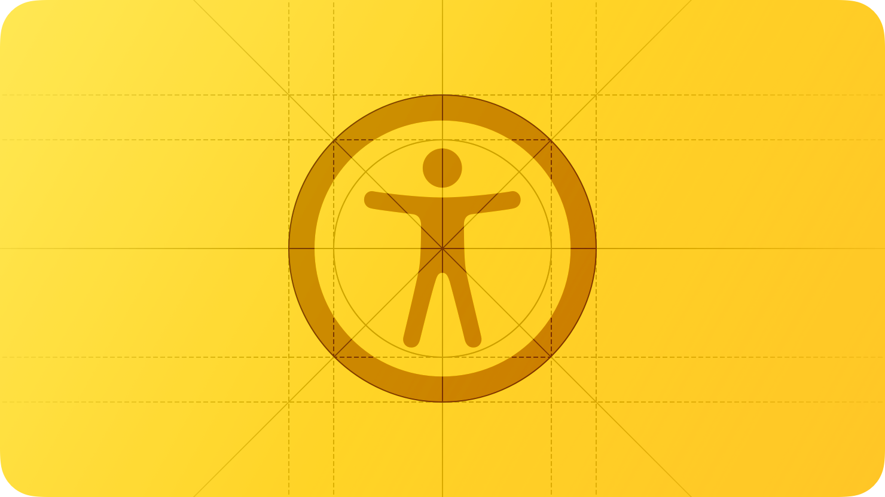
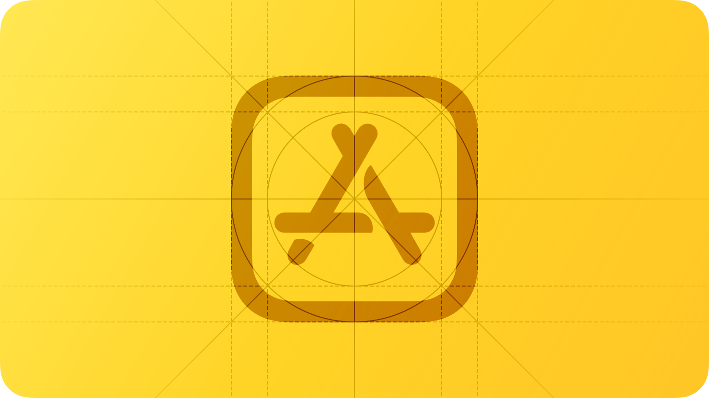
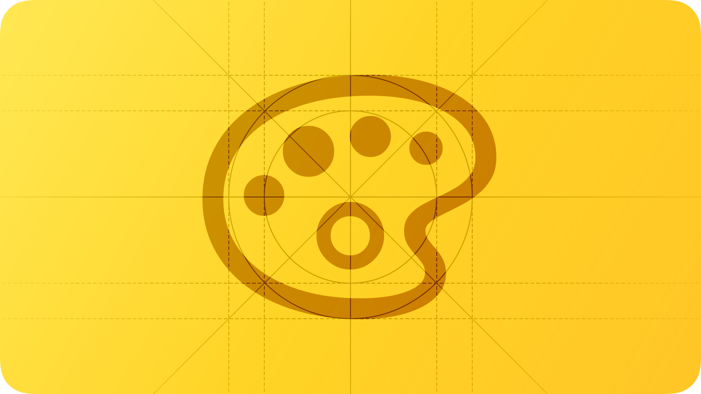
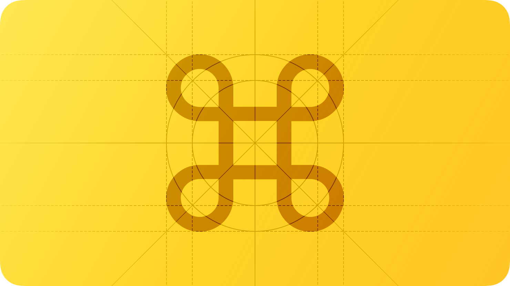
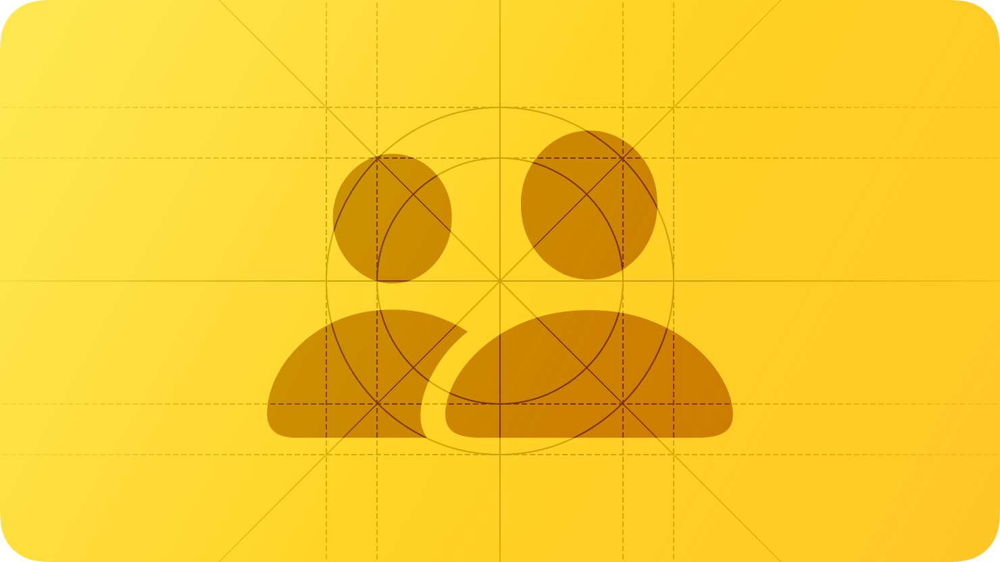
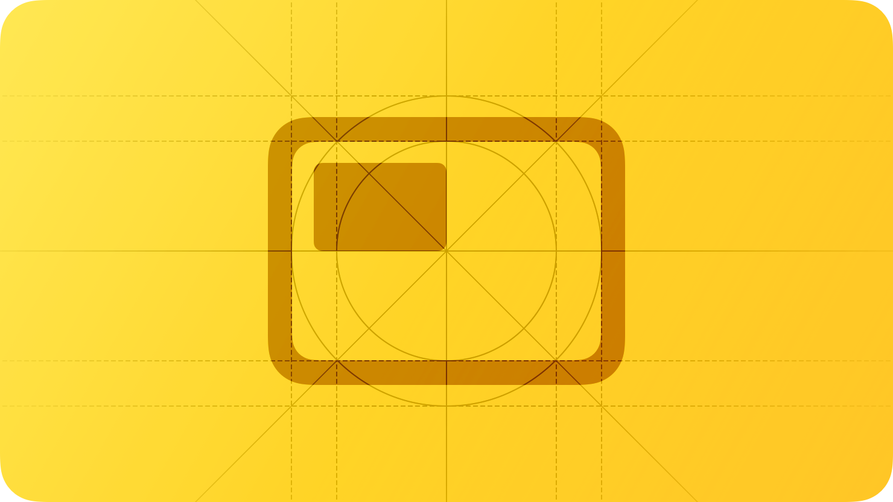
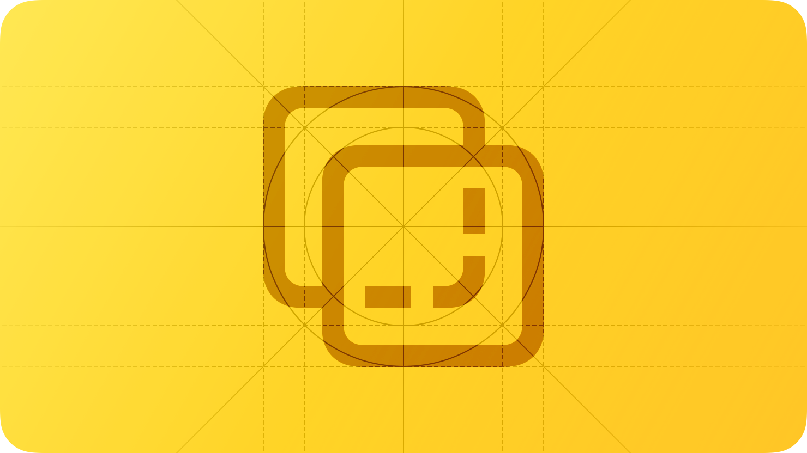
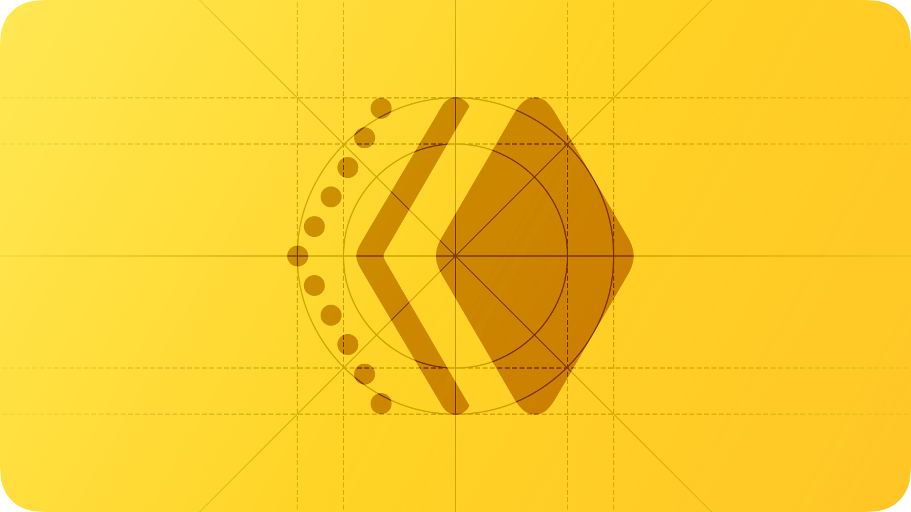
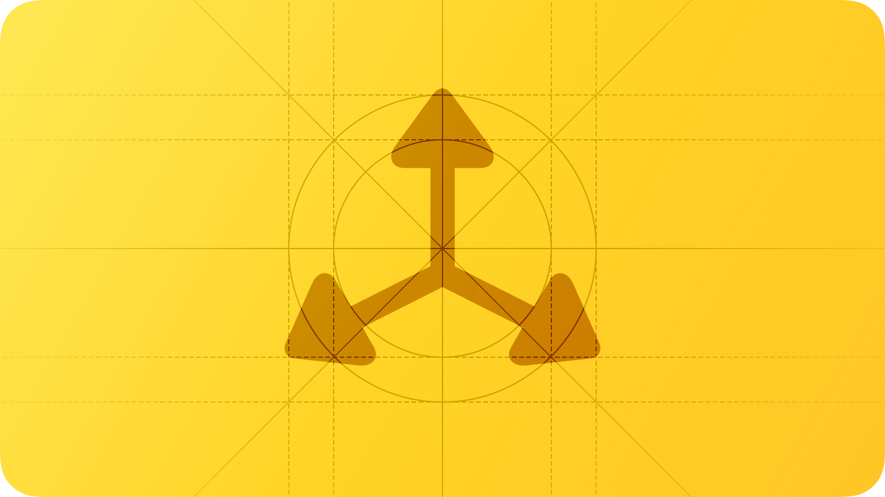
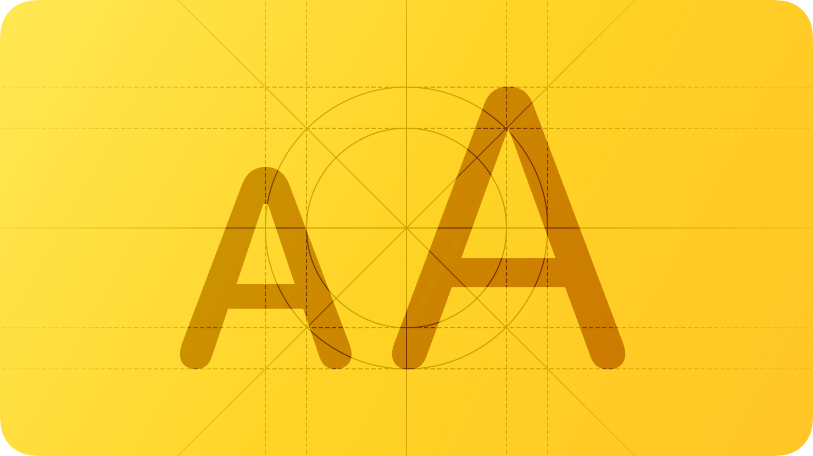

## Foundations

The Foundations section of the Human Interface Guidelines covers the core design principles and visual language that underpin all Apple platform experiences. These pages describe how apps should handle accessibility, visual identity (icons, color, typography), spatial design for visionOS, privacy, internationalization, and the system symbol library. Together they form the non-negotiable baseline every app must respect before tackling platform-specific patterns or components.

| Page | Slug | Status | URL |
|------|------|--------|-----|
| Accessibility | accessibility | Detailed | https://developer.apple.com/design/human-interface-guidelines/accessibility |
| App icons | app-icons | Detailed | https://developer.apple.com/design/human-interface-guidelines/app-icons |
| Branding | branding | Detailed | https://developer.apple.com/design/human-interface-guidelines/branding |
| Color | color | Detailed | https://developer.apple.com/design/human-interface-guidelines/color |
| Dark Mode | dark-mode | Detailed | https://developer.apple.com/design/human-interface-guidelines/dark-mode |
| Icons | icons | Detailed | https://developer.apple.com/design/human-interface-guidelines/icons |
| Images | images | Detailed | https://developer.apple.com/design/human-interface-guidelines/images |
| Immersive experiences | immersive-experiences | Detailed | https://developer.apple.com/design/human-interface-guidelines/immersive-experiences |
| Inclusion | inclusion | Detailed | https://developer.apple.com/design/human-interface-guidelines/inclusion |
| Layout | layout | Detailed | https://developer.apple.com/design/human-interface-guidelines/layout |
| Materials | materials | Detailed | https://developer.apple.com/design/human-interface-guidelines/materials |
| Motion | motion | Detailed | https://developer.apple.com/design/human-interface-guidelines/motion |
| Privacy | privacy | Detailed | https://developer.apple.com/design/human-interface-guidelines/privacy |
| Right to left | right-to-left | Detailed | https://developer.apple.com/design/human-interface-guidelines/right-to-left |
| SF Symbols | sf-symbols | Detailed | https://developer.apple.com/design/human-interface-guidelines/sf-symbols |
| Spatial layout | spatial-layout | Detailed | https://developer.apple.com/design/human-interface-guidelines/spatial-layout |
| Typography | typography | Detailed | https://developer.apple.com/design/human-interface-guidelines/typography |
| Writing | writing | Detailed | https://developer.apple.com/design/human-interface-guidelines/writing |

---

### Accessibility
**Path:** Foundations  
**Canonical URL:** https://developer.apple.com/design/human-interface-guidelines/accessibility

#### Hero image

*A sketch of a human figure within a circle, suggesting the universal symbol for accessibility. The image is overlaid with rectangular and circular grid lines and is tinted yellow to subtly reflect the yellow in the original six-color Apple logo.*

#### Summary
Accessibility features help people with a wide range of disabilities interact with their devices. When you design with accessibility in mind, you give everyone the best possible experience.

The goal of accessibility isn't to design one experience for people with disabilities and another experience for people without. The goal is to design a single experience that anyone can benefit from.

#### Vision

| | Platform default | Recommended minimum |
|-|-----------------|---------------------|
| Text size (iOS) | 17 pt | 11 pt |
| Text size (macOS) | 13 pt | 11 pt |
| Text contrast | — | 4.5:1 |

For additional guidance, see Color and contrast.

**Large text**
Support Dynamic Type, and make sure your layout can adapt when people choose larger text sizes. Don't clip text or truncate it based on a small text size. Use the system-provided layouts wherever possible.

**Color**
Don't rely on color alone to convey information. People who can't distinguish colors will miss the message. Use additional visual indicators like shape, label text, or an icon.

**Motion**
Avoid flashing content or animations that flash more than three times a second. Provide alternative experiences for people who have disabled motion. Prefer gentle animations; avoid large or fast-moving elements.

**Contrast**

| Text/background pair | Minimum contrast |
|----------------------|-----------------|
| Normal text (< 18 pt) | 4.5:1 |
| Large text (≥ 18 pt bold, ≥ 24 pt regular) | 3:1 |
| UI components and graphical objects | 3:1 |

#### Hearing

Support captions and subtitles where you display audio or video content. Include visual and tactile alternatives (for example, haptic patterns) for important audio cues. Don't require audio for your app to function.

#### Mobility

Make interactive elements large enough to activate easily. The recommended minimum tap target size is 44×44 pt.

| Control type | Recommended minimum size |
|-------------|--------------------------|
| Touch target | 44×44 pt |
| Pointer target (macOS) | 44×44 pt |

Support keyboard navigation and switch access. Don't require simultaneous multi-touch gestures that may be difficult for some people.

#### Speech

If your app uses speech recognition, offer an alternative input method. Label buttons and controls clearly so VoiceOver can read them accurately.

#### Cognitive

Provide clear, direct labels and instructions. Use familiar UI patterns. Avoid time limits where possible, or allow people to extend them. Minimize distractions by keeping interfaces focused.

#### Platform considerations

**visionOS**
In visionOS, use system-provided interactive components that respond to look-and-tap input. Avoid requiring precise spatial targeting. Ensure your app works well without requiring verbal commands.

#### Resources

- Accessibility — Human Interface Guidelines overview
- Human Interface Guidelines: Accessibility
- WCAG 2.1 guidelines

#### Change log

| Date | Changes |
|------|---------|
| June 21, 2023 | Consolidated guidance and updated for visionOS. |

---

### App icons
**Path:** Foundations  
**Canonical URL:** https://developer.apple.com/design/human-interface-guidelines/app-icons

#### Hero image

*A sketch of a rounded-rectangle icon shape, suggesting the form of an app icon. The image is overlaid with rectangular and circular grid lines and is tinted yellow to subtly reflect the yellow in the original six-color Apple logo.*

#### Summary
A beautiful app icon is important. It's the first impression people have of your app, and it appears throughout the system — on the Home Screen, in Settings, and in search results.

Design your icon with care. Because people see it many times a day, your icon needs to be immediately recognizable and visually appealing. Aim for a simple, distinctive design that reflects the purpose of your app.

#### Layer design

App icons can use multiple layers, where background layers are revealed as the icon is pressed or tilted. On supported platforms, the system composites these layers into a single image, applying lighting and shadow automatically. Keep each layer simple and make sure your icon looks great in its flat (non-parallax) state as well.

#### Icon shape

The system applies a rounded-rectangle mask to your icon on iOS, iPadOS, macOS, and watchOS. You supply a square image, and the system clips it. On macOS, you can supply icons with custom shapes, though most apps benefit from the standard rounded rectangle for visual consistency on the Dock.

#### Design

Use a simple, recognizable image. A single, centered object with a plain or gradient background tends to be the most recognizable icon design. Avoid photos or overly complex compositions.

Focus on the primary purpose of your app. The icon should communicate what the app does or represents its name, not the combination of every feature.

Keep the background simple. Use a single color or subtle gradient. Busy backgrounds reduce legibility against wallpapers and in folders.

Don't include text in your icon unless it's a word mark or brand element. Text is hard to read at small sizes and in multiple languages.

#### Visual effects

The system applies drop shadows and gloss to app icons automatically in some contexts. Don't add your own drop shadow or outer glow. The system also overlays a subtle gloss in some contexts; design your icon without that effect.

#### Appearances

Provide a single icon image. The system applies the appropriate appearance for the current context. If your app supports dark mode, you can optionally provide a dark variant. If you provide a tinted icon variant for iOS 18 and later, it adopts the system accent color.

#### Platform considerations

**tvOS**
tvOS icons use a layered, parallax effect. Provide 2–5 layers to take advantage of the effect. The front layers should contain the primary content; background layers add depth.

**visionOS**
Icons use a circular mask in visionOS. Design with a circle crop in mind, not just a rounded rectangle.

**watchOS**
Icons are circular in watchOS. Design with the circular crop in mind.

#### Specifications

| Platform | Layout | Shape | Sizes (pt) | Style | Appearances |
|----------|--------|-------|-----------|-------|-------------|
| iOS / iPadOS | Grid | Rounded rect | 1024 (App Store), 180, 120, 87, 80, 76, 60, 58, 40, 29, 20 | Flat | Light, Dark, Tinted |
| macOS | Grid | Rounded rect / custom | 1024, 512, 256, 128, 64, 32, 16 | Flat | Light, Dark |
| tvOS | Layered | Rounded rect | 1280×768, 400×240 | Layered | Light |
| visionOS | Grid | Circle | 1024 | Flat | Light, Dark |
| watchOS | Grid | Circle | 1024, 196, 172, 100 | Flat | Light |

#### Resources

- SF Symbols
- Apple Design Resources

#### Change log

| Date | Changes |
|------|---------|
| June 10, 2024 | Added guidance on tinted icons for iOS 18. |
| June 21, 2023 | Updated for visionOS. |

---

### Branding
**Path:** Foundations  
**Canonical URL:** https://developer.apple.com/design/human-interface-guidelines/branding

#### Hero image

*A sketch of a tag or label shape with a circular hole, suggesting branding or identity. The image is overlaid with rectangular and circular grid lines and is tinted yellow to subtly reflect the yellow in the original six-color Apple logo.*

#### Summary
Great branding helps people understand what your app does, trust it, and feel at home with it. The best brand expressions in apps are subtle and integrated — they enhance the experience without overwhelming it.

#### Best practices

Express your brand through color, typography, and imagery, but always in ways that enhance the experience, not in ways that compromise usability. Maintain consistency with the platform's visual language so your app feels native.

Incorporate your brand colors in ways that complement the system color palette. Avoid overusing a single brand color, particularly if it makes text or interactive elements hard to read.

Use your brand's fonts as display fonts or for decorative purposes. Prefer system fonts for body text, labels, and UI controls, where legibility is critical.

If you use a logo, display it where it makes sense — for example, in an initial splash screen, in an About screen, or as a watermark. Don't display logos in navigation bars or other system UI areas in ways that clash with standard system components.

Avoid recreating standard system UI elements in your brand's visual style. For example, don't replace system-provided buttons and bars with custom graphics styled to match your brand. Custom UI that differs from system conventions can confuse people and undermine trust.

#### Platform considerations

No additional considerations for iOS, iPadOS, macOS, tvOS, visionOS, or watchOS.

#### Resources

- Color
- Typography
- App icons

---

### Color
**Path:** Foundations  
**Canonical URL:** https://developer.apple.com/design/human-interface-guidelines/color

#### Hero image

*A sketch of a color wheel or palette, suggesting color selection. The image is overlaid with rectangular and circular grid lines and is tinted yellow to subtly reflect the yellow in the original six-color Apple logo.*

#### Summary
Color is a powerful tool for communicating information, conveying mood, and establishing visual hierarchy. Used thoughtfully, color can enhance the experience; used carelessly, it can create confusion or accessibility barriers.

The system provides a rich set of semantic and dynamic colors that adapt to contexts like Dark Mode, high-contrast mode, and different color gamuts. Prefer system colors over custom values wherever possible.

#### Best practices

Use color purposefully. Limit your palette to a few key colors and use them consistently throughout your app. Reserve your accent color for interactive elements and important indicators.

Don't rely on color alone to convey information. Always pair color with text labels, shapes, or other visual cues so people who can't distinguish colors aren't at a disadvantage.

Test your color choices in both light and dark appearances, and with increased contrast enabled. System dynamic colors do this automatically; custom colors require testing.

Prefer colors that work well across multiple backgrounds. Avoid semi-transparent or low-contrast colors that may be hard to read against varied backgrounds.

#### Inclusive color

Approximately 8% of men and 0.5% of women have some form of color vision deficiency. Design your color usage so that the most common deficiencies — red-green color blindness — don't prevent understanding your interface.

Use color to enhance information, not as the sole carrier of meaning. For example, don't use only red and green to indicate pass/fail; add labels or icons as well.

#### System colors

Apple provides system colors for both light and dark appearances, and for different vibrancy contexts. Use semantic system colors (like `.label`, `.systemBackground`) where possible, because they adapt automatically.

Avoid hardcoding color values when a semantic system color covers your use case.

#### Liquid Glass color

In macOS 26 and iOS 26, the new Liquid Glass material introduces dynamic color that responds to the content behind it. Liquid Glass–based elements automatically blend with the background color and can adopt tint colors from your app's accent color. Avoid placing opaque fills over Liquid Glass elements; let the material's translucency work as intended.

#### Color management

Specify colors in a color-managed space. For broad gamut content, use Display P3 when precise color fidelity matters. For standard content, sRGB is appropriate.

#### Platform considerations

**iOS / iPadOS**
iOS supports both light and dark appearances. System colors adapt automatically. You can specify per-app accent colors in the asset catalog.

**App accent colors**
Specify a global tint color in your asset catalog using the `AccentColor` asset. This color is used for buttons, links, and other interactive elements.

**macOS**
macOS supports accent colors that users can choose in System Settings. Respect the user's choice by using `.accentColor` rather than hardcoding a hue.

**tvOS**
tvOS uses a lighter color palette and relies on focus-based highlights. Use the system-provided focus highlight colors.

**visionOS**
Colors in visionOS must work well against the semi-transparent Liquid Glass materials used in windows and controls. The system automatically adjusts vibrancy and contrast.

**watchOS**
watchOS uses dark backgrounds in most contexts. Design for dark-background legibility as the primary case.

#### Specifications

System colors for iOS and iPadOS (representative values):

| Name | Light | Dark |
|------|-------|------|
| systemRed | #FF3B30 | #FF453A |
| systemOrange | #FF9500 | #FF9F0A |
| systemYellow | #FFCC00 | #FFD60A |
| systemGreen | #34C759 | #30D158 |
| systemMint | #00C7BE | #63E6E2 |
| systemTeal | #30B0C7 | #40C8E0 |
| systemCyan | #32ADE6 | #64D2FF |
| systemBlue | #007AFF | #0A84FF |
| systemIndigo | #5856D6 | #5E5CE6 |
| systemPurple | #AF52DE | #BF5AF2 |
| systemPink | #FF2D55 | #FF375F |
| systemBrown | #A2845E | #AC8E68 |
| systemGray | #8E8E93 | #8E8E93 |

> **Teal/Cyan naming history.** iOS 13–14 had a single `systemTeal` whose
> values were `#5AC8FA` / `#64D2FF`. iOS 15 split that hue into two distinct
> semantic colors: the lighter sky-blue became `systemCyan` and a deeper
> teal (`#30B0C7` / `#40C8E0`) took the `systemTeal` name. The table above
> reflects iOS 15+ naming. macOS `NSColor.systemTeal` differs from iOS — it
> uses a darker, less saturated teal (`#00C3D0`-family). The
> `tahoe-gpui` palette uses macOS-aligned values for `Teal` and
> iOS-aligned approximate values for `Cyan` because the crate targets macOS
> first; see `crates/tahoe-gpui/src/foundations/color.rs` (Teal/Cyan
> blocks) for the resolved values and rationale.

iOS / iPadOS system gray colors:

| Name | Light | Dark |
|------|-------|------|
| systemGray2 | #AEAEB2 | #636366 |
| systemGray3 | #C7C7CC | #48484A |
| systemGray4 | #D1D1D6 | #3A3A3C |
| systemGray5 | #E5E5EA | #2C2C2E |
| systemGray6 | #F2F2F7 | #1C1C1E |

#### Resources

- Dark Mode
- Materials
- Accessibility

#### Change log

| Date | Changes |
|------|---------|
| June 10, 2024 | Added Liquid Glass color guidance for macOS 26 / iOS 26. |
| June 21, 2023 | Updated for visionOS. |

---

### Dark Mode
**Path:** Foundations  
**Canonical URL:** https://developer.apple.com/design/human-interface-guidelines/dark-mode

#### Hero image

*A sketch of a half-light, half-dark circle, suggesting the toggle between light and dark appearances. The image is overlaid with rectangular and circular grid lines and is tinted yellow to subtly reflect the yellow in the original six-color Apple logo.*

#### Summary
Dark Mode is a system-wide appearance setting that uses a darker color palette for all views, controls, and windows. Many people prefer Dark Mode as their default, and others switch depending on ambient lighting. Apps that support Dark Mode give all users the experience they prefer.

#### Best practices

Support Dark Mode in your app. Use semantic system colors and materials rather than hardcoded color values so your app adapts automatically. If you use custom colors, provide both light and dark variants in your asset catalog.

Don't force Dark Mode or Light Mode in your app. Respect the user's system-wide preference and let the system handle the appearance.

Test your UI in both appearances, and also with the increased contrast accessibility setting enabled.

Don't use appearance-specific images unless content genuinely differs between appearances. Use SF Symbols and template images wherever possible, because they automatically adopt the appropriate color.

Ensure sufficient contrast in both appearances. Colors that look fine in light mode can lose contrast in dark mode, and vice versa.

#### Dark Mode colors

**Icons and images**
SF Symbols adapt automatically to both appearances. Template images also adapt. For full-color images, provide separate light and dark variants in your asset catalog.

**Text**
Use semantic text colors (`.label`, `.secondaryLabel`, etc.) so text automatically meets minimum contrast requirements in both appearances.

#### Platform considerations

**iOS / iPadOS**
Dark Mode uses elevated surface colors to create depth — `systemBackground` is the darkest layer, with `secondarySystemBackground` and `tertiarySystemBackground` progressively lighter.

**macOS**
macOS supports both Light and Dark appearances. The system also provides a high-contrast variant for each appearance. Use `NSColor` semantic colors.

#### Resources

- Color
- Materials
- Accessibility

#### Change log

| Date | Changes |
|------|---------|
| June 21, 2023 | Consolidated guidance and updated for visionOS. |

---

### Icons
**Path:** Foundations  
**Canonical URL:** https://developer.apple.com/design/human-interface-guidelines/icons

#### Hero image

*A sketch of a grid of small square icon-like shapes, suggesting a collection of interface icons. The image is overlaid with rectangular and circular grid lines and is tinted yellow to subtly reflect the yellow in the original six-color Apple logo.*

#### Summary
Interface icons — distinct from app icons — are the small images that communicate actions, indicate status, or represent objects in your UI. Use SF Symbols as your primary source; they integrate seamlessly with text and adapt to accessibility settings.

#### Best practices

Prefer SF Symbols over custom icons whenever an appropriate symbol exists. SF Symbols are designed to work at all weights and scales, adapt to dynamic type sizes, and support all accessibility rendering modes.

When you create custom icons, design them to match the visual weight and style of SF Symbols. Use similar stroke widths, proportions, and visual simplicity.

Don't use icon-only buttons in contexts where people may not know what the icon means. Pair icons with text labels in toolbars, menus, and anywhere the action may be ambiguous.

Provide accessibility labels for all icons used as interactive controls or as indicators of important information.

#### Standard icons

Standard SF Symbols are organized by category. The following tables list representative symbols by category.

**Editing**

| Symbol name | Meaning |
|-------------|---------|
| pencil | Edit / annotate |
| scissors | Cut |
| doc.on.clipboard | Paste |
| arrow.uturn.backward | Undo |
| arrow.uturn.forward | Redo |
| trash | Delete |

**Selection**

| Symbol name | Meaning |
|-------------|---------|
| checkmark | Confirm / done |
| xmark | Dismiss / cancel |
| circle | Unselected item |
| checkmark.circle.fill | Selected item |

**Text formatting**

| Symbol name | Meaning |
|-------------|---------|
| bold | Bold text |
| italic | Italic text |
| underline | Underline text |
| strikethrough | Strikethrough text |
| textformat.size | Font size |

**Search**

| Symbol name | Meaning |
|-------------|---------|
| magnifyingglass | Search |
| magnifyingglass.circle | Search (circular button) |

**Sharing and exporting**

| Symbol name | Meaning |
|-------------|---------|
| square.and.arrow.up | Share |
| arrow.down.to.line | Download |
| arrow.up.to.line | Upload |
| square.and.arrow.down | Save / import |

**Users and accounts**

| Symbol name | Meaning |
|-------------|---------|
| person | Person / account |
| person.2 | Group / contacts |
| person.crop.circle | Profile picture |

**Ratings**

| Symbol name | Meaning |
|-------------|---------|
| star | Rating star (empty) |
| star.fill | Rating star (filled) |
| heart | Favorite (empty) |
| heart.fill | Favorite (filled) |

**Layer ordering**

| Symbol name | Meaning |
|-------------|---------|
| square.2.layers.3d | Layers |
| rectangle.on.rectangle | Duplicate / copy layers |

**Other**

| Symbol name | Meaning |
|-------------|---------|
| ellipsis | More / overflow menu |
| info.circle | Information |
| questionmark.circle | Help |
| gear | Settings |
| bell | Notifications |
| lock | Locked / secure |
| lock.open | Unlocked |

#### Platform considerations

**macOS**
macOS toolbars can display both icon-only and icon-with-label configurations depending on user preferences. Always supply accessibility labels so the toolbar can display labels when requested.

**Document icons**
Custom document icons represent file types in Finder. They use the same rounded-rectangle shape as app icons and should visually relate to the app icon where possible.

#### Resources

- SF Symbols
- App icons
- Images

#### Change log

| Date | Changes |
|------|---------|
| June 10, 2024 | Updated with new SF Symbols categories. |
| June 21, 2023 | Consolidated guidance and updated for visionOS. |

---

### Images
**Path:** Foundations  
**Canonical URL:** https://developer.apple.com/design/human-interface-guidelines/images

#### Hero image

*A sketch of a photograph within a frame, suggesting images or photos. The image is overlaid with rectangular and circular grid lines and is tinted yellow to subtly reflect the yellow in the original six-color Apple logo.*

#### Summary
Images communicate meaning quickly and reinforce your app's personality. Use high-quality images that render crisply at all display scales and adapt to both light and dark appearances.

#### Resolution

All Apple displays are high resolution. Always provide @2x and @3x assets for raster images.

| Platform | Scale factors |
|----------|--------------|
| iOS | @1x, @2x, @3x |
| iPadOS | @1x, @2x |
| macOS | @1x, @2x |
| tvOS | @1x, @2x |
| visionOS | @2x |
| watchOS | @2x |

#### Formats

| Format | Best use |
|--------|---------|
| PNG | Transparency, sharp edges, icons |
| JPEG | Photographs, gradients with no transparency |
| HEIF | Photography (high efficiency) |
| SVG / PDF | Vector artwork (scales to any size) |
| WebP | Web-origin content |

#### Best practices

Provide images at the correct size for the display. Scale images in an asset catalog and let the system select the appropriate resolution; don't scale images in code at runtime if you can avoid it.

Use the asset catalog to provide light and dark variants of images when appearance affects their meaning or legibility.

Use SF Symbols for interface icons wherever possible. They render at any size without rasterization artifacts.

Provide meaningful alt text for all images that convey information, so VoiceOver can describe them.

Avoid displaying text within images when that text needs to be localized or selectable.

#### Platform considerations

**tvOS**
tvOS supports parallax images for focusable elements. A parallax image consists of 2–5 PNG layers that the system composites to create a depth effect when focused.

**Parallax effect**
Use the layered image format for app icons and any other focusable full-image elements on tvOS. The back layer should contain the background; front layers contain progressively more foreground detail.

**Layered images**
Provide separate PNG layers exported from the tvOS template. Name layers according to the tvOS layered image specification.

**visionOS**
Images in visionOS appear inside windows that float in space. The system applies a subtle shadow and depth automatically. Provide @2x images.

**Spatial photos and spatial scenes**
Spatial photos (stereoscopic image pairs) and spatial scenes appear in visionOS with a sense of depth. Capture or create spatial content following the spatial media authoring guidelines.

**watchOS**
watchOS uses small screens. Keep images simple and high-contrast. Avoid images that contain fine detail that will be lost at small sizes.

#### Resources

- SF Symbols
- Icons
- Color

#### Change log

| Date | Changes |
|------|---------|
| June 21, 2023 | Updated for visionOS. |

---

### Immersive experiences
**Path:** Foundations  
**Canonical URL:** https://developer.apple.com/design/human-interface-guidelines/immersive-experiences

#### Hero image

*A sketch of a person wearing Apple Vision Pro, surrounded by immersive content, suggesting spatial and immersive experiences. The image is overlaid with rectangular and circular grid lines and is tinted yellow to subtly reflect the yellow in the original six-color Apple logo.*

#### Summary
Apple Vision Pro lets you create experiences that range from a standard window in the Shared Space to a fully immersive environment that completely replaces the user's surroundings. Design immersive experiences thoughtfully to balance presence with comfort and safety.

#### Immersion and passthrough

In visionOS, passthrough refers to the live video feed of the user's real environment that appears when they are not in a fully immersive experience. The system controls how much passthrough is visible based on the current immersion style.

**Immersion styles**
- Shared Space: Standard windows coexist with the real environment and other apps.
- Mixed Immersion: Your app adds virtual content to the real environment with full passthrough visible.
- Progressive Immersion: A configurable Digital Crown allows people to adjust how much of their surroundings they see.
- Full Immersion: Your virtual environment completely replaces the real world.

Use the least amount of immersion that achieves your experience goal. People are more comfortable and can use your app for longer when they can see their surroundings.

#### Best practices

Design for comfort from the start. Immersive experiences can cause disorientation or simulator sickness if not carefully designed. Move virtual objects slowly, avoid rapid visual changes, and keep the horizon stable.

Give people control over immersion level. Let people adjust how immersive the experience is using the Digital Crown or explicit in-app controls.

Don't obscure safety-critical environmental awareness without clear user intent. If you present a fully immersive environment, make it easy for people to return to their surroundings at any time.

Keep essential controls accessible at all times. Navigation and exit controls should always be reachable without requiring the user to look in a specific direction.

#### Promoting comfort

Maintain a stable, horizontal horizon line. A tilted or rolling horizon can quickly cause disorientation.

Avoid content that fills the entire field of view with motion. Large-scale motion in the periphery is more disorienting than motion in the center.

Provide rest areas — areas of low visual activity — where people's eyes can rest.

#### Transitioning between immersive styles

Use smooth transitions when changing immersion levels. A sudden change from passthrough to full immersion (or vice versa) is jarring. Fade or dissolve between states.

Synchronize transitions with audio cues when possible.

#### Displaying virtual hands

If your experience shows virtual representations of a person's hands, ensure they match the real hand positions accurately to avoid a mismatch between proprioception and visual feedback, which can cause discomfort.

Avoid displaying virtual hands in ways that look unnatural or conflict with the person's expected hand positions.

#### Creating an environment

Design environments at real-world scale. Objects should appear at the size they would in the physical world unless a stylized scale is intentional and clearly communicated.

Ground your environment with a recognizable floor or horizon that helps people maintain orientation.

Limit the contrast between the virtual environment and any passthrough edges in progressive immersion mode.

#### Platform considerations

Not supported in iOS, iPadOS, macOS, tvOS, or watchOS. Exclusive to visionOS.

#### Resources

- Spatial layout
- Eyes
- Gestures

#### Change log

| Date | Changes |
|------|---------|
| June 21, 2023 | New page. |

---

### Inclusion
**Path:** Foundations  
**Canonical URL:** https://developer.apple.com/design/human-interface-guidelines/inclusion

#### Hero image

*A sketch of several human figures of different sizes standing together, suggesting diversity and inclusion. The image is overlaid with rectangular and circular grid lines and is tinted yellow to subtly reflect the yellow in the original six-color Apple logo.*

#### Summary
An inclusive app welcomes everyone, regardless of age, ability, race, ethnicity, gender, or language. Inclusive design considers the full range of people who might use your app and removes unnecessary barriers.

#### Inclusive by design

Think about inclusion at the start of your design process, not as an afterthought. Consider the diverse backgrounds, abilities, and contexts of the people who will use your app.

Avoid design decisions that make implicit assumptions about who your users are. Default settings, placeholder content, and example data should reflect a diverse range of people.

#### Welcoming language

Write in plain language that is easy to understand across a broad reading level. Avoid jargon, technical abbreviations, and culturally specific idioms that may not translate well.

Use direct, positive language. Address the reader directly (you/your) and avoid passive constructions.

#### Being approachable

Test your app with people from diverse backgrounds. Include participants with disabilities, different ages, and different cultural contexts in your user research.

#### Gender identity

Use inclusive pronouns and language when referring to people. Where possible, use "they/them" or "you" rather than gendered pronouns. Avoid assumptions about the user's gender in greetings, forms, and notifications.

When you ask for personal information, avoid assuming binary gender. Offer inclusive options in any gender selection field, or omit the field if gender is not relevant to your app's function.

#### People and settings

Use diverse, representative imagery when showing people in your app. Don't consistently show one demographic group in leadership roles and others in subordinate roles.

Avoid imagery that reinforces cultural stereotypes. When in doubt, prefer abstract or illustrative representations over photographic depictions of people.

#### Avoiding stereotypes

Don't use cultural, racial, or gendered stereotypes in illustrations, icons, or written content. Have a diverse team review content for unintended bias.

#### Accessibility

Inclusive design and accessibility often overlap. Follow the accessibility guidelines to ensure your app works for people with disabilities.

#### Languages

Support localization. Use the system's localization infrastructure so your app can be translated and adapted for different regions. Follow localization best practices for date formats, number formats, and text direction.

#### Platform considerations

No additional considerations for iOS, iPadOS, macOS, tvOS, visionOS, or watchOS.

#### Resources

- Accessibility
- Right to left
- Writing

---

### Layout
**Path:** Foundations  
**Canonical URL:** https://developer.apple.com/design/human-interface-guidelines/layout

#### Hero image

*A sketch of a rectangular grid with margin guides overlaid, suggesting layout and spacing. The image is overlaid with rectangular and circular grid lines and is tinted yellow to subtly reflect the yellow in the original six-color Apple logo.*

#### Summary
Good layout guides the eye, communicates hierarchy, and makes content easy to read and interact with. Use system-provided layout tools — including Auto Layout, SwiftUI's layout system, and the safe area — to create adaptive interfaces that work across all device sizes and orientations.

#### Best practices

Design with a consistent grid and margins. Use the system's standard layout margins so your content aligns naturally with system UI elements and other apps.

Make your layout adapt to different screen sizes and orientations. Test your layout on all supported devices, including iPad in both portrait and landscape orientations.

Don't place interactive content in the safe area margins — the areas reserved by the system for the home indicator, the Dynamic Island, and other system UI. Use the safe area layout guides.

Prioritize important content in the upper portion of the screen. People scan from top to bottom; critical actions and key information should be in the upper two-thirds.

#### Visual hierarchy

Use size, weight, color, and spacing to create a clear visual hierarchy. Primary content should be largest and highest contrast; secondary content should be smaller or lower contrast.

Avoid placing too many elements at the same visual weight. When everything is emphasized, nothing is.

#### Adaptability

Use SwiftUI or Auto Layout to create adaptive layouts that respond to size class changes. Avoid hardcoded pixel values; use points and relative constraints.

Design for both compact and regular size classes on iPad. A compact width layout may show a single-column list; a regular width layout may show a two-column split view.

#### Guides and safe areas

Always respect the safe area on iOS and iPadOS. System UI elements like the status bar, notch/Dynamic Island, and home indicator occupy the safe area. Extend backgrounds and decorative elements to fill the full screen, but keep interactive controls within the safe area.

On macOS, respect the title bar and toolbar areas. Don't place your own content in system-reserved areas without using proper window styling.

#### Platform considerations

**iOS / iPadOS**
Use layout margins and readable content guides to keep content comfortably readable on large screens.

**macOS**
macOS windows can be resized freely. Design with flexible, proportional layouts that remain usable at minimum and maximum window sizes.

**tvOS**
tvOS requires focus-based navigation. Arrange elements in grids or lists that are easy to navigate with the remote. Ensure all interactive elements are reachable via sequential focus movement.

**Grids**
Use a consistent grid for focus-based layouts on tvOS. Elements should be evenly sized and spaced so remote navigation is predictable.

##### Two-column grid

| Attribute | Value |
|---|---|
| Unfocused content width | 860 pt |
| Horizontal spacing | 40 pt |
| Minimum vertical spacing | 100 pt |

##### Three-column grid

| Attribute | Value |
|---|---|
| Unfocused content width | 560 pt |
| Horizontal spacing | 40 pt |
| Minimum vertical spacing | 100 pt |

##### Four-column grid

| Attribute | Value |
|---|---|
| Unfocused content width | 410 pt |
| Horizontal spacing | 40 pt |
| Minimum vertical spacing | 100 pt |

##### Five-column grid

| Attribute | Value |
|---|---|
| Unfocused content width | 320 pt |
| Horizontal spacing | 40 pt |
| Minimum vertical spacing | 100 pt |

##### Six-column grid

| Attribute | Value |
|---|---|
| Unfocused content width | 260 pt |
| Horizontal spacing | 40 pt |
| Minimum vertical spacing | 100 pt |

##### Seven-column grid

| Attribute | Value |
|---|---|
| Unfocused content width | 217 pt |
| Horizontal spacing | 40 pt |
| Minimum vertical spacing | 100 pt |

##### Eight-column grid

| Attribute | Value |
|---|---|
| Unfocused content width | 184 pt |
| Horizontal spacing | 40 pt |
| Minimum vertical spacing | 100 pt |

##### Nine-column grid

| Attribute | Value |
|---|---|
| Unfocused content width | 160 pt |
| Horizontal spacing | 40 pt |
| Minimum vertical spacing | 100 pt |

**visionOS**
Windows in visionOS float in space. Provide a default window size and a minimum size. Use SwiftUI's spatial layout tools.

**watchOS**
watchOS has limited screen sizes. Use the watch's small display optimally — single-column layouts, short text, and large touch targets.

#### Specifications

iOS, iPadOS device screen dimensions:

| Model | Dimensions (portrait) |
|---|---|
| iPad Pro 12.9-inch | 1024x1366 pt (2048x2732 px @2x) |
| iPad Pro 11-inch | 834x1194 pt (1668x2388 px @2x) |
| iPad Pro 10.5-inch | 834x1194 pt (1668x2388 px @2x) |
| iPad Pro 9.7-inch | 768x1024 pt (1536x2048 px @2x) |
| iPad Air 13-inch | 1024x1366 pt (2048x2732 px @2x) |
| iPad Air 11-inch | 820x1180 pt (1640x2360 px @2x) |
| iPad Air 10.9-inch | 820x1180 pt (1640x2360 px @2x) |
| iPad Air 10.5-inch | 834x1112 pt (1668x2224 px @2x) |
| iPad Air 9.7-inch | 768x1024 pt (1536x2048 px @2x) |
| iPad 11-inch | 820x1180 pt (1640x2360 px @2x) |
| iPad 10.2-inch | 810x1080 pt (1620x2160 px @2x) |
| iPad 9.7-inch | 768x1024 pt (1536x2048 px @2x) |
| iPad mini 8.3-inch | 744x1133 pt (1488x2266 px @2x) |
| iPad mini 7.9-inch | 768x1024 pt (1536x2048 px @2x) |
| iPhone 17 Pro Max | 440x956 pt (1320x2868 px @3x) |
| iPhone 17 Pro | 402x874 pt (1206x2622 px @3x) |
| iPhone Air | 420x912 pt (1260x2736 px @3x) |
| iPhone 17 | 402x874 pt (1206x2622 px @3x) |
| iPhone 16 Pro Max | 440x956 pt (1320x2868 px @3x) |
| iPhone 16 Pro | 402x874 pt (1206x2622 px @3x) |
| iPhone 16 Plus | 430x932 pt (1290x2796 px @3x) |
| iPhone 16 | 393x852 pt (1179x2556 px @3x) |
| iPhone 16e | 390x844 pt (1170x2532 px @3x) |
| iPhone 15 Pro Max | 430x932 pt (1290x2796 px @3x) |
| iPhone 15 Pro | 393x852 pt (1179x2556 px @3x) |
| iPhone 15 Plus | 430x932 pt (1290x2796 px @3x) |
| iPhone 15 | 393x852 pt (1179x2556 px @3x) |
| iPhone 14 Pro Max | 430x932 pt (1290x2796 px @3x) |
| iPhone 14 Pro | 393x852 pt (1179x2556 px @3x) |
| iPhone 14 Plus | 428x926 pt (1284x2778 px @3x) |
| iPhone 14 | 390x844 pt (1170x2532 px @3x) |
| iPhone 13 Pro Max | 428x926 pt (1284x2778 px @3x) |
| iPhone 13 Pro | 390x844 pt (1170x2532 px @3x) |
| iPhone 13 | 390x844 pt (1170x2532 px @3x) |
| iPhone 13 mini | 375x812 pt (1125x2436 px @3x) |
| iPhone 12 Pro Max | 428x926 pt (1284x2778 px @3x) |
| iPhone 12 Pro | 390x844 pt (1170x2532 px @3x) |
| iPhone 12 | 390x844 pt (1170x2532 px @3x) |
| iPhone 12 mini | 375x812 pt (1125x2436 px @3x) |
| iPhone 11 Pro Max | 414x896 pt (1242x2688 px @3x) |
| iPhone 11 Pro | 375x812 pt (1125x2436 px @3x) |
| iPhone 11 | 414x896 pt (828x1792 px @2x) |
| iPhone XS Max | 414x896 pt (1242x2688 px @3x) |
| iPhone XS | 375x812 pt (1125x2436 px @3x) |
| iPhone XR | 414x896 pt (828x1792 px @2x) |
| iPhone X | 375x812 pt (1125x2436 px @3x) |
| iPhone 8 Plus | 414x736 pt (1080x1920 px @3x) |
| iPhone 8 | 375x667 pt (750x1334 px @2x) |
| iPhone 7 Plus | 414x736 pt (1080x1920 px @3x) |
| iPhone 7 | 375x667 pt (750x1334 px @2x) |
| iPhone 6s Plus | 414x736 pt (1080x1920 px @3x) |
| iPhone 6s | 375x667 pt (750x1334 px @2x) |
| iPhone 6 Plus | 414x736 pt (1080x1920 px @3x) |
| iPhone 6 | 375x667 pt (750x1334 px @2x) |
| iPhone SE 4.7-inch | 375x667 pt (750x1334 px @2x) |
| iPhone SE 4-inch | 320x568 pt (640x1136 px @2x) |
| iPod touch 5th generation and later | 320x568 pt (640x1136 px @2x) |

iOS, iPadOS device size classes:

| Model | Portrait orientation | Landscape orientation |
|---|---|---|
| iPad Pro 12.9-inch | Regular width, regular height | Regular width, regular height |
| iPad Pro 11-inch | Regular width, regular height | Regular width, regular height |
| iPad Pro 10.5-inch | Regular width, regular height | Regular width, regular height |
| iPad Air 13-inch | Regular width, regular height | Regular width, regular height |
| iPad Air 11-inch | Regular width, regular height | Regular width, regular height |
| iPad 11-inch | Regular width, regular height | Regular width, regular height |
| iPad 9.7-inch | Regular width, regular height | Regular width, regular height |
| iPad mini 7.9-inch | Regular width, regular height | Regular width, regular height |
| iPhone 17 Pro Max | Compact width, regular height | Regular width, compact height |
| iPhone 17 Pro | Compact width, regular height | Compact width, compact height |
| iPhone Air | Compact width, regular height | Regular width, compact height |
| iPhone 17 | Compact width, regular height | Compact width, compact height |
| iPhone 16 Pro Max | Compact width, regular height | Regular width, compact height |
| iPhone 16 Pro | Compact width, regular height | Compact width, compact height |
| iPhone 16 Plus | Compact width, regular height | Regular width, compact height |
| iPhone 16 | Compact width, regular height | Compact width, compact height |
| iPhone 16e | Compact width, regular height | Compact width, compact height |
| iPhone 15 Pro Max | Compact width, regular height | Regular width, compact height |
| iPhone 15 Pro | Compact width, regular height | Compact width, compact height |
| iPhone 15 Plus | Compact width, regular height | Regular width, compact height |
| iPhone 15 | Compact width, regular height | Compact width, compact height |
| iPhone 14 Pro Max | Compact width, regular height | Regular width, compact height |
| iPhone 14 Pro | Compact width, regular height | Compact width, compact height |
| iPhone 14 Plus | Compact width, regular height | Regular width, compact height |
| iPhone 14 | Compact width, regular height | Compact width, compact height |
| iPhone 13 Pro Max | Compact width, regular height | Regular width, compact height |
| iPhone 13 Pro | Compact width, regular height | Compact width, compact height |
| iPhone 13 | Compact width, regular height | Compact width, compact height |
| iPhone 13 mini | Compact width, regular height | Compact width, compact height |
| iPhone 12 Pro Max | Compact width, regular height | Regular width, compact height |
| iPhone 12 Pro | Compact width, regular height | Compact width, compact height |
| iPhone 12 | Compact width, regular height | Compact width, compact height |
| iPhone 12 mini | Compact width, regular height | Compact width, compact height |
| iPhone 11 Pro Max | Compact width, regular height | Regular width, compact height |
| iPhone 11 Pro | Compact width, regular height | Compact width, compact height |
| iPhone 11 | Compact width, regular height | Regular width, compact height |
| iPhone XS Max | Compact width, regular height | Regular width, compact height |
| iPhone XS | Compact width, regular height | Compact width, compact height |
| iPhone XR | Compact width, regular height | Regular width, compact height |
| iPhone X | Compact width, regular height | Compact width, compact height |
| iPhone 8 Plus | Compact width, regular height | Regular width, compact height |
| iPhone 8 | Compact width, regular height | Compact width, compact height |
| iPhone 7 Plus | Compact width, regular height | Regular width, compact height |
| iPhone 7 | Compact width, regular height | Compact width, compact height |
| iPhone 6s Plus | Compact width, regular height | Regular width, compact height |
| iPhone 6s | Compact width, regular height | Compact width, compact height |
| iPhone SE | Compact width, regular height | Compact width, compact height |
| iPod touch 5th generation and later | Compact width, regular height | Compact width, compact height |

watchOS device screen dimensions:

| Series | Size | Width (pixels) | Height (pixels) |
|---|---|---|---|
| Apple Watch Ultra (3rd generation) | 49mm | 422 | 514 |
| 10, 11 | 42mm | 374 | 446 |
| 10, 11 | 46mm | 416 | 496 |
| Apple Watch Ultra (1st and 2nd generations) | 49mm | 410 | 502 |
| 7, 8, and 9 | 41mm | 352 | 430 |
| 7, 8, and 9 | 45mm | 396 | 484 |
| 4, 5, 6, and SE (all generations) | 40mm | 324 | 394 |
| 4, 5, 6, and SE (all generations) | 44mm | 368 | 448 |
| 1, 2, and 3 | 38mm | 272 | 340 |
| 1, 2, and 3 | 42mm | 312 | 390 |

#### Resources

- Spatial layout
- Typography
- Color

#### Change log

| Date | Changes |
|---|---|
| September 9, 2025 | Added specifications for iPhone 17, iPhone Air, iPhone 17 Pro, iPhone 17 Pro Max, Apple Watch SE 3, Apple Watch Series 11, and Apple Watch Ultra 3. |
| June 9, 2025 | Added guidance for Liquid Glass. |
| March 7, 2025 | Added specifications for iPhone 16e, iPad 11-inch, iPad Air 11-inch, and iPad Air 13-inch. |
| September 9, 2024 | Added specifications for iPhone 16, iPhone 16 Plus, iPhone 16 Pro, iPhone 16 Pro Max, and Apple Watch Series 10. |
| June 10, 2024 | Made minor corrections and organizational updates. |
| February 2, 2024 | Enhanced guidance for avoiding system controls in iPadOS app layouts, and added specifications for 10.9-inch iPad Air and 8.3-inch iPad mini. |
| December 5, 2023 | Clarified guidance on centering content in a visionOS window. |
| September 15, 2023 | Added specifications for iPhone 15 Pro Max, iPhone 15 Pro, iPhone 15 Plus, iPhone 15, Apple Watch Ultra 2, and Apple Watch SE. |
| June 21, 2023 | Updated to include guidance for visionOS. |
| September 14, 2022 | Added specifications for iPhone 14 Pro Max, iPhone 14 Pro, iPhone 14 Plus, iPhone 14, and Apple Watch Ultra. |

---

### Materials
**Path:** Foundations  
**Canonical URL:** https://developer.apple.com/design/human-interface-guidelines/materials

#### Hero image

*A sketch of layered translucent surfaces, suggesting material blending and visual depth. The image is overlaid with rectangular and circular grid lines and is tinted yellow to subtly reflect the yellow in the original six-color Apple logo.*

#### Summary
Materials define how surfaces look and interact with the content and light behind them. Starting with macOS 26 and iOS 26, the new Liquid Glass material system replaces the previous frosted-glass family, bringing dynamic, refractive translucency to the entire system UI.

#### Liquid Glass

Liquid Glass is the foundational material of macOS 26 and iOS 26. It uses real-time compositing to create a refractive, translucent surface that reflects and refracts the content behind it, similar to actual glass. Liquid Glass surfaces:

- Dynamically adapt their tint and opacity to the content behind them.
- Respond to light and shadow to create depth.
- Support system-defined tint colors and accent colors.
- Automatically adjust for contrast and accessibility settings.

Use Liquid Glass for primary UI surfaces: windows, sidebars, toolbars, tab bars, and sheets. Let the system apply the material to standard components — don't manually replicate its visual appearance.

When placing content on a Liquid Glass surface, rely on the system's vibrancy effects for text and icons. Don't use opaque fills on top of Liquid Glass if you want the material to function correctly.

#### Standard materials

In addition to Liquid Glass, the system provides a set of semantic materials for different surface roles:

- **Thick material**: Used for prominent elements that need strong separation from the background.
- **Regular material**: The default background material for most overlay UI.
- **Thin material**: A subtle blur for elements that need to slightly separate from the background without strong emphasis.
- **Ultra-thin material**: Near-transparent material for minimal separation.

Choose the material based on the visual weight the UI element should have, not solely on aesthetic preference.

#### Platform considerations

**iOS / iPadOS**
Tab bars, navigation bars, sheets, and sidebars use Liquid Glass in iOS 26 and later. On earlier iOS versions, these elements use the previous blur materials.

**macOS**
macOS 26 adopts Liquid Glass across window chrome, sidebars, and floating panels. Use `NSVisualEffectView` with the appropriate material for custom translucent areas.

**tvOS**

tvOS materials are designed for the TV display distance. Use system-provided materials rather than custom translucent effects.

| Material | Usage |
|----------|-------|
| .prominent | Focused overlays |
| .regular | Standard overlays |
| .extraLight | Light-on-dark contexts |
| .dark | Dark-on-light contexts |

**visionOS**
visionOS windows use a specialized glass material that composites with the real-world passthrough. Always use system-provided window and panel styles; don't use raw colors or opaque fills for window backgrounds.

**watchOS**
watchOS uses dark backgrounds. Materials are minimal; prefer system-provided components that handle material automatically.

#### Resources

- Color
- Dark Mode
- Accessibility

#### Change log

| Date | Changes |
|------|---------|
| June 10, 2024 | Updated with Liquid Glass material system for macOS 26 / iOS 26. |
| June 21, 2023 | Updated for visionOS. |

---

### Motion
**Path:** Foundations  
**Canonical URL:** https://developer.apple.com/design/human-interface-guidelines/motion

#### Hero image

*A sketch of a curved arrow suggesting movement or animation. The image is overlaid with rectangular and circular grid lines and is tinted yellow to subtly reflect the yellow in the original six-color Apple logo.*

#### Summary
Motion — including animations, transitions, and interactive feedback — makes your app feel alive and helps people understand what's happening. Used thoughtfully, motion provides context, guides attention, and reinforces direct manipulation. Overused or poorly designed motion distracts and confuses.

#### Best practices

Use motion to communicate meaning, not just for decoration. Every animation should serve a clear purpose: confirming an action, revealing new content, or communicating a relationship between elements.

Keep animations short. System animations are typically 250–500ms. Longer animations feel slow; shorter ones feel abrupt or imperceptible.

Respect the Reduce Motion accessibility setting. When a user enables Reduce Motion, replace large, dramatic transitions with subtle cross-fades or omit them entirely.

Use the system's spring animations for natural-feeling interactive motion. Spring animations model physical behavior, making UI feel more tactile.

Avoid looping or continuous background animations that serve no informational purpose. They distract attention and consume battery.

#### Providing feedback

Use motion to acknowledge user actions. For example, a button's brief scale-down on tap communicates that the touch was registered.

Use loading indicators to show progress during asynchronous operations. Don't leave the interface in a static state that makes users unsure whether the app is working.

#### Leveraging platform capabilities

Use Metal-backed animations for complex, performance-sensitive motion. Avoid animating layout constraints in large, complex view hierarchies — prefer transforms and opacity changes.

On devices with ProMotion (adaptive refresh rate), the system can run animations at up to 120 Hz. Prefer Core Animation and SwiftUI animations, which automatically take advantage of ProMotion.

#### Platform considerations

**visionOS**
Motion in visionOS should feel natural for a three-dimensional space. Use depth changes alongside positional motion. Avoid rapid z-axis changes that can cause discomfort.

**watchOS**
watchOS displays have high pixel density but small physical size. Keep animations simple and brief; complex motion can feel overwhelming on a small screen.

#### Resources

- SF Symbols
- Accessibility
- Layout

#### Change log

| Date | Changes |
|------|---------|
| June 21, 2023 | Updated for visionOS. |

---

### Privacy
**Path:** Foundations  
**Canonical URL:** https://developer.apple.com/design/human-interface-guidelines/privacy

#### Hero image

*A sketch of an upright hand, suggesting protection. The image is overlaid with rectangular and circular grid lines and is tinted yellow to subtly reflect the yellow in the original six-color Apple logo.*

#### Summary
People use their devices in very personal ways and they expect apps to help them preserve their privacy.

When you submit a new or updated app, you must provide details about your privacy practices and the privacy-relevant data you collect so the App Store can display the information on your product page. (You can manage this information at any time in App Store Connect.) People use the privacy details on your product page to make an informed decision before they download your app. To learn more, see App privacy details on the App Store.

An app's App Store product page helps people understand the app's privacy practices before they download it.

#### Best practices

Request access only to data that you actually need. Asking for more data than a feature needs — or asking for data before a person shows interest in the feature — can make it hard for people to trust your app. Give people precise control over their data by making your permission requests as specific as possible.

Be transparent about how your app collects and uses people's data. People are less likely to be comfortable sharing data with your app if they don't understand exactly how you plan to use it. Always respect people's choices to use system features like Hide My Email and Mail Privacy Protection, and be sure you understand your obligations with regard to app tracking. To learn more about Apple privacy features, see Privacy; for developer guidance, see User privacy and data use.

Process data on the device where possible. In iOS, for example, you can take advantage of the Apple Neural Engine and custom CreateML models to process the data right on the device, helping you avoid lengthy and potentially risky round trips to a remote server.

Adopt system-defined privacy protections and follow security best practices. For example, in iOS 15 and later, you can rely on CloudKit to provide encryption and key management for additional data types, like strings, numbers, and dates.

#### Requesting permission

Here are several examples of the things you must request permission to access:
- Personal data, including location, health, financial, contact, and other personally identifying information
- User-generated content like emails, messages, calendar data, contacts, gameplay information, Apple Music activity, HomeKit data, and audio, video, and photo content
- Protected resources like Bluetooth peripherals, home automation features, Wi-Fi connections, and local networks
- Device capabilities like camera and microphone
- In a visionOS app running in a Full Space, ARKit data, such as hand tracking, plane estimation, image anchoring, and world tracking
- The device's advertising identifier, which supports app tracking

The system provides a standard alert that lets people view each request you make. You supply copy that describes why your app needs access, and the system displays your description in the alert. People can also view the description — and update their choice — in Settings > Privacy.

Request permission only when your app clearly needs access to the data or resource. It's natural for people to be suspicious of a request for personal information or access to a device capability, especially if there's no obvious need for it. Ideally, wait to request permission until people actually use an app feature that requires access. For example, you can use the location button to give people a way to share their location after they indicate interest in a feature that needs that information.

Avoid requesting permission at launch unless the data or resource is required for your app to function. People are less likely to be bothered by a launch-time request when it's obvious why you're making it. For example, people understand that a navigation app needs access to their location before they can benefit from it. Similarly, before people can play a visionOS game that lets them bounce virtual objects off walls in their surroundings, they need to permit the game to access information about their surroundings.

Write copy that clearly describes how your app uses the ability, data, or resource you're requesting. The standard alert displays your copy (called a purpose string or usage description string) after your app name and before the buttons people use to grant or deny their permission. Aim for a brief, complete sentence that's straightforward, specific, and easy to understand. Use sentence case, avoid passive voice, and include a period at the end. For developer guidance, see Requesting access to protected resources and App Tracking Transparency.

| | Example purpose string | Notes |
|-|------------------------|-------|
| Good | The app records during the night to detect snoring sounds. | An active sentence that clearly describes how and why the app collects the data. |
| Bad | Microphone access is needed for a better experience. | A passive sentence that provides a vague, undefined justification. |
| Bad | Turn on microphone access. | An imperative sentence that doesn't provide any justification. |

**Pre-alert screens, windows, or views**
Ideally, the current context helps people understand why you're requesting their permission. If it's essential to provide additional details, you can display a custom screen or window before the system alert appears. The following guidelines apply to custom views that display before system alerts that request permission to access protected data and resources, including camera, microphone, location, contact, calendar, and tracking.

Include only one button and make it clear that it opens the system alert. People can feel manipulated when a custom screen or window also includes a button that doesn't open the alert because the experience diverts them from making their choice. Another type of manipulation is using a term like "Allow" to title the custom screen's button. If the custom button seems similar in meaning and visual weight to the allow button in the alert, people can be more likely to choose the alert's allow button without meaning to. Use a term like "Continue" or "Next" to title the single button in your custom screen or window, clarifying that its action is to open the system alert.

Don't include additional actions in your custom screen or window. For example, don't provide a way for people to leave the screen or window without viewing the system alert — like offering an option to close or cancel.
- Don't include an option to cancel.
- Don't include an option to close the view.

**Tracking requests**
App tracking is a sensitive issue. In some cases, it might make sense to display a custom screen or window that describes the benefits of tracking. If you want to perform app tracking as soon as people launch your app, you must display the system-provided alert before you collect any tracking data.

Never precede the system-provided alert with a custom screen or window that could confuse or mislead people. People sometimes tap quickly to dismiss alerts without reading them. A custom messaging screen, window, or view that takes advantage of such behaviors to influence choices will lead to rejection by App Store review.

There are several prohibited custom-screen designs that will cause rejection. Some examples are offering incentives, displaying a screen or window that looks like a request, displaying an image of the alert, and annotating the screen behind the alert (as shown below). To learn more, see App Review Guidelines: 5.1.1 (iv).

#### Location button

In iOS, iPadOS, and watchOS, Core Location provides a button so people can grant your app temporary authorization to access their location at the moment a task needs it. A location button's appearance can vary to match your app's UI and it always communicates the action of location sharing in a way that's instantly recognizable.

The first time people open your app and tap a location button, the system displays a standard alert. The alert helps people understand how using the button limits your app's access to their location, and reminds them of the location indicator that appears when sharing starts.

After people confirm their understanding of the button's action, simply tapping the location button gives your app one-time permission to access their location. Although each one-time authorization expires when people stop using your app, they don't need to reconfirm their understanding of the button's behavior.

> Note If your app has no authorization status, tapping the location button has the same effect as when a person chooses Allow Once in the standard alert. If people previously chose While Using the App, tapping the location button doesn't change your app's status. For developer guidance, see LocationButton (SwiftUI) and CLLocationButton (Swift).

Consider using the location button to give people a lightweight way to share their location for specific app features. For example, your app might help people attach their location to a message or post, find a store, or identify a building, plant, or animal they've encountered in their location. If you know that people often grant your app Allow Once permission, consider using the location button to help them benefit from sharing their location without having to repeatedly interact with the alert.

Consider customizing the location button to harmonize with your UI. Specifically, you can:
- Choose the system-provided title that works best with your feature, such as "Current Location" or "Share My Current Location."
- Choose the filled or outlined location glyph.
- Select a background color and a color for the title and glyph.
- Adjust the button's corner radius.

To help people recognize and trust location buttons, you can't customize the button's other visual attributes. The system also ensures a location button remains legible by warning you about problems like low-contrast color combinations or too much translucency. In addition to fixing such problems, you're responsible for making sure the text fits in the button — for example, button text needs to fit without truncation at all accessibility text sizes and when translated into other languages.

> Important If the system identifies consistent problems with your customized location button, it won't give your app access to the device location when people tap it. Although such a button can perform other app-specific actions, people may lose trust in your app if your location button doesn't work as they expect.

#### Protecting data

Protecting people's information is paramount. Give people confidence in your app's security and help preserve their privacy by taking advantage of system-provided security technologies when you need to store information locally, authorize people for specific operations, and transport information across a network.

Here are some high-level guidelines.

Avoid relying solely on passwords for authentication. Where possible, use passkeys to replace passwords. If you need to continue using passwords for authentication, augment security by requiring two-factor authentication (for developer guidance, see Securing Logins with iCloud Keychain Verification Codes). To further protect access to apps that people keep logged in on their device, use biometric identification like Face ID, Optic ID, or Touch ID. For developer guidance, see Local Authentication.

Store sensitive information in a keychain. A keychain provides a secure, predictable user experience when handling someone's private information. For developer guidance, see Keychain services.

Never store passwords or other secure content in plain-text files. Even if you restrict access using file permissions, sensitive information is much safer in an encrypted keychain.

Avoid inventing custom authentication schemes. If your app requires authentication, prefer system-provided features like passkeys, Sign in with Apple or Password AutoFill. For related guidance, see Managing accounts.

#### Platform considerations

No additional considerations for iOS, iPadOS, tvOS, or watchOS.

**macOS**
Sign your app with a valid Developer ID. If you choose to distribute your app outside the store, signing your app with Developer ID identifies you as an Apple developer and confirms that your app is safe to use. For developer guidance, see Xcode Help.

Protect people's data with app sandboxing. Sandboxing provides your app with access to system resources and user data while protecting it from malware. All apps submitted to the Mac App Store require sandboxing. For developer guidance, see Configuring the macOS App Sandbox.

Avoid making assumptions about who is signed in. Because of fast user switching, multiple people may be active on the same system.

**visionOS**
By default, visionOS uses ARKit algorithms to handle features like persistence, world mapping, segmentation, matting, and environment lighting. These algorithms are always running, allowing apps and games to automatically benefit from ARKit while in the Shared Space.

ARKit doesn't send data to apps in the Shared Space; to access ARKit APIs, your app must open a Full Space. Additionally, features like Plane Estimation, Scene Reconstruction, Image Anchoring, and Hand Tracking require people's permission to access any information. For developer guidance, see Setting up access to ARKit data.

In visionOS, user input is private by design. The system automatically displays hover effects when people look at interactive components you create using SwiftUI or RealityKit, giving people the visual feedback they need without exposing where they're looking before they tap. For guidance, see Eyes and Gestures > visionOS.

Developer access to device cameras works differently in visionOS than it does in other platforms. Specifically, the back camera provides blank input and is only available as a compatibility convenience; the front camera provides input for spatial Personas, but only after people grant their permission. If the iOS or iPadOS app you're bringing to visionOS includes a feature that needs camera access, remove it or replace it with an option for people to import content instead. For developer guidance, see Making your existing app compatible with visionOS.

#### Resources

- Entering data
- Onboarding

#### Change log

| Date | Changes |
|------|---------|
| June 21, 2023 | Consolidated guidance into new page and updated for visionOS. |

---

### Right to left
**Path:** Foundations  
**Canonical URL:** https://developer.apple.com/design/human-interface-guidelines/right-to-left

#### Hero image

*A sketch of a right-aligned bulleted list within a window, suggesting an interface displayed in a right-to-left language. The image is overlaid with rectangular and circular grid lines and is tinted yellow to subtly reflect the yellow in the original six-color Apple logo.*

#### Summary
When people choose a language for their device — or just your app or game — they expect the interface to adapt in various ways (to learn more, see Localization).

System-provided UI frameworks support right-to-left (RTL) by default, allowing system-provided UI components to flip automatically in the RTL context. If you use system-provided elements and standard layouts, you might not need to make any changes to your app's automatically reversed interface.

If you want to fine-tune your layout or enhance specific localizations to adapt to different currencies, numerals, or mathematical symbols that can occur in various locales in countries that use RTL languages, follow these guidelines.

#### Text alignment

Adjust text alignment to match the interface direction, if the system doesn't do so automatically. For example, if you left-align text with content in the left-to-right (LTR) context, right-align the text to match the content's mirrored position in the RTL context.

Align a paragraph based on its language, not on the current context. When the alignment of a paragraph — defined as three or more lines of text — doesn't match its language, it can be difficult to read. For example, right-aligning a paragraph that consists of LTR text can make the beginning of each line difficult to see. To improve readability, continue aligning one- and two-line text blocks to match the reading direction of the current context, but align a paragraph to match its language.

Use a consistent alignment for all text items in a list. To ensure a comfortable reading and scanning experience, reverse the alignment of all items in a list, including items that are displayed in a different script.

#### Numbers and characters

Different RTL languages can use different number systems. For example, Hebrew text uses Western Arabic numerals, whereas Arabic text might use either Western or Eastern Arabic numerals. The use of Western and Eastern Arabic numerals varies among countries and regions and even among areas within the same country or region.

If your app covers mathematical concepts or other number-centric topics, it's a good idea to identify the appropriate way to display such information in each locale you support. In contrast, apps that don't address number-related topics can generally rely on system-provided number representations.

Don't reverse the order of numerals in a specific number. Regardless of the current language or the surrounding content, the digits in a specific number — such as "541," a phone number, or a credit card number — always appear in the same order.

Reverse the order of numerals that show progress or a counting direction; never flip the numerals themselves. Controls like progress bars, sliders, and rating controls often include numerals to clarify their meaning. If you use numerals in this way, be sure to reverse the order of the numerals to match the direction of the flipped control. Also reverse a sequence of numerals if you use the sequence to communicate a specific order.

#### Controls

Flip controls that show progress from one value to another. Because people tend to view forward progress as moving in the same direction as the language they read, it makes sense to flip controls like sliders and progress indicators in the RTL context. When you do this, also be sure to reverse the positions of the accompanying glyphs or images that depict the beginning and ending values of the control.

Flip controls that help people navigate or access items in a fixed order. For example, in the RTL context, a back button must point to the right so the flow of screens matches the reading order of the RTL language. Similarly, next or previous buttons that let people access items in an ordered list need to flip in the RTL context to match the reading order.

Preserve the direction of a control that refers to an actual direction or points to an onscreen area. For example, if you provide a control that means "to the right," it must always point right, regardless of the current context.

Visually balance adjacent Latin and RTL scripts when necessary. In buttons, labels, and titles, Arabic or Hebrew text can appear too small when next to uppercased Latin text, because Arabic and Hebrew don't include uppercase letters. To visually balance Arabic or Hebrew text with Latin text that uses all capitals, it often works well to increase the RTL font size by about 2 points.

#### Images

Avoid flipping images like photographs, illustrations, and general artwork. Flipping an image often changes the image's meaning; flipping a copyrighted image could be a violation. If an image's content is strongly connected to reading direction, consider creating a new version of the image instead of flipping the original.

Reverse the positions of images when their order is meaningful. For example, if you display multiple images in a specific order like chronological, alphabetical, or favorite, reverse their positions to preserve the order's meaning in the RTL context.

#### Interface icons

When you use SF Symbols to supply interface icons for your app, you get variants for the RTL context and localized symbols for Arabic and Hebrew, among other languages. If you create custom symbols, you can specify their directionality. For developer guidance, see Creating custom symbol images for your app.

Flip interface icons that represent text or reading direction. For example, if an interface icon uses left-aligned bars to represent text in the LTR context, right-align the bars in the RTL context.

Consider creating a localized version of an interface icon that displays text. Some interface icons include letters or words to help communicate a script-related concept, like font-size choice or a signature. If you have a custom interface icon that needs to display actual text, consider creating a localized version. For example, SF Symbols offers different versions of the signature, rich-text, and I-beam pointer symbols for use with Latin, Hebrew, and Arabic text, among others.

If you have a custom interface icon that uses letters or words to communicate a concept unrelated to reading or writing, consider designing an alternative image that doesn't use text.

Flip an interface icon that shows forward or backward motion. When something moves in the same direction that people read, they typically interpret that direction as forward; when something moves in the opposite direction, people tend to interpret the direction as backward. An interface icon that depicts an object moving forward or backward needs to flip in the RTL context to preserve the meaning of the motion. For example, an icon that represents a speaker typically shows sound waves emanating forward from the speaker. In the LTR context, the sound waves come from the left, so in the RTL context, the icon needs to flip to show the waves coming from the right.

Don't flip logos or universal signs and marks. Displaying a flipped logo confuses people and can have legal repercussions. Always display a logo in its original form, even if it includes text. People expect universal symbols and marks like the checkmark to have a consistent appearance, so avoid flipping them.

In general, avoid flipping interface icons that depict real-world objects. Unless you use the object to indicate directionality, it's best to avoid flipping an icon that represents a familiar item. For example, clocks work the same everywhere, so a traditional clock interface icon needs to look the same regardless of language direction. Some interface icons might seem to reference language or reading direction because they represent items that are slanted for right-handed use. However, most people are right-handed, so flipping an icon that shows a right-handed tool isn't necessary and might be confusing.

Before merely flipping a complex custom interface icon, consider its individual components and the overall visual balance. In some cases, a component — like a badge, slash, or magnifying glass — needs to adhere to a visual design language regardless of localization. For example, SF Symbols maintains visual consistency by using the same backslash to represent the prohibition or negation of a symbol's meaning in both LTR and RTL versions.

In other cases, you might need to flip a component (or its position) to ensure the localized version of the icon still makes sense. For example, if a badge represents the actual UI that people see in your app, it needs to flip if your UI flips. Alternatively, if a badge modifies the meaning of an interface icon, consider whether flipping the badge preserves both the modified meaning and the overall visual balance of the icon. In the images shown below, the badge doesn't depict an object in the UI, but keeping it in the top-right corner visually unbalances the cart.

If your custom interface icon includes a component that can imply handedness, like a tool, consider preserving the orientation of the tool while flipping the base image if necessary.

#### Platform considerations

No additional considerations for iOS, iPadOS, macOS, tvOS, visionOS, or watchOS.

#### Resources

- Layout
- Inclusion
- SF Symbols

---

### SF Symbols
**Path:** Foundations  
**Canonical URL:** https://developer.apple.com/design/human-interface-guidelines/sf-symbols

#### Hero image

*A sketch of the SF Symbols icon. The image is overlaid with rectangular and circular grid lines and is tinted yellow to subtly reflect the yellow in the original six-color Apple logo.*

#### Summary
You can use a symbol to convey an object or concept wherever interface icons can appear, such as in toolbars, tab bars, context menus, and within text.

Availability of individual symbols and features varies based on the version of the system you're targeting. Symbols and symbol features introduced in a given year aren't available in earlier operating systems.

Visit SF Symbols to download the app and browse the full set of symbols. Be sure to understand the terms and conditions for using SF Symbols, including the prohibition against using symbols — or images that are confusingly similar — in app icons, logos, or any other trademarked use. For developer guidance, see Configuring and displaying symbol images in your UI.

#### Rendering modes

SF Symbols provides four rendering modes — monochrome, hierarchical, palette, and multicolor — that give you multiple options when applying color to symbols. For example, you might want to use multiple opacities of your app's accent color to give symbols depth and emphasis, or specify a palette of contrasting colors to display symbols that coordinate with various color schemes.

To support the rendering modes, SF Symbols organizes a symbol's paths into distinct layers. For example, the cloud.sun.rain.fill symbol consists of three layers: the primary layer contains the cloud paths, the secondary layer contains the paths that define the sun and its rays, and the tertiary layer contains the raindrop paths.

Depending on the rendering mode you choose, a symbol can produce various appearances. For example, Hierarchical rendering mode assigns a different opacity of a single color to each layer, creating a visual hierarchy that gives depth to the symbol.

To learn more about supporting rendering modes in custom symbols, see Custom symbols.

SF Symbols supports the following rendering modes.

- **Monochrome** — Applies one color to all layers in a symbol. Within a symbol, paths render in the color you specify or as a transparent shape within a color-filled path.
- **Hierarchical** — Applies one color to all layers in a symbol, varying the color's opacity according to each layer's hierarchical level.
- **Palette** — Applies two or more colors to a symbol, using one color per layer. Specifying only two colors for a symbol that defines three levels of hierarchy means the secondary and tertiary layers use the same color.
- **Multicolor** — Applies intrinsic colors to some symbols to enhance meaning. For example, the leaf symbol uses green to reflect the appearance of leaves in the physical world, whereas the trash.slash symbol uses red to signal data loss. Some multicolor symbols include layers that can receive other colors.

Regardless of rendering mode, using system-provided colors ensures that symbols automatically adapt to accessibility accommodations and appearance modes like vibrancy and Dark Mode. For developer guidance, see renderingMode(_:).

Confirm that a symbol's rendering mode works well in every context. Depending on factors like the size of a symbol and its contrast with the current background color, different rendering modes can affect how well people can discern the symbol's details. You can use the automatic setting to get a symbol's preferred rendering mode, but it's still a good idea to check the results for places where a different rendering mode might improve a symbol's legibility.

#### Gradients

In SF Symbols 7 and later, gradient rendering generates a smooth linear gradient from a single source color. You can use gradients across all rendering modes for both system and custom colors and for custom symbols. Gradients render for symbols of any size, but look best at larger sizes.

#### Variable color

With variable color, you can represent a characteristic that can change over time — like capacity or strength — regardless of rendering mode. To visually communicate such a change, variable color applies color to different layers of a symbol as a value reaches different thresholds between zero and 100 percent.

For example, you could use variable color with the speaker.wave.3 symbol to communicate three different ranges of sound — plus the state where there's no sound — by mapping the layers that represent the curved wave paths to different ranges of decibel values. In the case of no sound, no wave layers get color. In all other cases, a wave layer receives color when the sound reaches a threshold the system defines based on the number of nonzero states you want to represent.

Sometimes, it can make sense for some of a symbol's layers to opt out of variable color. For example, in the speaker.wave.3 symbol shown above, the layer that contains the speaker path doesn't receive variable color because a speaker doesn't change as the sound level changes. A symbol can support variable color in any number of layers.

Use variable color to communicate change — don't use it to communicate depth. To convey depth and visual hierarchy, use Hierarchical rendering mode to elevate certain layers and distinguish foreground and background elements in a symbol.

#### Weights and scales

SF Symbols provides symbols in a wide range of weights and scales to help you create adaptable designs.

Each of the nine symbol weights — from ultralight to black — corresponds to a weight of the San Francisco system font, helping you achieve precise weight matching between symbols and adjacent text, while supporting flexibility for different sizes and contexts.

Each symbol is also available in three scales: small, medium (the default), and large. The scales are defined relative to the cap height of the San Francisco system font.

Specifying a scale lets you adjust a symbol's emphasis compared to adjacent text, without disrupting the weight matching with text that uses the same point size. For developer guidance, see imageScale(_:) (SwiftUI), UIImage.SymbolScale (UIKit), and NSImage.SymbolConfiguration (AppKit).

#### Design variants

SF Symbols defines several design variants — such as fill, slash, and enclosed — that can help you communicate precise states and actions while maintaining visual consistency and simplicity in your UI. For example, you could use the slash variant of a symbol to show that an item or action is unavailable, or use the fill variant to indicate selection.

Outline is the most common variant in SF Symbols. An outlined symbol has no solid areas, resembling the appearance of text. Most symbols are also available in a fill variant, in which the areas within some shapes are solid.

In addition to outline and fill, SF Symbols also defines variants that include a slash or enclose a symbol within a shape like a circle, square, or rectangle. In many cases, enclosed and slash variants can combine with outline or fill variants.

SF Symbols provides many variants for specific languages and writing systems, including Latin, Arabic, Hebrew, Hindi, Thai, Chinese, Japanese, Korean, Cyrillic, Devanagari, and several Indic numeral systems. Language- and script-specific variants adapt automatically when the device language changes. For guidance, see Images.

Symbol variants support a range of design goals. For example:
- The outline variant works well in toolbars, lists, and other places where you display a symbol alongside text.
- Symbols that use an enclosing shape — like a square or circle — can improve legibility at small sizes.
- The solid areas in a fill variant tend to give a symbol more visual emphasis, making it a good choice for iOS tab bars and swipe actions and places where you use an accent color to communicate selection.

In many cases, the view that displays a symbol determines whether to use outline or fill, so you don't have to specify a variant. For example, an iOS tab bar prefers the fill variant, whereas a toolbar takes the outline variant.

#### Animations

SF Symbols provides a collection of expressive, configurable animations that enhance your interface and add vitality to your app. Symbol animations help communicate ideas, provide feedback in response to people's actions, and signal changes in status or ongoing activities.

Animations work on all SF Symbols in the library, in all rendering modes, weights, and scales, and on custom symbols. For considerations when animating custom symbols, see Custom symbols. You can control the playback of an animation, whether you want the animation to run from start to finish, or run indefinitely, repeating its effect until a condition is met. You can customize behaviors, like changing the playback speed of an animation or determining whether to reverse an animation before repeating it. For developer guidance, see Symbols and SymbolEffect.

- **Appear** — Causes a symbol to gradually emerge into view.
- **Disappear** — Causes a symbol to gradually recede out of view.
- **Bounce** — Briefly scales a symbol with an elastic-like movement that goes either up or down and then returns to the symbol's initial state. The bounce animation plays once by default and can help communicate that an action occurred or needs to take place.
- **Scale** — Changes the size of a symbol, increasing or decreasing its scale. Unlike the bounce animation, which returns the symbol to its original state, the scale animation persists until you set a new scale or remove the effect. You might use the scale animation to draw people's attention to a selected item or as feedback when people choose a symbol.
- **Pulse** — Varies the opacity of a symbol over time. This animation automatically pulses only the layers within a symbol that are annotated to pulse, and optionally can pulse all layers within a symbol. You might use the pulse animation to communicate ongoing activity, playing it continuously until a condition is met.
- **Variable color** — Incrementally varies the opacity of layers within a symbol. This animation can be cumulative or iterative. When cumulative, color changes persist for each layer until the animation cycle is complete. When iterative, color changes occur one layer at a time. You might use variable color to communicate progress or ongoing activity, such as playback, connecting, or broadcasting. You can customize the animation to autoreverse — meaning reverse the animation to the starting point and replay the sequence — as well as hide inactive layers rather than reduce their opacity.
- **Replace** — Replaces one symbol with another. This animation features three configurations:
  - Down-up: the outgoing symbol scales down and the incoming symbol scales up, communicating a change in state.
  - Up-up: both the outgoing and incoming symbols scale up, communicating a change in state with a sense of forward progression.
  - Off-up: the outgoing symbol hides immediately and the incoming symbol scales up, emphasizing the next available state or action.
- **Magic Replace** — Performs a smart transition between two symbols with related shapes. For example, slashes can draw on and off, and badges can appear or disappear, or you can replace them independently of the base symbol. Magic Replace is the new default replace animation, but doesn't occur between unrelated symbols; the default down-up animation occurs instead. You can choose a custom direction for the fallback animation in these situations if you prefer one other than the default.
- **Wiggle** — Moves the symbol back and forth along a directional axis. You might use the wiggle animation to highlight a change or a call to action that a person might overlook.
- **Breathe** — Smoothly increases and decreases the presence of a symbol, giving it a living quality. You might use the breathe animation to convey status changes, or signal that an activity is taking place, like an ongoing recording session. Breathe is similar to pulse; however pulse animates by changing opacity alone, while breathe changes both opacity and size to convey ongoing activity.
- **Rotate** — Rotates the symbol to act as a visual indicator or imitate an object's behavior in the real world. The rotate animation causes some symbols to rotate entirely, while in others only certain parts of the symbol rotate.
- **Draw On / Draw Off** — In SF Symbols 7 and later, draws the symbol along a path through a set of guide points, either from offscreen to onscreen (Draw On) or from onscreen to offscreen (Draw Off). You can draw all layers at once, stagger them, or draw each layer one at a time.

Apply symbol animations judiciously. While there's no limit to how many animations you can add to a view, too many animations can overwhelm an interface and distract people.

Make sure that animations serve a clear purpose in communicating a symbol's intent. Each type of animation has a discrete movement that communicates a certain type of action or elicits a certain response. Consider how people might interpret an animated symbol and whether the animation, or combination of animations, might be confusing.

Use symbol animations to communicate information more efficiently. Animations provide visual feedback, reinforcing that something happened in your interface. You can use animations to present complex information in a simple way and without taking up a lot of visual space.

Consider your app's tone when adding animations. When animating a symbol, think about what the animation can convey and how that might align with your brand identity and your app's overall style and tone. For guidance, see Branding.

#### Custom symbols

If you need a symbol that SF Symbols doesn't provide, you can create your own. To create a custom symbol, first export the template for a symbol that's similar to the design you want, then use a vector-editing tool to modify it. For developer guidance, see Creating custom symbol images for your app.

> Important SF Symbols includes copyrighted symbols that depict Apple products and features. You can display these symbols in your app, but you can't customize them. To help you identify a noncustomizable symbol, the SF Symbols app badges it with an Info icon; to help you use the symbol correctly, the inspector pane describes its usage restrictions.

Using a process called annotating, you can assign a specific color — or a specific hierarchical level, such as primary, secondary, or tertiary — to each layer in a custom symbol. Depending on the rendering modes you support, you can use a different mode in each instance of the symbol in your app.

Use the template as a guide. Create a custom symbol that's consistent with the ones the system provides in level of detail, optical weight, alignment, position, and perspective. Strive to design a symbol that is:
- Simple
- Recognizable
- Inclusive
- Directly related to the action or content it represents

For guidance, see Icons.

Assign negative side margins to your custom symbol if necessary. SF Symbols supports negative side margins to aid optical horizontal alignment when a symbol contains a badge or other elements that increase its width. For example, negative side margins can help you horizontally align a stack of folder symbols, some of which include a badge. The name of each margin includes the relevant configuration — such as "left-margin-Regular-M" — so be sure to use this naming pattern if you add margins to your custom symbols.

Optimize layers to use animations with custom symbols. If you want to animate your symbol by layer, make sure to annotate the layers in the SF Symbols app. The Z-order determines the order that you want to apply colors to the layers of a variable color symbol, and you can choose whether to animate those changes from front-to-back, or back-to-front. You can also animate by layer groups to have related layers move together.

Test animations for custom symbols. It's important to test your custom symbols with all of the animation presets because the shapes and paths might not appear how you expect when the layers are in motion. To get the most out of this feature, consider drawing your custom symbols with whole shapes. For example, a custom symbol similar to the person.2.fill symbol doesn't need to create a cutout for the shape representing the person on the left. Instead, you can draw the full shape of the person, and in addition to that, draw an offset path of the person on the right to help represent the gap between them. You can later annotate this offset path as an erase layer to render the symbol as you want. This method of drawing helps preserve additional layer information that allows for animations to perform as you expect.

Avoid making custom symbols that include common variants, such as enclosures or badges. The SF Symbols app offers a component library for creating variants of your custom symbol. Using the component library allows you to create commonly used variants of your custom symbol while maintaining design consistency with the included SF Symbols.

Provide alternative text labels for custom symbols. Alternative text labels — or accessibility descriptions — let VoiceOver describe visible UI and content, making navigation easier for people with visual disabilities. For guidance, see VoiceOver.

Don't design replicas of Apple products. Apple products are copyrighted and you can't reproduce them in your custom symbols. Also, you can't customize a symbol that SF Symbols identifies as representing an Apple feature or product.

#### Platform considerations

No additional considerations for iOS, iPadOS, macOS, tvOS, visionOS, or watchOS.

#### Resources

- Download SF Symbols
- Typography
- Icons

#### Change log

| Date | Changes |
|------|---------|
| July 28, 2025 | Updated with guidance for Draw animations and gradient rendering in SF Symbols 7. |
| June 10, 2024 | Updated with guidance for new animations and features of SF Symbols 6. |
| June 5, 2023 | Added a new section on animations. Included animation guidance for custom symbols. |
| September 14, 2022 | Added a new section on variable color. Removed instructions on creating custom symbol paths, exporting templates, and layering paths, deferring to developer articles that cover these topics. |

---

### Spatial layout
**Path:** Foundations  
**Canonical URL:** https://developer.apple.com/design/human-interface-guidelines/spatial-layout

#### Hero image

*A sketch of axes in the X, Y, and Z dimensions, suggesting three-dimensional layout. The image is overlaid with rectangular and circular grid lines and is tinted yellow to subtly reflect the yellow in the original six-color Apple logo.*

#### Summary
Spatial layout techniques help you take advantage of the infinite canvas of Apple Vision Pro and present your content in engaging, comfortable ways.

#### Field of view

A person's field of view is the space they can see without moving their head. The dimensions of an individual's field of view while wearing Apple Vision Pro vary based on factors like the way people configure the Light Seal and the extent of their peripheral acuity.

> Important The system doesn't provide information about a person's field of view.

Center important content within the field of view. By default, visionOS launches an app directly in front of people, placing it within their field of view. In an immersive experience, you can help people keep their attention on important content by keeping it centered and not displaying distracting motion or bright, high-contrast objects in the periphery.

Avoid anchoring content to the wearer's head. Although you generally want your app to stay within the field of view, anchoring content so that it remains statically in front of someone can make them feel stuck, confined, and uncomfortable, especially if the content obscures a lot of passthrough and decreases the apparent stability of their surroundings. Instead, anchor content in people's space, giving them the freedom to look around naturally and view different objects in different locations.

#### Depth

People rely on visual cues like distance, occlusion, and shadow to perceive depth and make sense of their surroundings. On Apple Vision Pro, the system automatically uses visual effects like color temperature, reflections, and shadow to help people perceive the depth of virtual content. When people move a virtual object in space — or when they change their position relative to that object — the visual effects change the object's apparent depth, making the experience feel more lifelike.

Because people can view your content from any angle, incorporating small amounts of depth throughout your interface — even in standard windows — can help it look more natural. When you use SwiftUI, the system adds visual effects to views in a 2D window, making them appear to have depth. For developer guidance, see Adding 3D content to your app.

If you need to present content with additional depth, you use RealityKit to create a 3D object (for developer guidance, see RealityKit). You can display the 3D object anywhere, or you can use a volume, which is a component that displays 3D content. A volume is similar to a window, but without a visible frame. For guidance, see visionOS volumes.

Provide visual cues that accurately communicate the depth of your content. If visual cues are missing or they conflict with a person's real-world experience, people can experience visual discomfort.

Use depth to communicate hierarchy. Depth helps an object appear to stand out from surrounding content, making it more noticeable. People also tend to notice changes in depth: for example, when a sheet appears over a window, the window recedes along the z-axis, allowing the sheet to come forward and become visually prominent.

In general, avoid adding depth to text. Text that appears to hover above its background is difficult to read, which slows people down and can sometimes cause vision discomfort.

Make sure depth adds value. In general, you want to use depth to clarify and delight — you don't need to use it everywhere. As you add depth to your design, think about the size and relative importance of objects. Depth is great for visually separating large, important elements in your app, like making a tab bar or toolbar stand out from a window, but it may not work as well on small objects. For example, using depth to make a button's symbol stand out from its background can make the button less legible and harder to use. Also review how often you use different depths throughout your app. People need to refocus their eyes to perceive each difference in depth, and doing so too often or quickly can be tiring.

#### Scale

visionOS defines two types of scale to preserve the appearance of depth while optimizing usability.

Dynamic scale helps content remain comfortably legible and interactive regardless of its proximity to people. Specifically, visionOS automatically increases a window's scale as it moves away from the wearer and decreases it as the window moves closer, making the window appear to maintain the same size at all distances.

Fixed scale means that an object maintains the same scale regardless of its proximity to people. A fixed-scale object appears smaller when it moves farther from the viewer along the z-axis, similar to the way an object in a person's physical surroundings looks smaller when it's far away than it does when it's close up.

To support dynamic scaling and the appearance of depth, visionOS defines a point as an angle, in contrast to other platforms, which define a point as a number of pixels that can vary with the resolution of a 2D display.

Consider using fixed scale when you want a virtual object to look exactly like a physical object. For example, you might want to maintain the life-size scale of a product you offer so it can look more realistic when people view it in their space. Because interactive content needs to scale to maintain usability as it gets closer or farther away, prefer applying fixed scale sparingly, reserving it for noninteractive objects that need it.

#### Best practices

Avoid displaying too many windows. Too many windows can obscure people's surroundings, making them feel overwhelmed, constricted, and even uncomfortable. It can also make it cumbersome for people to relocate an app because it means moving a lot of windows.

Prioritize standard, indirect gestures. People can make an indirect gesture without moving their hand into their field of view. In contrast, making a direct gesture requires people to touch the virtual object with their finger, which can be tiring, especially when the object is positioned at or above their line of sight. In visionOS, people use indirect gestures to perform the standard gestures they already know. When you prioritize indirect gestures, people can use them to interact with any object they look at, whatever its distance. If you support direct gestures, consider reserving them for nearby objects that invite close inspection or manipulation for short periods of time. For guidance, see Gestures > visionOS.

Rely on the Digital Crown to help people recenter windows in their field of view. When people move or turn their head, content might no longer appear where they want it to. If this happens, people can press the Digital Crown when they want to recenter content in front of them. Your app doesn't need to do anything to support this action.

Include enough space around interactive components to make them easy for people to look at. When people look at an interactive element, visionOS displays a visual hover effect that helps them confirm the element is the one they want. It's crucial to include enough space around an interactive component so that looking at it is easy and comfortable, while preventing the hover effect from crowding other content. For example, place multiple, regular-size buttons so their centers are at least 60 points apart, leaving 16 points or more of space between them. Also, don't let controls overlap other interactive elements or views, because doing so can make selecting a single element difficult.

Let people use your app with minimal or no physical movement. Unless some physical movement is essential to your experience, help everyone enjoy it while remaining stationary.

Use the floor to help you place a large immersive experience. If your immersive experience includes content that extends up from the floor, place it using a flat horizontal plane. Aligning this plane with the floor can help it blend seamlessly with people's surroundings and provide a more intuitive experience.

To learn more about windows and volumes in visionOS, see Windows > visionOS; for guidance on laying content within a window, see Layout > visionOS.

#### Platform considerations

Not supported in iOS, iPadOS, macOS, tvOS, or watchOS.

#### Resources

- Eyes
- Layout
- Immersive experiences

#### Change log

| Date | Changes |
|------|---------|
| March 29, 2024 | Emphasized the importance of keeping interactive elements from overlapping each other. |
| June 21, 2023 | New page. |

---

### Typography
**Path:** Foundations  
**Canonical URL:** https://developer.apple.com/design/human-interface-guidelines/typography

#### Hero image

*A sketch of large letter forms, suggesting typography and text design. The image is overlaid with rectangular and circular grid lines and is tinted yellow to subtly reflect the yellow in the original six-color Apple logo.*

#### Summary
Typography plays a critical role in communicating hierarchy, tone, and brand. Apple platforms provide the San Francisco and New York typefaces and a built-in text style system that adapts to user preferences including Dynamic Type.

#### Ensuring legibility

Use font sizes large enough to read comfortably at the intended viewing distance. The recommended minimum sizes vary by platform.

| Platform | Default size | Minimum size |
|---|---|---|
| iOS, iPadOS | 17 pt | 11 pt |
| macOS | 13 pt | 10 pt |
| tvOS | 29 pt | 23 pt |
| visionOS | 17 pt | 12 pt |
| watchOS | 16 pt | 12 pt |

Maintain adequate contrast between text and its background. Use system semantic text colors whenever possible, as they are designed to meet contrast requirements in both light and dark appearances.

#### Conveying hierarchy

Use type size, weight, and color to establish a clear visual hierarchy. Primary content should be larger and heavier; supporting content should be smaller or lighter. Don't use more than three or four distinct text styles in a single screen.

#### Using system fonts

San Francisco (SF) and New York (NY) are the system typefaces. Use SF for UI text and NY for editorial or reading-focused content. Both are available through the system font APIs and adapt to Dynamic Type.

Use the system's semantic text styles (Title, Headline, Body, Caption, etc.) rather than hardcoded font names and sizes. Semantic styles automatically adapt when users change their preferred text size.

#### Using custom fonts

If you use a custom typeface, ensure it is legible at all required sizes and in both light and dark appearances. Register custom fonts in your app bundle and load them through the system font APIs.

Don't replace system text styles entirely with a custom font. Prefer custom fonts for display, headline, or decorative contexts. Use the system font for body text and UI controls.

#### Supporting Dynamic Type

Support Dynamic Type so your text scales with the user's preferred text size. Test your layout at the smallest and largest Dynamic Type sizes — especially the accessibility sizes, which can be very large.

Use Auto Layout or SwiftUI's adaptive layout to ensure your layout adjusts gracefully when text sizes change.

#### Platform considerations

**iOS / iPadOS**
San Francisco is the system font. Use `.body`, `.headline`, `.caption`, and the other semantic styles. Always support Dynamic Type.

**macOS**
San Francisco is the system font on macOS. Use `NSFont.systemFont(ofSize:weight:)` for UI text and respect the user's font size preferences in System Settings.

**tvOS**
tvOS uses large type because it is viewed from a distance of roughly 3 meters. Use system text styles and do not reduce font sizes below the tvOS minimums.

**visionOS**
Typography in visionOS must be legible on a Liquid Glass background at various distances. Use system semantic styles. Avoid very small type.

**watchOS**
watchOS screens are small; use the largest feasible font sizes and rely on San Francisco Rounded, which improves legibility on the small display.

#### Specifications

iOS Dynamic Type sizes — xSmall:

| Style | Weight | Size (points) | Leading (points) | Emphasized weight |
|---|---|---|---|---|
| Large Title | Regular | 31 | 38 | Bold |
| Title 1 | Regular | 25 | 31 | Bold |
| Title 2 | Regular | 19 | 24 | Bold |
| Title 3 | Regular | 17 | 22 | Semibold |
| Headline | Semibold | 14 | 19 | Semibold |
| Body | Regular | 14 | 19 | Semibold |
| Callout | Regular | 13 | 18 | Semibold |
| Subhead | Regular | 12 | 16 | Semibold |
| Footnote | Regular | 12 | 16 | Semibold |
| Caption 1 | Regular | 11 | 13 | Semibold |
| Caption 2 | Regular | 11 | 13 | Semibold |

iOS Dynamic Type sizes — Small:

| Style | Weight | Size (points) | Leading (points) | Emphasized weight |
|---|---|---|---|---|
| Large Title | Regular | 32 | 39 | Bold |
| Title 1 | Regular | 26 | 32 | Bold |
| Title 2 | Regular | 20 | 25 | Bold |
| Title 3 | Regular | 18 | 23 | Semibold |
| Headline | Semibold | 15 | 20 | Semibold |
| Body | Regular | 15 | 20 | Semibold |
| Callout | Regular | 14 | 19 | Semibold |
| Subhead | Regular | 13 | 18 | Semibold |
| Footnote | Regular | 12 | 16 | Semibold |
| Caption 1 | Regular | 11 | 13 | Semibold |
| Caption 2 | Regular | 11 | 13 | Semibold |

iOS Dynamic Type sizes — Medium:

| Style | Weight | Size (points) | Leading (points) | Emphasized weight |
|---|---|---|---|---|
| Large Title | Regular | 33 | 40 | Bold |
| Title 1 | Regular | 27 | 33 | Bold |
| Title 2 | Regular | 21 | 26 | Bold |
| Title 3 | Regular | 19 | 24 | Semibold |
| Headline | Semibold | 16 | 21 | Semibold |
| Body | Regular | 16 | 21 | Semibold |
| Callout | Regular | 15 | 20 | Semibold |
| Subhead | Regular | 14 | 19 | Semibold |
| Footnote | Regular | 12 | 16 | Semibold |
| Caption 1 | Regular | 11 | 13 | Semibold |
| Caption 2 | Regular | 11 | 13 | Semibold |

iOS Dynamic Type sizes — Large (default):

| Style | Weight | Size (points) | Leading (points) | Emphasized weight |
|---|---|---|---|---|
| Large Title | Regular | 34 | 41 | Bold |
| Title 1 | Regular | 28 | 34 | Bold |
| Title 2 | Regular | 22 | 28 | Bold |
| Title 3 | Regular | 20 | 25 | Semibold |
| Headline | Semibold | 17 | 22 | Semibold |
| Body | Regular | 17 | 22 | Semibold |
| Callout | Regular | 16 | 21 | Semibold |
| Subhead | Regular | 15 | 20 | Semibold |
| Footnote | Regular | 13 | 18 | Semibold |
| Caption 1 | Regular | 12 | 16 | Semibold |
| Caption 2 | Regular | 11 | 13 | Semibold |

iOS Dynamic Type sizes — xLarge:

| Style | Weight | Size (points) | Leading (points) | Emphasized weight |
|---|---|---|---|---|
| Large Title | Regular | 36 | 43 | Bold |
| Title 1 | Regular | 30 | 37 | Bold |
| Title 2 | Regular | 24 | 30 | Bold |
| Title 3 | Regular | 22 | 28 | Semibold |
| Headline | Semibold | 19 | 24 | Semibold |
| Body | Regular | 19 | 24 | Semibold |
| Callout | Regular | 18 | 23 | Semibold |
| Subhead | Regular | 17 | 22 | Semibold |
| Footnote | Regular | 15 | 20 | Semibold |
| Caption 1 | Regular | 14 | 19 | Semibold |
| Caption 2 | Regular | 13 | 18 | Semibold |

iOS Dynamic Type sizes — xxLarge:

| Style | Weight | Size (points) | Leading (points) | Emphasized weight |
|---|---|---|---|---|
| Large Title | Regular | 38 | 46 | Bold |
| Title 1 | Regular | 32 | 39 | Bold |
| Title 2 | Regular | 26 | 32 | Bold |
| Title 3 | Regular | 24 | 30 | Semibold |
| Headline | Semibold | 21 | 26 | Semibold |
| Body | Regular | 21 | 26 | Semibold |
| Callout | Regular | 20 | 25 | Semibold |
| Subhead | Regular | 19 | 24 | Semibold |
| Footnote | Regular | 17 | 22 | Semibold |
| Caption 1 | Regular | 16 | 21 | Semibold |
| Caption 2 | Regular | 15 | 20 | Semibold |

iOS Dynamic Type sizes — xxxLarge:

| Style | Weight | Size (points) | Leading (points) | Emphasized weight |
|---|---|---|---|---|
| Large Title | Regular | 40 | 48 | Bold |
| Title 1 | Regular | 34 | 41 | Bold |
| Title 2 | Regular | 28 | 34 | Bold |
| Title 3 | Regular | 26 | 32 | Semibold |
| Headline | Semibold | 23 | 29 | Semibold |
| Body | Regular | 23 | 29 | Semibold |
| Callout | Regular | 22 | 28 | Semibold |
| Subhead | Regular | 21 | 28 | Semibold |
| Footnote | Regular | 19 | 24 | Semibold |
| Caption 1 | Regular | 18 | 23 | Semibold |
| Caption 2 | Regular | 17 | 22 | Semibold |

iOS Dynamic Type sizes — AX1:

| Style | Weight | Size (points) | Leading (points) | Emphasized weight |
|---|---|---|---|---|
| Large Title | Regular | 44 | 52 | Bold |
| Title 1 | Regular | 38 | 46 | Bold |
| Title 2 | Regular | 34 | 41 | Bold |
| Title 3 | Regular | 31 | 38 | Semibold |
| Headline | Semibold | 28 | 34 | Semibold |
| Body | Regular | 28 | 34 | Semibold |
| Callout | Regular | 26 | 32 | Semibold |
| Subhead | Regular | 25 | 31 | Semibold |
| Footnote | Regular | 23 | 29 | Semibold |
| Caption 1 | Regular | 22 | 28 | Semibold |
| Caption 2 | Regular | 20 | 25 | Semibold |

iOS Dynamic Type sizes — AX2:

| Style | Weight | Size (points) | Leading (points) | Emphasized weight |
|---|---|---|---|---|
| Large Title | Regular | 48 | 57 | Bold |
| Title 1 | Regular | 43 | 51 | Bold |
| Title 2 | Regular | 39 | 47 | Bold |
| Title 3 | Regular | 37 | 44 | Semibold |
| Headline | Semibold | 33 | 40 | Semibold |
| Body | Regular | 33 | 40 | Semibold |
| Callout | Regular | 32 | 39 | Semibold |
| Subhead | Regular | 30 | 37 | Semibold |
| Footnote | Regular | 27 | 33 | Semibold |
| Caption 1 | Regular | 26 | 32 | Semibold |
| Caption 2 | Regular | 24 | 30 | Semibold |

iOS Dynamic Type sizes — AX3:

| Style | Weight | Size (points) | Leading (points) | Emphasized weight |
|---|---|---|---|---|
| Large Title | Regular | 52 | 61 | Bold |
| Title 1 | Regular | 48 | 57 | Bold |
| Title 2 | Regular | 44 | 52 | Bold |
| Title 3 | Regular | 43 | 51 | Semibold |
| Headline | Semibold | 40 | 48 | Semibold |
| Body | Regular | 40 | 48 | Semibold |
| Callout | Regular | 38 | 46 | Semibold |
| Subhead | Regular | 36 | 43 | Semibold |
| Footnote | Regular | 33 | 40 | Semibold |
| Caption 1 | Regular | 32 | 39 | Semibold |
| Caption 2 | Regular | 29 | 35 | Semibold |

iOS Dynamic Type sizes — AX4:

| Style | Weight | Size (points) | Leading (points) | Emphasized weight |
|---|---|---|---|---|
| Large Title | Regular | 56 | 66 | Bold |
| Title 1 | Regular | 53 | 62 | Bold |
| Title 2 | Regular | 50 | 59 | Bold |
| Title 3 | Regular | 49 | 58 | Semibold |
| Headline | Semibold | 47 | 56 | Semibold |
| Body | Regular | 47 | 56 | Semibold |
| Callout | Regular | 44 | 52 | Semibold |
| Subhead | Regular | 42 | 50 | Semibold |
| Footnote | Regular | 38 | 46 | Semibold |
| Caption 1 | Regular | 37 | 44 | Semibold |
| Caption 2 | Regular | 34 | 41 | Semibold |

iOS Dynamic Type sizes — AX5:

| Style | Weight | Size (points) | Leading (points) | Emphasized weight |
|---|---|---|---|---|
| Large Title | Regular | 60 | 70 | Bold |
| Title 1 | Regular | 58 | 68 | Bold |
| Title 2 | Regular | 56 | 66 | Bold |
| Title 3 | Regular | 55 | 65 | Semibold |
| Headline | Semibold | 53 | 62 | Semibold |
| Body | Regular | 53 | 62 | Semibold |
| Callout | Regular | 51 | 60 | Semibold |
| Subhead | Regular | 49 | 58 | Semibold |
| Footnote | Regular | 44 | 52 | Semibold |
| Caption 1 | Regular | 43 | 51 | Semibold |
| Caption 2 | Regular | 40 | 48 | Semibold |

macOS built-in text styles:

| Text style | Weight | Size (points) | Line height (points) | Emphasized weight |
|---|---|---|---|---|
| Large Title | Regular | 26 | 32 | Bold |
| Title 1 | Regular | 22 | 26 | Bold |
| Title 2 | Regular | 17 | 22 | Bold |
| Title 3 | Regular | 15 | 20 | Semibold |
| Headline | Bold | 13 | 16 | Heavy |
| Body | Regular | 13 | 16 | Semibold |
| Callout | Regular | 12 | 15 | Semibold |
| Subheadline | Regular | 11 | 14 | Semibold |
| Footnote | Regular | 10 | 13 | Semibold |
| Caption 1 | Regular | 10 | 13 | Medium |
| Caption 2 | Medium | 10 | 13 | Semibold |

macOS font APIs:

| Dynamic font variant | API |
|---|---|
| Control content | controlContentFont(ofSize:) |
| Label | labelFont(ofSize:) |
| Menu | menuFont(ofSize:) |
| Menu bar | menuBarFont(ofSize:) |
| Message | messageFont(ofSize:) |
| Palette | paletteFont(ofSize:) |
| Title | titleBarFont(ofSize:) |
| Tool tips | toolTipsFont(ofSize:) |
| Document text (user) | userFont(ofSize:) |
| Monospaced document text (user fixed pitch) | userFixedPitchFont(ofSize:) |
| Bold system font | boldSystemFont(ofSize:) |
| System font | systemFont(ofSize:) |

tvOS built-in text styles:

| Text style | Weight | Size (points) | Leading (points) | Emphasized weight |
|---|---|---|---|---|
| Title 1 | Medium | 76 | 96 | Bold |
| Title 2 | Medium | 57 | 66 | Bold |
| Title 3 | Medium | 48 | 56 | Bold |
| Headline | Medium | 38 | 46 | Bold |
| Subtitle 1 | Regular | 38 | 46 | Medium |
| Callout | Medium | 31 | 38 | Bold |
| Body | Medium | 29 | 36 | Bold |
| Caption 1 | Medium | 25 | 32 | Bold |
| Caption 2 | Medium | 23 | 30 | Bold |

watchOS Dynamic Type sizes — xSmall:

| Style | Weight | Size (points) | Leading (points) | Emphasized weight |
|---|---|---|---|---|
| Large Title | Regular | 30 | 32.5 | Bold |
| Title 1 | Regular | 28 | 30.5 | Semibold |
| Title 2 | Regular | 24 | 26.5 | Semibold |
| Title 3 | Regular | 17 | 19.5 | Semibold |
| Headline | Semibold | 14 | 16.5 | Semibold |
| Body | Regular | 14 | 16.5 | Semibold |
| Caption 1 | Regular | 13 | 15.5 | Semibold |
| Caption 2 | Regular | 12 | 14.5 | Semibold |
| Footnote 1 | Regular | 11 | 13.5 | Semibold |
| Footnote 2 | Regular | 10 | 12.5 | Semibold |

watchOS Dynamic Type sizes — Small (default 38mm):

| Style | Weight | Size (points) | Leading (points) | Emphasized weight |
|---|---|---|---|---|
| Large Title | Regular | 32 | 34.5 | Bold |
| Title 1 | Regular | 30 | 32.5 | Semibold |
| Title 2 | Regular | 26 | 28.5 | Semibold |
| Title 3 | Regular | 18 | 20.5 | Semibold |
| Headline | Semibold | 15 | 17.5 | Semibold |
| Body | Regular | 15 | 17.5 | Semibold |
| Caption 1 | Regular | 14 | 16.5 | Semibold |
| Caption 2 | Regular | 13 | 15.5 | Semibold |
| Footnote 1 | Regular | 12 | 14.5 | Semibold |
| Footnote 2 | Regular | 11 | 13.5 | Semibold |

watchOS Dynamic Type sizes — Large (default 40mm/41mm/42mm):

| Style | Weight | Size (points) | Leading (points) | Emphasized weight |
|---|---|---|---|---|
| Large Title | Regular | 36 | 38.5 | Bold |
| Title 1 | Regular | 34 | 36.5 | Semibold |
| Title 2 | Regular | 28 | 30.5 | Semibold |
| Title 3 | Regular | 19 | 21.5 | Semibold |
| Headline | Semibold | 16 | 18.5 | Semibold |
| Body | Regular | 16 | 18.5 | Semibold |
| Caption 1 | Regular | 15 | 17.5 | Semibold |
| Caption 2 | Regular | 14 | 16.5 | Semibold |
| Footnote 1 | Regular | 13 | 15.5 | Semibold |
| Footnote 2 | Regular | 12 | 14.5 | Semibold |

watchOS Dynamic Type sizes — xLarge (default 44mm/45mm/49mm):

| Style | Weight | Size (points) | Leading (points) | Emphasized weight |
|---|---|---|---|---|
| Large Title | Regular | 40 | 42.5 | Bold |
| Title 1 | Regular | 38 | 40.5 | Semibold |
| Title 2 | Regular | 30 | 32.5 | Semibold |
| Title 3 | Regular | 20 | 22.5 | Semibold |
| Headline | Semibold | 17 | 19.5 | Semibold |
| Body | Regular | 17 | 19.5 | Semibold |
| Caption 1 | Regular | 16 | 18.5 | Semibold |
| Caption 2 | Regular | 15 | 17.5 | Semibold |
| Footnote 1 | Regular | 14 | 16.5 | Semibold |
| Footnote 2 | Regular | 13 | 15.5 | Semibold |

watchOS Dynamic Type sizes — xxLarge:

| Style | Weight | Size (points) | Leading (points) | Emphasized weight |
|---|---|---|---|---|
| Large Title | Regular | 41 | 43.5 | Bold |
| Title 1 | Regular | 39 | 41.5 | Semibold |
| Title 2 | Regular | 31 | 33.5 | Semibold |
| Title 3 | Regular | 21 | 23.5 | Semibold |
| Headline | Semibold | 18 | 20.5 | Semibold |
| Body | Regular | 18 | 20.5 | Semibold |
| Caption 1 | Regular | 17 | 19.5 | Semibold |
| Caption 2 | Regular | 16 | 18.5 | Semibold |
| Footnote 1 | Regular | 15 | 17.5 | Semibold |
| Footnote 2 | Regular | 14 | 16.5 | Semibold |

watchOS Dynamic Type sizes — xxxLarge:

| Style | Weight | Size (points) | Leading (points) | Emphasized weight |
|---|---|---|---|---|
| Large Title | Regular | 42 | 44.5 | Bold |
| Title 1 | Regular | 40 | 42.5 | Semibold |
| Title 2 | Regular | 32 | 34.5 | Semibold |
| Title 3 | Regular | 22 | 24.5 | Semibold |
| Headline | Semibold | 19 | 21.5 | Semibold |
| Body | Regular | 19 | 21.5 | Semibold |
| Caption 1 | Regular | 18 | 20.5 | Semibold |
| Caption 2 | Regular | 17 | 19.5 | Semibold |
| Footnote 1 | Regular | 16 | 18.5 | Semibold |
| Footnote 2 | Regular | 15 | 17.5 | Semibold |

watchOS Dynamic Type sizes — AX1:

| Style | Weight | Size (points) | Leading (points) | Emphasized weight |
|---|---|---|---|---|
| Large Title | Regular | 44 | 46.5 | Bold |
| Title 1 | Regular | 42 | 44.5 | Semibold |
| Title 2 | Regular | 34 | 41 | Semibold |
| Title 3 | Regular | 24 | 26.5 | Semibold |
| Headline | Semibold | 21 | 23.5 | Semibold |
| Body | Regular | 21 | 23.5 | Semibold |
| Caption 1 | Regular | 18 | 20.5 | Semibold |
| Caption 2 | Regular | 17 | 19.5 | Semibold |
| Footnote 1 | Regular | 16 | 18.5 | Semibold |
| Footnote 2 | Regular | 15 | 17.5 | Semibold |

watchOS Dynamic Type sizes — AX2:

| Style | Weight | Size (points) | Leading (points) | Emphasized weight |
|---|---|---|---|---|
| Large Title | Regular | 45 | 47.5 | Bold |
| Title 1 | Regular | 43 | 46 | Semibold |
| Title 2 | Regular | 35 | 37.5 | Semibold |
| Title 3 | Regular | 25 | 27.5 | Semibold |
| Headline | Semibold | 22 | 24.5 | Semibold |
| Body | Regular | 22 | 24.5 | Semibold |
| Caption 1 | Regular | 19 | 21.5 | Semibold |
| Caption 2 | Regular | 18 | 20.5 | Semibold |
| Footnote 1 | Regular | 17 | 19.5 | Semibold |
| Footnote 2 | Regular | 16 | 17.5 | Semibold |

watchOS Dynamic Type sizes — AX3:

| Style | Weight | Size (points) | Leading (points) | Emphasized weight |
|---|---|---|---|---|
| Large Title | Regular | 46 | 48.5 | Bold |
| Title 1 | Regular | 44 | 47 | Semibold |
| Title 2 | Regular | 36 | 38.5 | Semibold |
| Title 3 | Regular | 26 | 28.5 | Semibold |
| Headline | Semibold | 23 | 25.5 | Semibold |
| Body | Regular | 23 | 25.5 | Semibold |
| Caption 1 | Regular | 20 | 22.5 | Semibold |
| Caption 2 | Regular | 19 | 21.5 | Semibold |
| Footnote 1 | Regular | 18 | 20.5 | Semibold |
| Footnote 2 | Regular | 17 | 19.5 | Semibold |

SF Pro tracking values:

| Size (points) | Tracking (1/1000 em) | Tracking (points) |
|---|---|---|
| 6 | +41 | +0.24 |
| 7 | +34 | +0.23 |
| 8 | +26 | +0.21 |
| 9 | +19 | +0.17 |
| 10 | +12 | +0.12 |
| 11 | +6 | +0.06 |
| 12 | 0 | 0.0 |
| 13 | -6 | -0.08 |
| 14 | -11 | -0.15 |
| 15 | -16 | -0.23 |
| 16 | -20 | -0.31 |
| 17 | -26 | -0.43 |
| 18 | -25 | -0.44 |
| 19 | -24 | -0.45 |
| 20 | -23 | -0.45 |
| 21 | -18 | -0.36 |
| 22 | -12 | -0.26 |
| 23 | -4 | -0.10 |
| 24 | +3 | +0.07 |
| 25 | +6 | +0.15 |
| 26 | +8 | +0.22 |
| 27 | +11 | +0.29 |
| 28 | +14 | +0.38 |
| 29 | +14 | +0.40 |
| 30 | +14 | +0.40 |
| 31 | +13 | +0.39 |
| 32 | +13 | +0.41 |
| 33 | +12 | +0.40 |
| 34 | +12 | +0.40 |
| 35 | +11 | +0.38 |
| 36 | +10 | +0.37 |
| 37 | +10 | +0.36 |
| 38 | +10 | +0.37 |
| 39 | +10 | +0.38 |
| 40 | +10 | +0.37 |
| 41 | +9 | +0.36 |
| 42 | +9 | +0.37 |
| 43 | +9 | +0.38 |
| 44 | +8 | +0.37 |
| 45 | +8 | +0.35 |
| 46 | +8 | +0.36 |
| 47 | +8 | +0.37 |
| 48 | +8 | +0.35 |
| 49 | +7 | +0.33 |
| 50 | +7 | +0.34 |
| 51 | +7 | +0.35 |
| 52 | +6 | +0.33 |
| 53 | +6 | +0.31 |
| 54 | +6 | +0.32 |
| 56 | +6 | +0.30 |
| 58 | +5 | +0.28 |
| 60 | +4 | +0.26 |
| 62 | +4 | +0.24 |
| 64 | +4 | +0.22 |
| 66 | +3 | +0.19 |
| 68 | +2 | +0.17 |
| 70 | +2 | +0.14 |
| 72 | +2 | +0.14 |
| 76 | +1 | +0.07 |
| 80 | 0 | 0 |
| 84 | 0 | 0 |
| 88 | 0 | 0 |
| 92 | 0 | 0 |
| 96 | 0 | 0 |

SF Pro Rounded tracking values:

| Size (points) | Tracking (1/1000 em) | Tracking (points) |
|---|---|---|
| 6 | +87 | +0.51 |
| 7 | +80 | +0.54 |
| 8 | +72 | +0.57 |
| 9 | +65 | +0.57 |
| 10 | +58 | +0.57 |
| 11 | +52 | +0.56 |
| 12 | +46 | +0.54 |
| 13 | +40 | +0.51 |
| 14 | +35 | +0.48 |
| 15 | +30 | +0.44 |
| 16 | +26 | +0.41 |
| 17 | +22 | +0.37 |
| 18 | +21 | +0.37 |
| 19 | +20 | +0.37 |
| 20 | +18 | +0.36 |
| 21 | +17 | +0.35 |
| 22 | +16 | +0.34 |
| 23 | +16 | +0.35 |
| 24 | +15 | +0.35 |
| 25 | +14 | +0.35 |
| 26 | +14 | +0.36 |
| 27 | +14 | +0.36 |
| 28 | +13 | +0.36 |
| 29 | +13 | +0.37 |
| 30 | +12 | +0.37 |
| 31 | +12 | +0.36 |
| 32 | +12 | +0.38 |
| 33 | +12 | +0.39 |
| 34 | +12 | +0.38 |
| 35 | +11 | +0.38 |
| 36 | +11 | +0.39 |
| 37 | +10 | +0.38 |
| 38 | +10 | +0.39 |
| 39 | +10 | +0.38 |
| 40 | +10 | +0.39 |
| 41 | +10 | +0.38 |
| 42 | +10 | +0.39 |
| 43 | +9 | +0.38 |
| 44 | +8 | +0.37 |
| 45 | +8 | +0.37 |
| 46 | +8 | +0.36 |
| 47 | +8 | +0.37 |
| 48 | +8 | +0.35 |
| 49 | +8 | +0.36 |
| 50 | +7 | +0.34 |
| 51 | +6 | +0.32 |
| 52 | +6 | +0.33 |
| 53 | +6 | +0.31 |
| 54 | +6 | +0.32 |
| 56 | +6 | +0.30 |
| 58 | +4 | +0.25 |
| 60 | +4 | +0.23 |
| 62 | +4 | +0.21 |
| 64 | +3 | +0.19 |
| 66 | +2 | +0.16 |
| 68 | +2 | +0.13 |
| 70 | +2 | +0.14 |
| 72 | +2 | +0.11 |
| 76 | +1 | +0.07 |
| 80 | 0 | 0.00 |
| 84 | 0 | 0.00 |
| 88 | 0 | 0.00 |
| 92 | 0 | 0.00 |
| 96 | 0 | 0.00 |

New York tracking values:

| Size (points) | Tracking (1/1000 em) | Tracking (points) |
|---|---|---|
| 6 | +40 | +0.23 |
| 7 | +32 | +0.22 |
| 8 | +25 | +0.20 |
| 9 | +20 | +0.18 |
| 10 | +16 | +0.15 |
| 11 | +11 | +.12 |
| 12 | +6 | +0.07 |
| 13 | +4 | +0.05 |
| 14 | +2 | +0.03 |
| 15 | +0 | +0.00 |
| 16 | -2 | -0.03 |
| 17 | -4 | -0.07 |
| 18 | -6 | -0.11 |
| 19 | -8 | -0.15 |
| 20 | -10 | -0.20 |
| 21 | -10 | -0.21 |
| 22 | -10 | -0.23 |
| 23 | -11 | -0.25 |
| 24 | -11 | -0.26 |
| 25 | -11 | -0.27 |
| 26 | -12 | -0.29 |
| 27 | -12 | -0.32 |
| 28 | -12 | -0.33 |
| 29 | -12 | -0.34 |
| 30 | -12 | -0.37 |
| 31 | -13 | -0.39 |
| 32 | -13 | -0.41 |
| 33 | -13 | -0.42 |
| 34 | -14 | -0.45 |
| 35 | -14 | -0.48 |
| 36 | -14 | -0.49 |
| 38 | -14 | -0.52 |
| 40 | -14 | -0.55 |
| 42 | -14 | -0.57 |
| 44 | -14 | -0.62 |
| 46 | -14 | -0.65 |
| 48 | -14 | -0.68 |
| 50 | -14 | -0.71 |
| 52 | -14 | -0.74 |
| 54 | -15 | -0.79 |
| 58 | -15 | -0.85 |
| 62 | -15 | -0.91 |
| 66 | -15 | -0.97 |
| 70 | -16 | -1.06 |
| 72 | -16 | -1.09 |
| 80 | -16 | -1.21 |
| 88 | -16 | -1.33 |
| 96 | -16 | -1.50 |
| 100 | -16 | -1.56 |
| 120 | -16 | -1.88 |
| 140 | -16 | -2.26 |
| 160 | -16 | -2.58 |
| 180 | -17 | -2.99 |
| 200 | -17 | -3.32 |
| 220 | -18 | -3.76 |
| 240 | -18 | -4.22 |
| 260 | -18 | -4.57 |

macOS tracking values:

| Size (points) | Tracking (1/1000 em) | Tracking (points) |
|---|---|---|
| 6 | +41 | +0.24 |
| 7 | +34 | +0.23 |
| 8 | +26 | +0.21 |
| 9 | +19 | +0.17 |
| 10 | +12 | +0.12 |
| 11 | +6 | +0.06 |
| 12 | 0 | 0.0 |
| 13 | -6 | -0.08 |
| 14 | -11 | -0.15 |
| 15 | -16 | -0.23 |
| 16 | -20 | -0.31 |
| 17 | -26 | -0.43 |
| 18 | -25 | -0.44 |
| 19 | -24 | -0.45 |
| 20 | -23 | -0.45 |
| 21 | -18 | -0.36 |
| 22 | -12 | -0.26 |
| 23 | -4 | -0.10 |
| 24 | +3 | +0.07 |
| 25 | +6 | +0.15 |
| 26 | +8 | +0.22 |
| 27 | +11 | +0.29 |
| 28 | +14 | +0.38 |
| 29 | +14 | +0.40 |
| 30 | +14 | +0.40 |
| 31 | +13 | +0.39 |
| 32 | +13 | +0.41 |
| 33 | +12 | +0.40 |
| 34 | +12 | +0.40 |
| 35 | +11 | +0.38 |
| 36 | +10 | +0.37 |
| 37 | +10 | +0.36 |
| 38 | +10 | +0.37 |
| 39 | +10 | +0.38 |
| 40 | +10 | +0.37 |
| 41 | +9 | +0.36 |
| 42 | +9 | +0.37 |
| 43 | +9 | +0.38 |
| 44 | +8 | +0.37 |
| 45 | +8 | +0.35 |
| 46 | +8 | +0.36 |
| 47 | +8 | +0.37 |
| 48 | +8 | +0.35 |
| 49 | +7 | +0.33 |
| 50 | +7 | +0.34 |
| 51 | +7 | +0.35 |
| 52 | +6 | +0.31 |
| 53 | +6 | +0.33 |
| 54 | +6 | +0.32 |
| 56 | +6 | +0.30 |
| 58 | +5 | +0.28 |
| 60 | +4 | +0.26 |
| 62 | +4 | +0.24 |
| 64 | +4 | +0.22 |
| 66 | +3 | +0.19 |
| 68 | +2 | +0.17 |
| 70 | +2 | +0.14 |
| 72 | +2 | +0.14 |
| 76 | +1 | +0.07 |
| 80 | 0 | 0 |
| 84 | 0 | 0 |
| 88 | 0 | 0 |
| 92 | 0 | 0 |
| 96 | 0 | 0 |

tvOS tracking values:

| Size (points) | Tracking (1/1000 em) | Tracking (points) |
|---|---|---|
| 6 | +41 | +0.24 |
| 7 | +34 | +0.23 |
| 8 | +26 | +0.21 |
| 9 | +19 | +0.17 |
| 10 | +12 | +0.12 |
| 11 | +6 | +0.06 |
| 12 | 0 | 0.0 |
| 13 | -6 | -0.08 |
| 14 | -11 | -0.15 |
| 15 | -16 | -0.23 |
| 16 | -20 | -0.31 |
| 17 | -26 | -0.43 |
| 18 | -25 | -0.44 |
| 19 | -24 | -0.45 |
| 20 | -23 | -0.45 |
| 21 | -18 | -0.36 |
| 22 | -12 | -0.26 |
| 23 | -4 | -0.10 |
| 24 | +3 | +0.07 |
| 25 | +6 | +0.15 |
| 26 | +8 | +0.22 |
| 27 | +11 | +0.29 |
| 28 | +14 | +0.38 |
| 29 | +14 | +0.40 |
| 30 | +14 | +0.40 |
| 31 | +13 | +0.39 |
| 32 | +13 | +0.41 |
| 33 | +12 | +0.40 |
| 34 | +12 | +0.40 |
| 35 | +11 | +0.38 |
| 36 | +10 | +0.37 |
| 37 | +10 | +0.36 |
| 38 | +10 | +0.37 |
| 39 | +10 | +0.38 |
| 40 | +10 | +0.37 |
| 41 | +9 | +0.36 |
| 42 | +9 | +0.37 |
| 43 | +9 | +0.38 |
| 44 | +8 | +0.37 |
| 45 | +8 | +0.35 |
| 46 | +8 | +0.36 |
| 47 | +8 | +0.37 |
| 48 | +8 | +0.35 |
| 49 | +7 | +0.33 |
| 50 | +7 | +0.34 |
| 51 | +7 | +0.35 |
| 52 | +6 | +0.31 |
| 53 | +6 | +0.33 |
| 54 | +6 | +0.32 |
| 56 | +6 | +0.30 |
| 58 | +5 | +0.28 |
| 60 | +4 | +0.26 |
| 62 | +4 | +0.24 |
| 64 | +4 | +0.22 |
| 66 | +3 | +0.19 |
| 68 | +2 | +0.17 |
| 70 | +2 | +0.14 |
| 72 | +2 | +0.14 |
| 76 | +1 | +0.07 |
| 80 | 0 | 0 |
| 84 | 0 | 0 |
| 88 | 0 | 0 |
| 92 | 0 | 0 |
| 96 | 0 | 0 |

SF Compact tracking values (watchOS):

| Size (points) | Tracking (1/1000 em) | Tracking (points) |
|---|---|---|
| 6 | +50 | +0.29 |
| 7 | +30 | +0.21 |
| 8 | +30 | +0.23 |
| 9 | +30 | +0.26 |
| 10 | +30 | +0.29 |
| 11 | +24 | +0.26 |
| 12 | +20 | +0.23 |
| 13 | +16 | +0.20 |
| 14 | +14 | +0.19 |
| 15 | +4 | +0.06 |
| 16 | 0 | 0.00 |
| 17 | -4 | -0.07 |
| 18 | -8 | -0.14 |
| 19 | -12 | -0.22 |
| 20 | 0 | 0.00 |
| 21 | -2 | -0.04 |
| 22 | -4 | -0.09 |
| 23 | -6 | -0.13 |
| 24 | -8 | -0.19 |
| 25 | -10 | -0.24 |
| 26 | -11 | -0.28 |
| 27 | -12 | -0.30 |
| 28 | -12 | -0.34 |
| 29 | -14 | -0.38 |
| 30 | -14 | -0.42 |
| 31 | -15 | -0.45 |
| 32 | -16 | -0.50 |
| 33 | -17 | -0.55 |
| 34 | -18 | -0.60 |
| 35 | -18 | -0.63 |
| 36 | -20 | -0.69 |
| 37 | -20 | -0.72 |
| 38 | -20 | -0.74 |
| 39 | -20 | -0.76 |
| 40 | -20 | -0.78 |
| 41 | -20 | -0.80 |
| 42 | -20 | -0.82 |
| 43 | -20 | -0.84 |
| 44 | -20 | -0.86 |
| 45 | -20 | -0.88 |
| 46 | -20 | -0.92 |
| 47 | -20 | -0.94 |
| 48 | -20 | -0.96 |
| 49 | -21 | -1.00 |
| 50 | -21 | -1.03 |
| 51 | -21 | -1.05 |
| 52 | -21 | -1.07 |
| 53 | -22 | -1.11 |
| 54 | -22 | -1.13 |
| 56 | -22 | -1.20 |
| 58 | -22 | -1.25 |
| 60 | -22 | -1.32 |
| 62 | -22 | -1.36 |
| 64 | -23 | -1.44 |
| 66 | -24 | -1.51 |
| 68 | -24 | -1.56 |
| 70 | -24 | -1.64 |
| 72 | -24 | -1.69 |
| 76 | -25 | -1.86 |
| 80 | -26 | -1.99 |
| 84 | -26 | -2.13 |
| 88 | -26 | -2.28 |
| 92 | -28 | -2.47 |
| 96 | -28 | -2.62 |

SF Compact Rounded tracking values (watchOS):

| Size (points) | Tracking (1/1000 em) | Tracking (points) |
|---|---|---|
| 6 | +28 | +0.16 |
| 7 | +26 | +0.18 |
| 8 | +24 | +0.19 |
| 9 | +22 | +0.19 |
| 10 | +20 | +0.20 |
| 11 | +18 | +0.19 |
| 12 | +16 | +0.19 |
| 13 | +14 | +0.18 |
| 14 | +12 | +0.16 |
| 15 | +10 | +0.15 |
| 16 | +8 | +0.12 |
| 17 | +6 | +0.10 |
| 18 | +4 | +0.07 |
| 19 | +2 | +0.04 |
| 20 | 0 | 0.00 |
| 21 | -2 | -0.04 |
| 22 | -4 | -0.09 |
| 23 | -6 | -0.13 |
| 24 | -8 | -0.19 |
| 25 | -10 | -0.24 |
| 26 | -11 | -0.28 |
| 27 | -12 | -0.30 |
| 28 | -12 | -0.34 |
| 29 | -14 | -0.38 |
| 30 | -14 | -0.42 |
| 31 | -15 | -0.45 |
| 32 | -16 | -0.50 |
| 33 | -17 | -0.55 |
| 34 | -18 | -0.60 |
| 35 | -18 | -0.63 |
| 36 | -20 | -0.69 |
| 37 | -20 | -0.72 |
| 38 | -20 | -0.74 |
| 39 | -20 | -0.76 |
| 40 | -20 | -0.78 |
| 41 | -20 | -0.80 |
| 42 | -20 | -0.82 |
| 43 | -20 | -0.84 |
| 44 | -20 | -0.86 |
| 45 | -20 | -0.88 |
| 46 | -20 | -0.92 |
| 47 | -20 | -0.94 |
| 48 | -20 | -0.96 |
| 49 | -21 | -1.00 |
| 50 | -21 | -1.03 |
| 51 | -21 | -1.05 |
| 52 | -21 | -1.07 |
| 53 | -22 | -1.11 |
| 54 | -22 | -1.13 |
| 56 | -22 | -1.20 |
| 58 | -22 | -1.25 |
| 60 | -22 | -1.32 |
| 62 | -22 | -1.36 |
| 64 | -23 | -1.44 |
| 66 | -24 | -1.51 |
| 68 | -24 | -1.56 |
| 70 | -24 | -1.64 |
| 72 | -24 | -1.69 |
| 76 | -25 | -1.86 |
| 80 | -26 | -1.99 |
| 84 | -26 | -2.13 |
| 88 | -26 | -2.28 |
| 92 | -28 | -2.47 |
| 96 | -28 | -2.62 |

#### Resources

- SF Symbols
- Color
- Accessibility

#### Change log

| Date | Changes |
|---|---|
| December 16, 2025 | Added emphasized weights to the Dynamic Type style specifications for each platform. |
| March 7, 2025 | Expanded guidance for Dynamic Type. |
| June 10, 2024 | Added guidance for using Apple's Unity plug-ins to support Dynamic Type in a Unity-based game and enhanced guidance on billboarding in a visionOS app or game. |
| September 12, 2023 | Added artwork illustrating system font weights, and clarified tvOS specification table descriptions. |
| June 21, 2023 | Updated to include guidance for visionOS. |

---

### Writing
**Path:** Foundations  
**Canonical URL:** https://developer.apple.com/design/human-interface-guidelines/writing

#### Hero image

*A sketch of a pencil or pen writing on a surface, suggesting writing or text composition. The image is overlaid with rectangular and circular grid lines and is tinted yellow to subtly reflect the yellow in the original six-color Apple logo.*

#### Summary
The words in your interface are an essential part of the experience. Good writing is clear, concise, and consistent with Apple's voice and the expectations of your audience.

#### Getting started

Write for your audience, not for yourself. Use language your users know. Avoid technical terms and abbreviations they might not recognize. If technical terms are necessary, define them on first use.

Be consistent with Apple's platform conventions. People expect buttons, menus, error messages, and other UI text to follow the same patterns they've learned from other apps. Deviating unnecessarily from conventions creates confusion.

Localize all user-facing text. Plan for text expansion in translations — some languages can be 30–40% longer than English. Design your layouts to accommodate expanded strings.

#### Best practices

Use sentence case for most UI text, including titles, headings, and labels. Capitalize only the first word and proper nouns. The exception is navigation items and tab bar labels, which use title case on macOS.

Write button titles as verbs that describe the action: "Save," "Delete," "Cancel." Avoid vague labels like "OK," "Yes," or "Submit" when a more descriptive verb is possible.

Keep error messages brief and actionable. Describe what went wrong in plain language and tell the user what they can do about it. Avoid technical jargon and system error codes in user-facing messages.

Use the active voice. "The file was deleted" is passive; "Delete the file" or "You deleted the file" is active and clearer.

Write inclusively. See the Inclusion guidelines for language guidance.

Avoid ellipses (...) after button labels unless the button opens a dialog that requires additional input before performing an action. For example, "Delete…" is appropriate if tapping it opens a confirmation dialog; "Delete" without ellipsis is correct if the action happens immediately.

#### Platform considerations

No additional considerations for iOS, iPadOS, macOS, tvOS, visionOS, or watchOS.

#### Resources

- Inclusion
- Accessibility
- Entering data

#### Change log

| Date | Changes |
|------|---------|
| June 21, 2023 | Consolidated guidance and updated for visionOS. |

---
